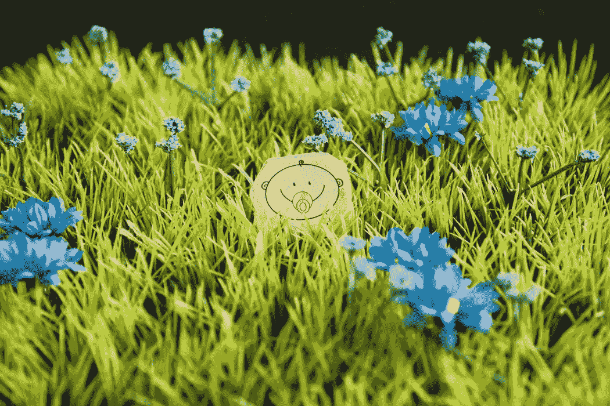

# 被艾看到了

> 原文：<https://medium.com/swlh/seen-by-ai-cce15a92eba3>

What can an algorithm see?

随着数字化被宣布为未来的主题，“人工智能”、“机器学习”和“深度学习”等术语变得越来越重要。进步在于算法的优化。他们到底有多“聪明”？

为了在短时间内回答这个问题，我已经开始了一个小的自我实验，这个实验可以用眨眼来观察，由于它的选择性，它并不声称是科学的。这与其说是一项全面的研究，不如说是一个快照。

试验田是“EyeEm”——一个分享和营销照片的免费在线服务。EyeEm 在它的网站上这样描述自己

> *“*EyeEm*是摄影师和图像购买者获得正确照片的地方。”*

在网上销售照片时，一个非常重要的工具是给每张照片加标签，这样顾客就可以在可能的搜索中找到它们。这通常是由摄影师自己分配完成的——要么在上传过程中，要么在上传之前写入个人照片的元标签。这个过程既费力又耗时。

作为一个特殊的功能， *EyeEm* 在上传每张图片的过程中直接提供自动的、算法控制的索引。因此，图像由软件分析，并向用户建议合适的术语，用户可以完全、部分或根本不采用这些术语。

这就是我尝试的地方。我把这张图片上传到 *EyeEm* 上，看看算法给我的建议是什么。我选择这张图片是因为它的矛盾性，而不是出于审美原因。

以下标签是“机器输出”:

[自然界中的美女](https://www.eyeem.com/a/1335496) [时钟](https://www.eyeem.com/a/4986) [钟面](https://www.eyeem.com/a/5067779) [交际](https://www.eyeem.com/a/815139) [日](https://www.eyeem.com/a/46624) [花](https://www.eyeem.com/a/2566) [花头](https://www.eyeem.com/a/11409769) [新鲜度](https://www.eyeem.com/a/918225) [草](https://www.eyeem.com/a/77579) [绿颜色](https://www.eyeem.com/a/6875880) [生长](https://www.eyeem.com/a/577669) [时针](https://www.eyeem.com/a/12209848) [时针](https://www.eyeem.com/a/12270225) [分钟](https://www.eyeem.com/a/12270225) [自然](https://www.eyeem.com/a/1540) [没有人](https://www.eyeem.com/a/2888711)

++++++++++++++++++++++++++++++

我 100%接受算法的建议，不再添加任何内容。标题分配对提供的标签没有影响。

到目前为止，一切顺利。还是没有？

如果你仔细观察这些术语，你会注意到有趣的是什么是公认的，什么是不公认的，以至于分配的术语作为一个整体描绘了一幅完全错误的画面。

这张照片展示了一块人造草皮，上面有一个彩色的纸人，代表一个婴儿和一个假人。

既没有[新鲜度](https://www.eyeem.com/a/918225)也没有[时钟的任何元素。](https://www.eyeem.com/a/5067779)亦作[编号](https://www.eyeem.com/a/216065) [户外](https://www.eyeem.com/a/67565) [雪花莲](https://www.eyeem.com/a/1032975) [时间](https://www.eyeem.com/a/9163) [自然中的美](https://www.eyeem.com/a/1335496)和[生长](https://www.eyeem.com/a/577669)不明显。所以算法似乎过于热心而不是省略了一些无法解读的东西。它还提出了一些方法。他似乎在色彩和基本主题“自然”上更成功。但没有“真实”和“人造”之分。自由地遵循“媒介即信息”的格言，然而，这影响了陈述。我们必须停止区分*真*和*假*吗？这不适用于库存摄影领域的照片处理。算法分析照片，以确定照片是否以及在多大程度上被篡改。过度的偏差会导致图像被排除在销售之外。

如果算法在解释和索引中包含了所选择的标题，它可能已经能够识别出某种讽刺…

–

这里是 *EyeEm:* 网站上的参考图片

[https://www.eyeem.com/p/113149759](https://www.eyeem.com/p/113149759)