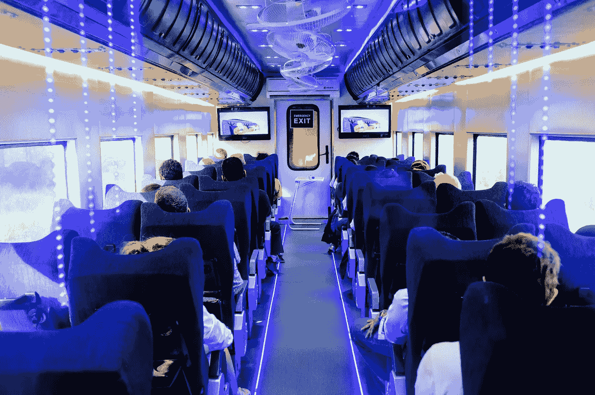

# 自动驾驶汽车是愚蠢的

> 原文：<https://medium.com/swlh/self-driving-cars-are-dumb-299ecf7a4106>

## 公共交通很聪明

Behold this amazing technology. It is called ‘train’

汽车是个哑巴。让它们聪明两倍，它们仍然比公共汽车或火车笨。

汽车有利于个人满足。他们可以很快地把你从 A 点带到 B 点，但是当每个人都开始这样做时，效率就会越来越低。你会遇到交通、停车问题，整个系统都会变慢。他们是一个…