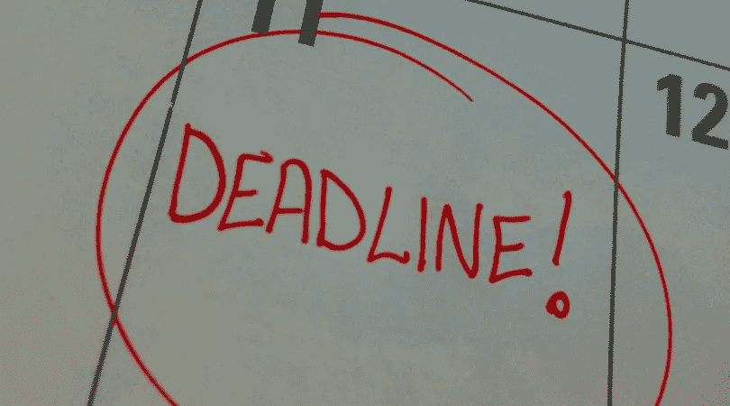

# 拥有更多权力的自我设定的截止日期

> 原文：<https://medium.com/swlh/self-imposed-deadlines-with-more-authority-c72c18d11700>

## 像老板一样实现目标

photo by Leanne Johnson

> 我喜欢截止日期。我喜欢它们飞过时发出的嗖嗖声。
> —道格拉斯·亚当斯

D eadlines。他们是我们生活中的常客，尤其是对我们作家来说。它们来自我们的老板，我们的客户，我们的出版商。见鬼，它们甚至来自我们自己。为什么后者那么容易被推开？有一些小的…