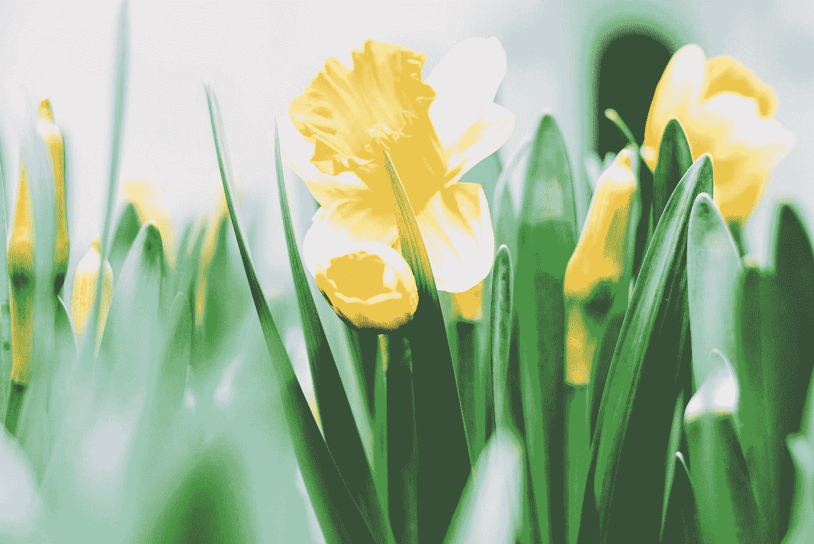

# 你能做的最无私的事(从今天开始)

> 原文：<https://medium.com/swlh/self-improvement-is-one-of-the-most-unselfish-thing-you-can-do-75c350ef8687>

## 充分利用自己比其他任何方式都更能帮助别人。

Photo by [Tim Gouw](https://unsplash.com/@punttim?utm_source=medium&utm_medium=referral) on [Unsplash](https://unsplash.com?utm_source=medium&utm_medium=referral)

有些人对任何关于自我发展的谈论都不屑一顾。他们认为你必须感到破碎，缺乏自尊，并感到实践自我发展真的毫无价值。