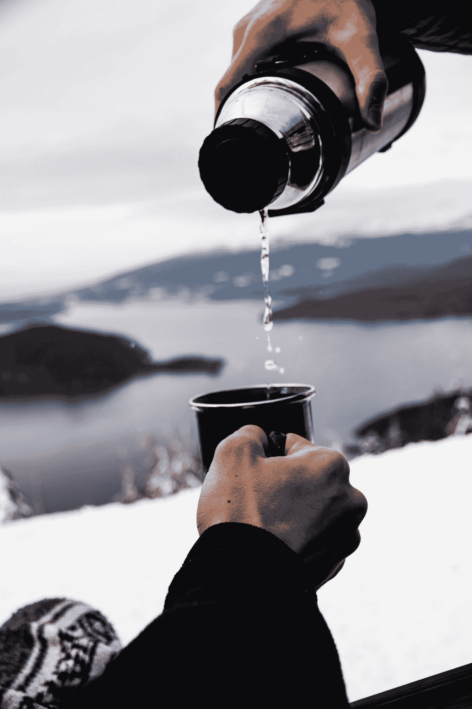

# 自爱被高估了…对吧？

> 原文：<https://medium.com/swlh/self-love-is-overrated-right-c61d06b4ca7e>

You cannot pour from an empty cup

我们经常听到这个被忽视的概念:先爱自己。我们想出许多方法来定义它对我们的意义。

没有错误的答案。

爱我们自己这个热门的概念在今天比以往任何时候都更有意义。在一个人类交往稀少的时代，它变得比以往任何时候都更加强大。