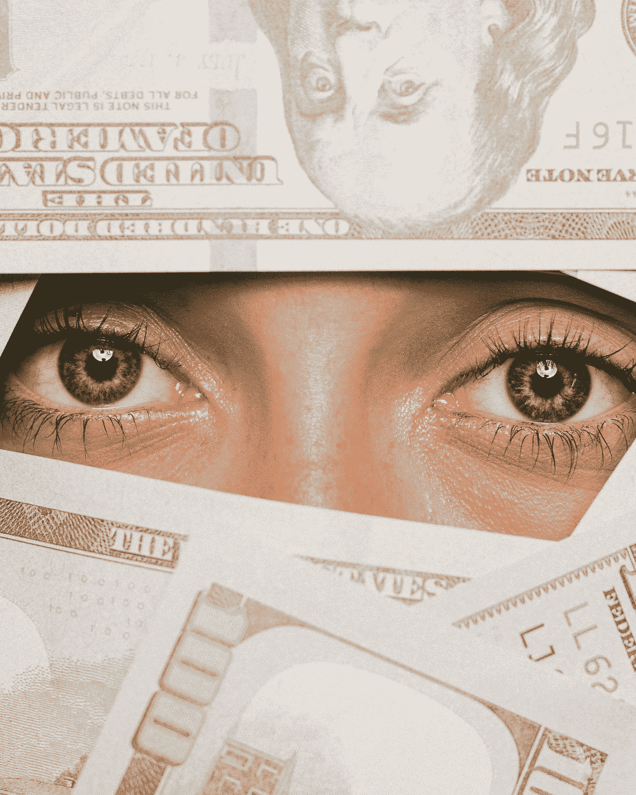

# 自我价值是金钱买不到的人权

> 原文：<https://medium.com/swlh/self-worth-is-a-human-right-that-money-cant-buy-9fabbeb59a81>

## 了解自我价值的关键

Photo by [Wei Ding](https://unsplash.com/@weiding22?utm_source=medium&utm_medium=referral) on [Unsplash](https://unsplash.com?utm_source=medium&utm_medium=referral)

> “看起来我很成功，但我没有赚钱，所以我必须重新定义成功对我的意义。”

你什么意思？我问。

> "我想赚很多钱，这样我知道自己的价值."