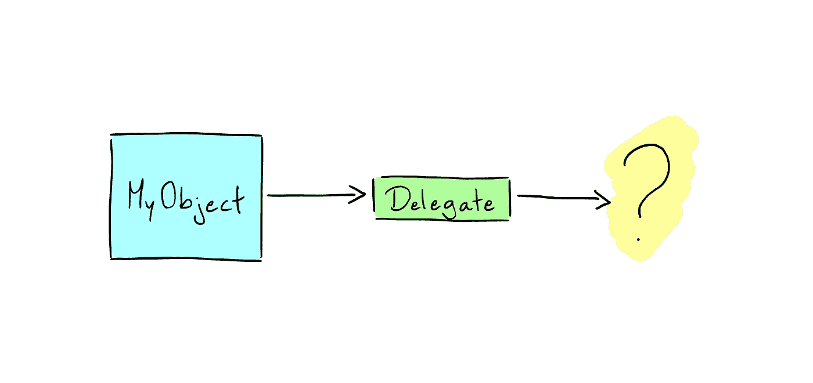

# 用委托模式分离关注点

> 原文：<https://medium.com/swlh/separating-concerns-with-the-delegate-pattern-93b9d3a65b71>

在上一篇文章中，我们讨论了闭包的语法以及如何在它们的接收函数中使用它们。今天，我们来看看一种技术，通过确保我们的视图尽可能地与我们的控制器分离，我们可以使用这种技术在我们的应用程序中加强分离和可扩展性。

# 什么是委托？