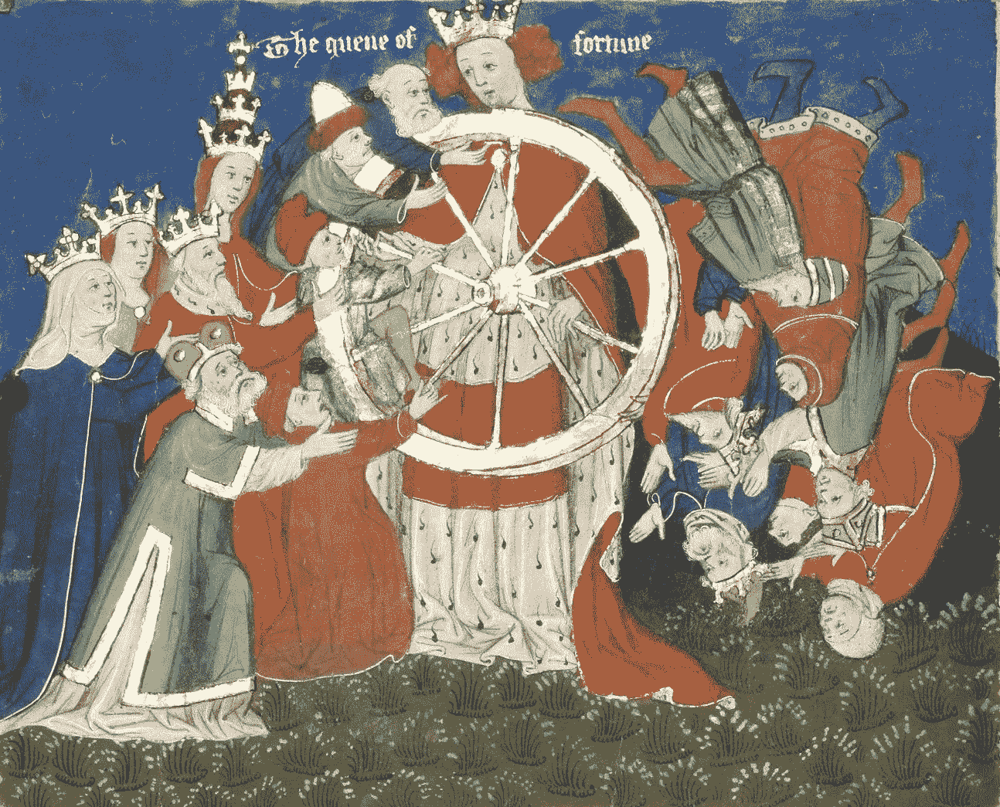

# 意外收获:培养创造性运气的艺术

> 原文：<https://medium.com/swlh/serendipity-cultivating-the-art-of-creative-luck-ed1eb6ee7f7b>

Illustration from John Lydgate’s *Siege of Troy*, showing the Wheel of Fortune. Mid 15th Century. Public Domain. Via [Wikimedia Commons](https://commons.wikimedia.org/wiki/File:Lydgate-siege-troy-wheel-fortune-detail.jpg).

创造力需要大量的运气。这本来就是不可预见的。由于不可预见，创造力以有趣的方式与运气和机遇联系在一起。当你运气好，在正确的时间偶然发现了正确的想法，那感觉就像奇迹一样。当你感到不幸时，似乎你无能为力。但是作为一名写作老师，我了解到…