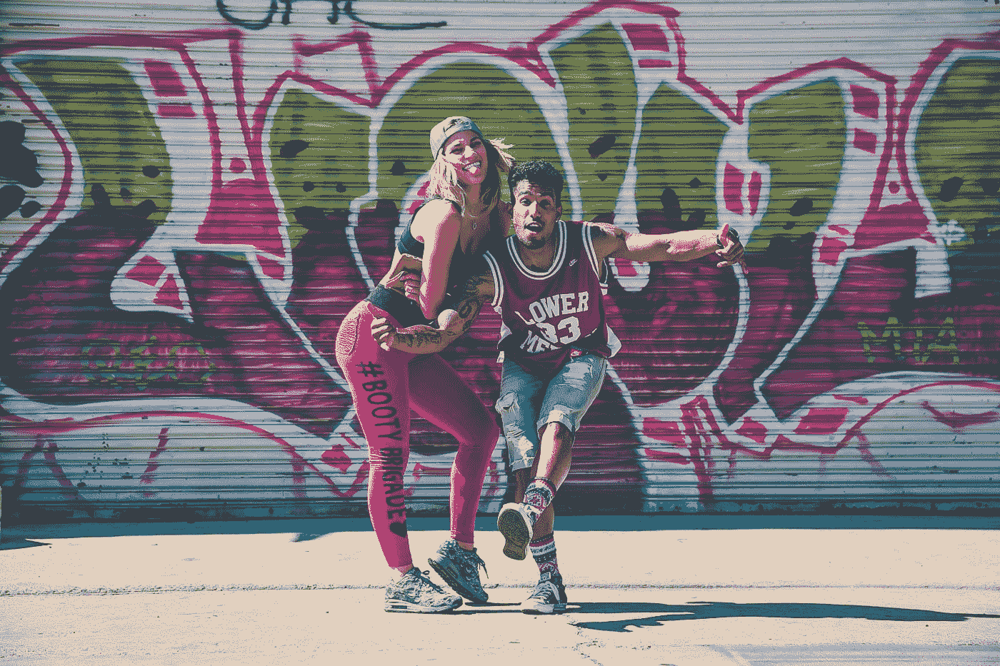

# 说真的，你多大了？

> 原文：<https://medium.com/swlh/seriously-how-old-are-you-110290df7d78>

## 因为你确实不像你的年龄…

Photo by [Jakob Owens](https://unsplash.com/@jakobowens1?utm_source=medium&utm_medium=referral) on [Unsplash](https://unsplash.com?utm_source=medium&utm_medium=referral)

我十四岁时，已经快四十岁了。有些人说我比实际年龄成熟。对我的年龄来说，我太老了。认真的。我是一个狂热的完美主义者，坚信只要我能把每件事都做得足够好，遵守所有的规则，即使我不确定它们是什么，一切都会好的。生活会一帆风顺。