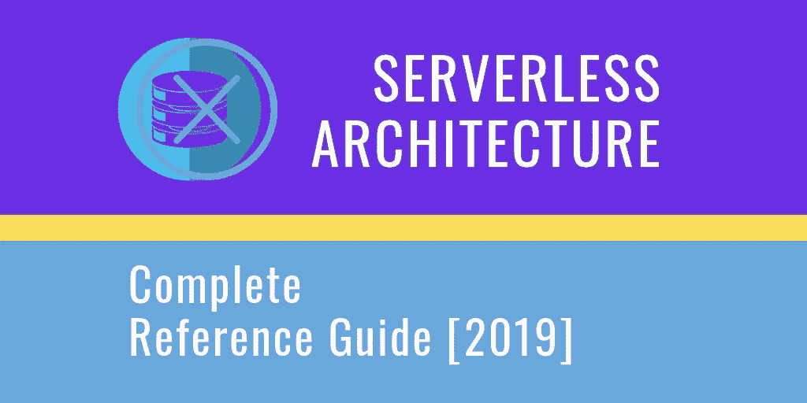

# 无服务器架构—完整参考指南[2019]

> 原文：<https://medium.com/swlh/serverless-architecture-complete-reference-guide-2019-55363c08d1be>

Serverless Architecture — Complete Reference Guide [2019]

无服务器架构(也称为*无服务器计算*或*功能即服务*、**、【FaaS】)**，让我们离人类独立更近了一步，也让我们离机器依赖更近了一步。对于许多人来说，无服务器是他们第一次接触公共云。

# 什么是无服务器架构？