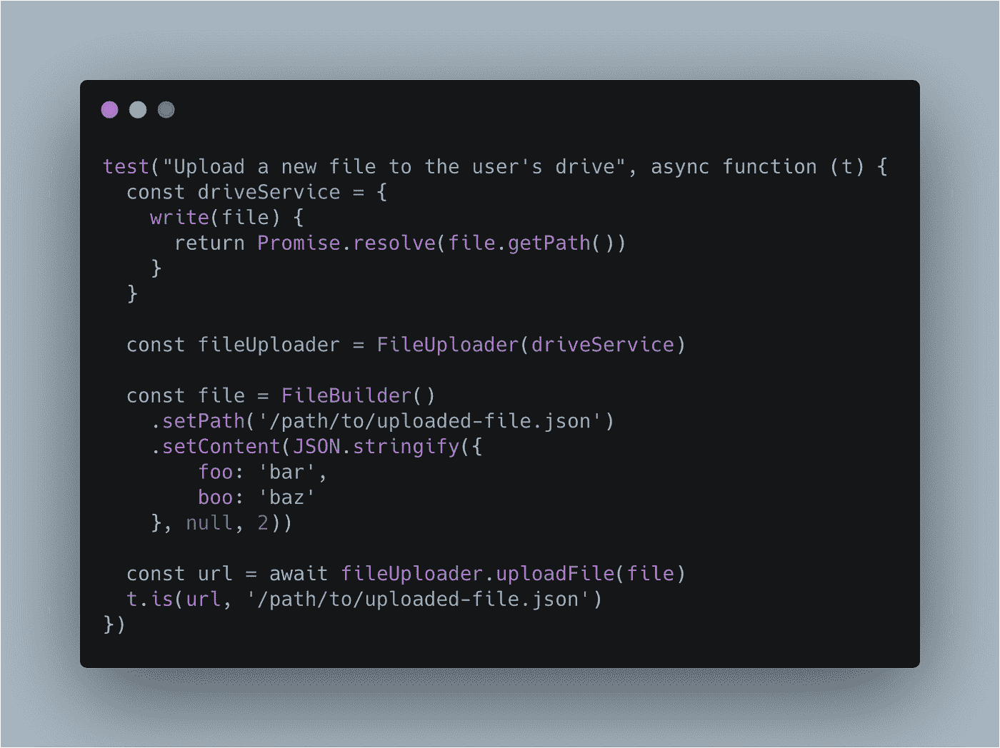
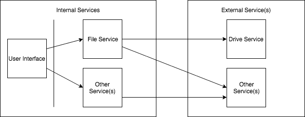
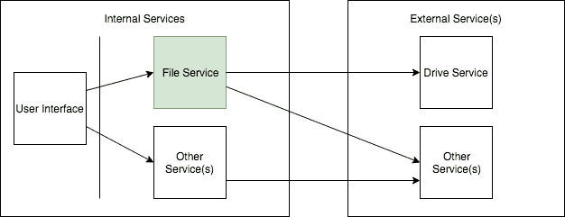
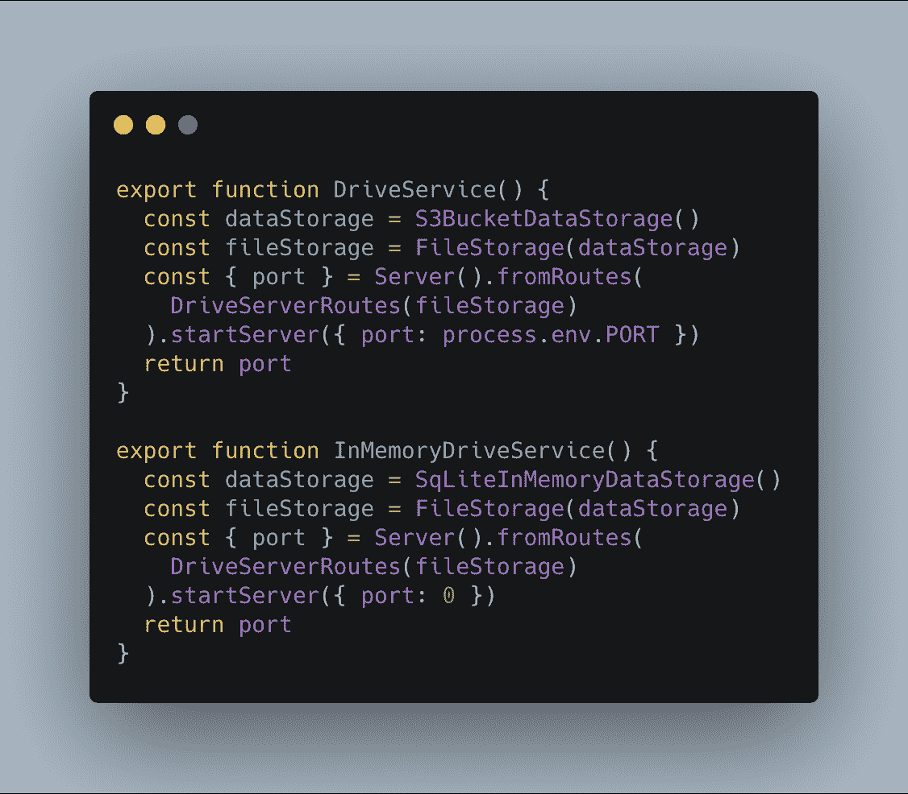
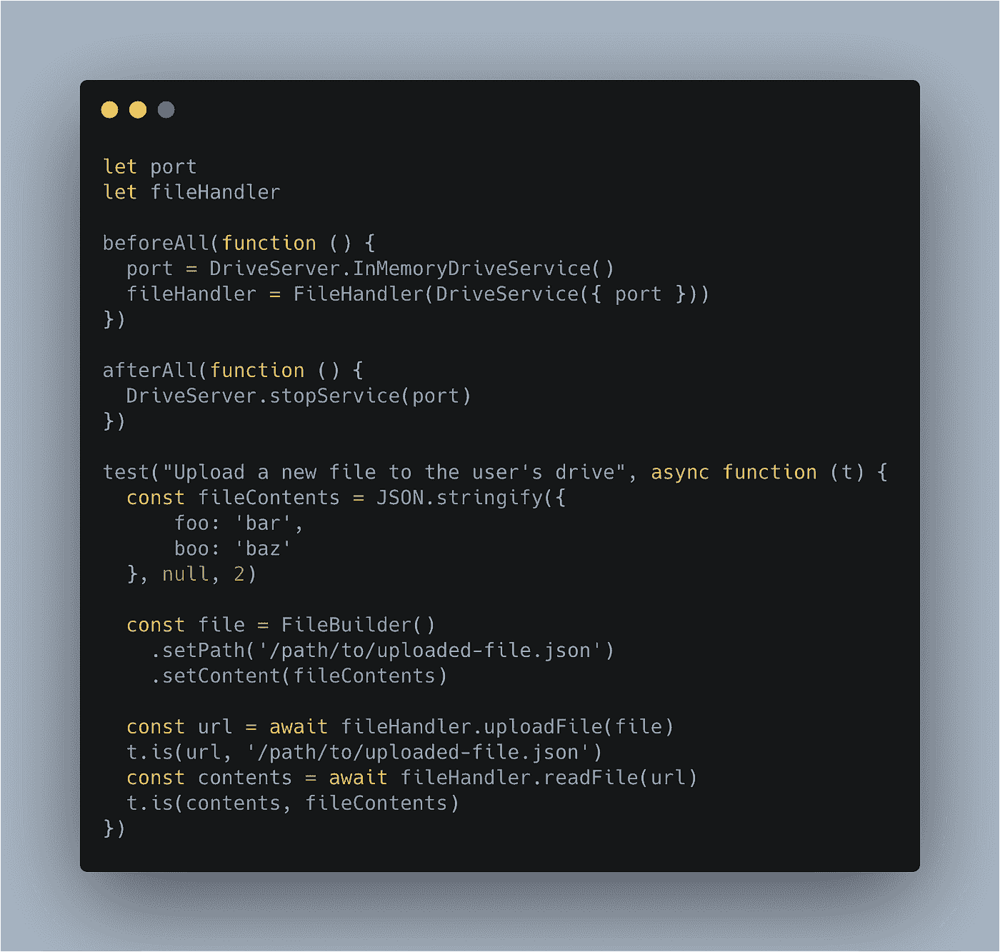
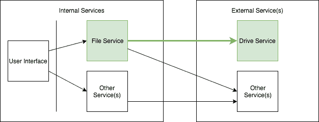
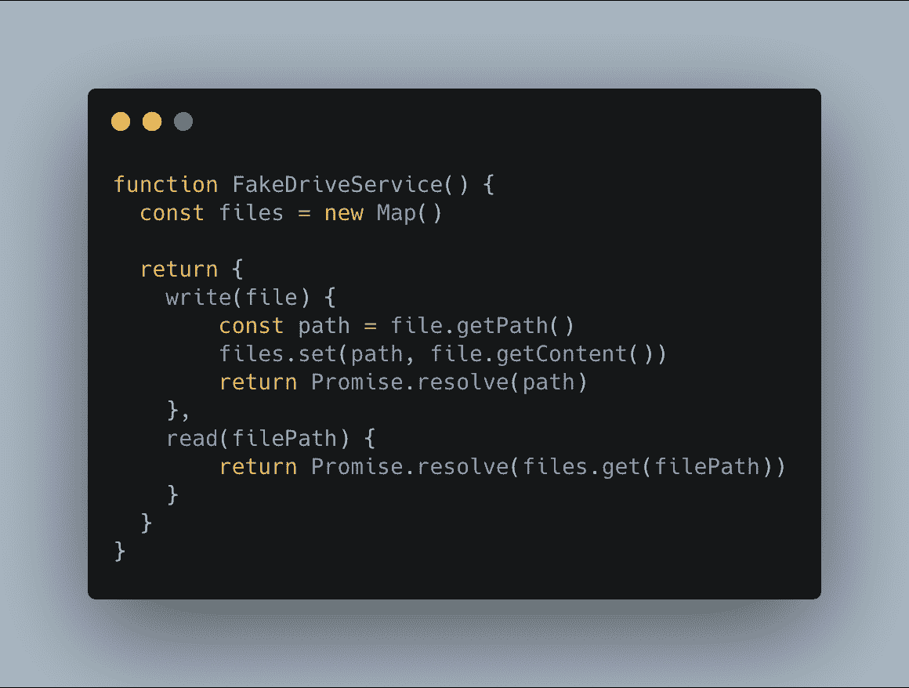
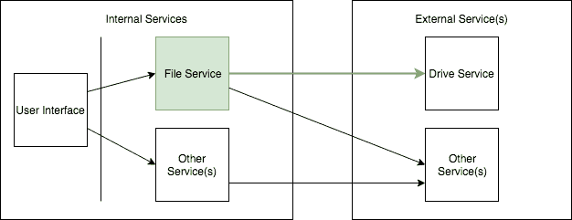

# 服务电话使您的测试更好

> 原文：<https://medium.com/swlh/service-calls-make-your-tests-better-457bed6da6db>

**TL；DR:如果所有的测试都被嘲笑，你不知道你的代码是否真的工作，你只知道，理论上，如果集成符合你期望的契约，它应该工作。**

嘲讽、存根，或者更好的是[依赖倒置](/free-code-camp/simply-javascript-a-straightforward-intro-to-mocking-stubbing-and-interfaces-14e67ed6641a)，它们可以简化测试，让你的代码更容易修改，但是它们也会导致问题吗？让我们看看。

看一下这个测试，我们使用外部文件服务保存一个文件。

你能看出这是一个有用的测试吗？

提示:它很可能永远不会捕捉到任何错误。让我们看看是否能确定为什么不能。

它不会捕捉到任何错误的第一个原因是，我们正在使用驱动服务的模拟实现。因此，如果有人在不更改文件上传程序的情况下更改了驱动器服务，我们不会发现任何错误。如果驱动服务从`write`变为`writeFile`，我们的测试将不会捕捉到这一点。

现在，更进一步呢？如果我们想要集成的实际驱动服务器发生了变化，该怎么办？我们当然不会捕捉到这些错误，因为我们从来没有调用过它。

最后，我们真正测试的唯一一件事是，`uploadFile`方法将`file`对象赋予了`driveService`的`write`函数。如果驱动服务错误地使用了`file`对象，或者`fileUploader`停止将文件直接提供给驱动服务，我们将捕捉到一个错误。

不幸的是，每当我们改变`fileUploader`和`driveService`的交互方式时，我们也必须更新这个测试。

所以这个测试不仅脆弱，而且没什么用处。此外，在类型化语言(Typescript)中，这是完全无用的，因为编译器会在编译期间捕捉这些类型的错误。

那么，怎样才能让这个测试更好呢？如果该测试实际上对驱动服务器进行了服务调用，那么它将变得非常有用。不是内部的`DriveService`对象，而是一个真实的驱动服务器。

你应该马上反对，“如果我打真正的服务电话，我的单元测试将永远运行，并且变得非常脆弱！”如果你说你是绝对正确的。这种测试最好作为集成测试。

# 集成测试

集成测试不会像单元测试那样经常运行，但是至少应该在将您的更改集成到代码库之前运行。看到我做了什么吗？集成测试在您集成时运行。

尽管如此，问题仍然存在，我如何实际运行我的应用程序运行所需的所有服务器？启动它们可能会很昂贵，更不用说数据存储、管理端口、身份验证以及创建一个全功能系统所需的一切。

看一下这个简单的系统图。它代表了前面的示例测试中的系统的一个非常精简的版本。

您可以看到，我们感兴趣的是测试我们的“文件服务”与属于另一个团队的外部“驱动服务”的集成。在这种情况下，我们不会尝试运行完整的端到端测试。

但是我们实际测试的是什么呢？

哎呀！这里，如绿色所示，只测试了文件服务。我们想测试我们的文件服务及其与驱动器服务的连接是否正常工作。因此，我们将寻找一种方法来获得驱动服务的可测试版本，而不是在我们这边编写一个被嘲笑的版本。

# **隔离服务**

一种选择是创建驱动服务的隔离版本。理想情况下，这将由创建驱动服务的团队所有。为了确保假服务器是可信的，他们将对假服务器和真实服务器运行相同的测试。

上面的代码代表了一个独立服务器实现的示例。您可以看到它与真实的服务器实现非常相似，只是它使用内存中的数据存储而不是真实的文件存储设备。它甚至使用端口 0 来确保使用了一个[临时端口](https://en.wikipedia.org/wiki/Ephemeral_port)，进一步增加了测试的稳定性。

现在，驱动团队正在提供这个隔离的服务器，我们的集成测试可以安全地启动它，并在集成测试期间使用它。让我们将原来的测试重写为集成测试，看看它是否变得更有用。

现在我们的测试更有用吗？由于我们调用了真正的驱动服务器 api(即使它保存到不同的存储设备，API 和业务逻辑保持不变)，我们将知道我们的集成是否中断。

更好的是，我们不仅能够测试它返回什么样的 URL，还能够测试内容是否按照预期保存。我们的测试将会告诉我们文件保存是否有效！

再看看我们的系统图。你可以看到绿色的正在测试的服务。这一次我们测试文件服务、驱动器服务，最重要的是它们之间的连接。

期望每次我们更改一行代码时都运行这组测试是不现实的——这种期望是为单元测试保留的——但是这个测试仍然是轻量级的，足以在每次代码签入时运行。以这种方式执行集成测试将确保您的主分支不仅拥有正确的业务逻辑，还拥有与其他服务的工作集成。

# **隔离服务不可行时的后备方案**

有时，您可能真的有某种环境或构建时约束，使得隔离服务器不可能实现。如果是这种情况，那么你可以考虑使用伪 API 作为退路。

请记住，我们仍然在这里谈论集成——与其他服务交互的代码。您可能已经注意到代码包含了两个与驱动相关的实体:`DriveServer`和`DriveService`。`DriveServer`是属于第三方的实际服务器。我们使用他们的内存版本来测试我们与他们的服务的集成。`DriveService`是一个知道如何与`DriveServer`交互的 API。这个 API 也属于驱动团队。

谢天谢地，他们明白不是每个人都可以使用他们隔离的内存服务器，所以他们也创建了一个伪版本的 API。看一看。

这个`FakeDriveService`是驱动团队可以提供给任何使用他们服务的人的实现。他们说“如果你用`FakeDriveService`测试，你可以相信真正的`DriveService`会工作。我们对两者都进行了测试，以确保它们的效果相同。”

这种实现显然比隔离的服务器还要轻，那么缺点是什么呢？让我们再一次参考我们的系统图。

当我们在技术上测试连接*机制*时，我们实际上并没有接触`DriveService`。我们的测试建立在信任的基础上，而不是实际的验证。信任是假的服务确实和完整的服务一样工作。在许多情况下，这已经足够好了，但是如果您有一个生产关键系统，您可能需要更好的保证。

尽管如此，这个测试还是比我们开始时使用的原始模拟函数要好。我认为，这个模拟函数完全不值得信任，它实际上欺骗了我们，让我们认为我们不会受到 bug 的影响，但实际上我们对此一无所知。如果`DriveService`发生变化，我们的测试也必须随之改变。在第一个模拟场景中，我们不必改变我们的测试，它会欺骗我们认为我们的代码仍然工作，即使它由于 API 的改变而中断。

# **学分**

这篇文章的灵感直接来自我最近在谷歌的“厕所测试”博客中发现的帖子。我想用 JavaScript 代码重新构建这个想法。请查看下面的链接，阅读他们的原始帖子。

练习服务呼叫

假货:

[https://testing . Google blog . com/2013/06/testing-on-toilet-fake-your-way-to . html](https://testing.googleblog.com/2013/06/testing-on-toilet-fake-your-way-to.html)

密封服务器:

[https://testing . Google blog . com/2012/10/hermetic-servers . html](https://testing.googleblog.com/2012/10/hermetic-servers.html)

## **免责声明**

这里的观点和建议是我自己的，不是雇主的。我绝不打算通过这篇文章来代表他们。

## **取得联系**

我很乐意收到你的来信。请随时通过 [LinkedIn](https://www.linkedin.com/in/justin-fuller-8726b2b1/) 或 [Github](https://github.com/justinDFuller/) 联系我。