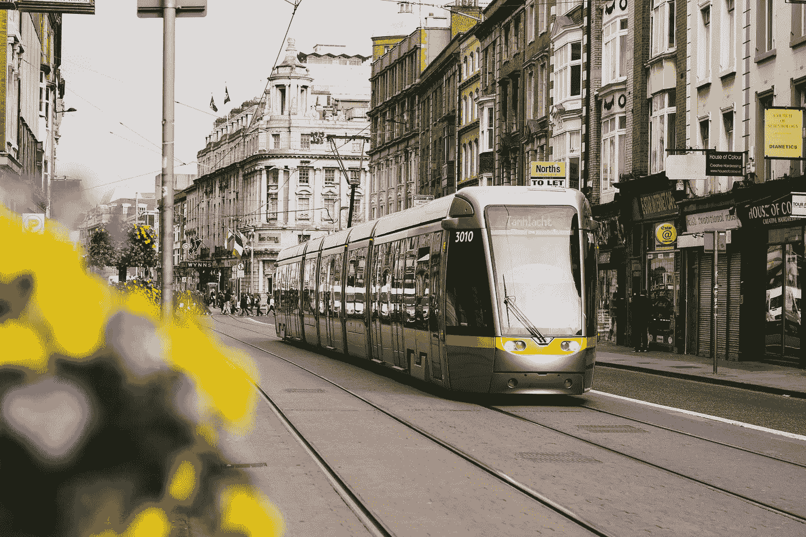

# 服务设计案例研究:重新设计公共交通的未来

> 原文：<https://medium.com/swlh/service-design-case-study-redesigning-the-future-of-public-transport-7454275abfa1>

你喜欢绝对喜欢乘坐公共交通工具旅行吗……或者你只是把它看作是一种把你从一个地方带到另一个地方的工具？

这是一项世界各地数百万人使用的服务，每天都在改进——与像[优步](https://www.uber.com/?source=post_page---------------------------)这样的新玩家整合，让更多人舒适地旅行，同时减少路上的汽车数量。