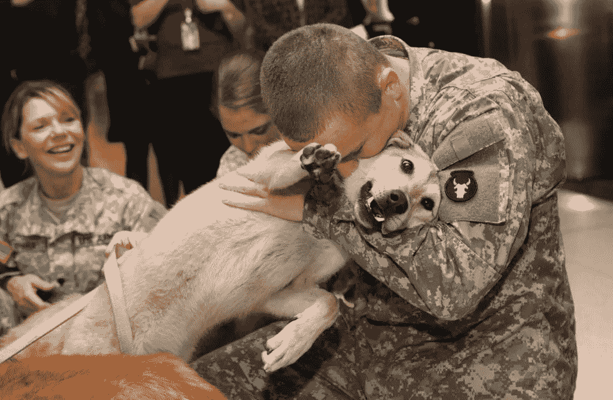

# 服务犬帮助患有创伤后应激障碍的兽医

> 原文：<https://medium.com/swlh/service-dogs-help-vets-with-ptsd-12b0ade76026>

Source: [americanhumane.org](https://www.google.com/url?sa=i&source=images&cd=&cad=rja&uact=8&ved=2ahUKEwiL9e_P_7LgAhUNZN8KHcNuCAAQjB16BAgBEAQ&url=https%3A%2F%2Fwww.americanhumane.org%2Finitiative%2Fmilitary-dog-team-reunifications%2F&psig=AOvVaw2SlYP8tJtagx1nZm4cuufU&ust=1549950827349344)

# 故事

当时是午夜，本该是平静的，但事实并非如此。这位老兵在噩梦中辗转反侧，梦见自己回到了战区。他突然醒来，在半睡半醒的混乱中感到震惊和恐慌，但由于灯已经打开，他的一些恐惧减少了。在某些情况下，这可能会…