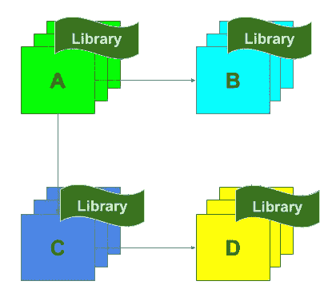
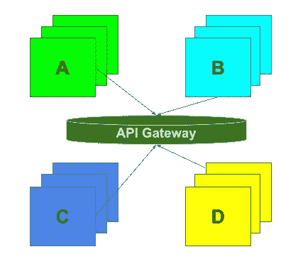
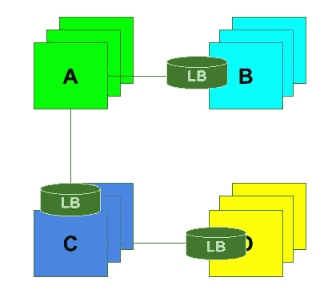
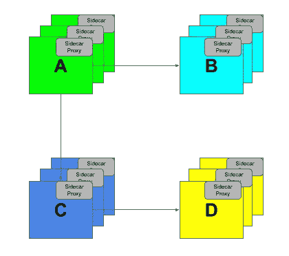
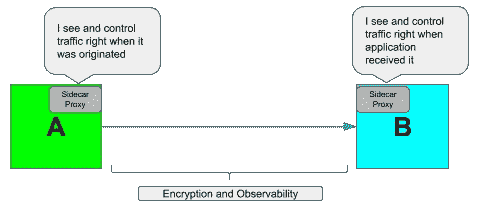
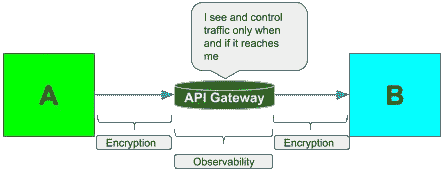
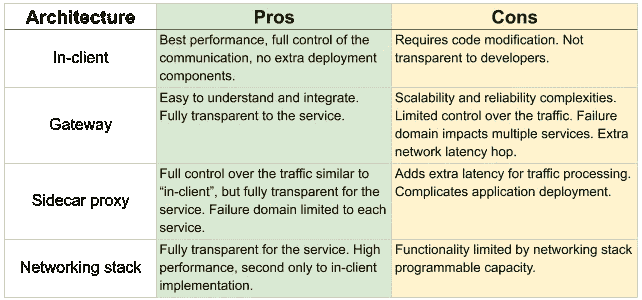

# 服务网状架构模式

> 原文：<https://medium.com/swlh/service-mesh-architectural-patterns-5dfa0ad96e38>

在第一篇文章中，我[通过它要解决的问题的棱镜描述了什么是](/swlh/service-mesh-explained-in-plain-english-8e5505f74ead)。这篇文章实际上是它的第二部分，回顾了如何实现服务网格的通用架构模式，以便为您的分布式部署提供服务发现、策略&安全管理以及可观察性。

如果最后一段没有多大意义，强烈推荐先阅读用简单英语解释的[服务网。](/swlh/service-mesh-explained-in-plain-english-8e5505f74ead)

# 无服务网格的服务网格

最直接的方法是将服务网格问题变成一个应用程序问题。通过将必要的逻辑直接编程到每个服务中，it 可以发现服务、加密流量、发出指标等。

An application can implement Service Mesh logic within it

您可以稍微优化一下，将这个逻辑变成一个库，这样它就可以跨许多不同的服务重用。

然而，现在您的应用程序必须解决与其核心逻辑不相关且对您的开发人员不透明的问题(阅读:开发人员需要知道并关心基础设施问题，而不是他们的应用程序)。如果您有一个异构环境(多种语言，多种技术)，您将需要为网格中的每个应用程序/技术集重新实现这个逻辑。您可以看到这是如何不可伸缩的。

客户端方法为您提供了最大的灵活性，如果操作得当，还可能提供最佳的性能。我们是否可以做得更好，至少部分地将我们的开发人员从服务网格问题中解救出来？他们已经有太多要担心的了。

# 网关、代理和瘦客户机

## 通过网关实现集中化

如果我们不希望与服务网格相关的代码存在于我们的应用程序中，我们首先想到的可能是——让我们将它集中在一个位置。我们可以实现一个服务，作为应用程序之间流量的集中网关。每个应用程序都需要知道如何向这个网关发送流量，剩下的就交给它了。我们将其命名为“API 网关”

API Gateway — most uncomplicated way to solve the problem

这种模式实现起来很简单，你把所有代码集中在一个地方，把开发人员从解决基础设施问题中解放出来:只要把你的流量送到这里，伙计！

简单是有代价的。毫不奇怪，我们刚刚为所有服务引入了单点故障。我们需要考虑网关的高可用性，以及随着需求增长的横向扩展。您不能进行端到端加密(因为在流量到达网关之前，您无法控制流量，所以您不能尽早对其进行加密，所以根据定义，它不是“端到端的”)。很难进行可靠的测量，因为网关只能看到一次流量，如果它看到流量(是否因为应用程序没有发送请求或网络故障而没有请求？).

我们可以通过在每组微服务前部署较小的网关来改善这种情况。

Sharding gateway deployments can help with scalability and SPoF

这种方法将集中式网关可伸缩性问题分解成几个较小的问题，至少在网关之间允许更好的可伸缩性、稍微好一点的测量和加密。然而，它仍然有同样的问题:加密不是端到端的，可观察性仅在网关级别，您仍然有集中的故障域，尽管较小。

从现在开始下一步会是什么？边车代理。

## 边车代理——你是什么？

您决定在应用程序本身中实现服务网格逻辑并不适合您，网关的性能特征也不是一个选项。有什么解决办法？

Sidecar proxies are one of the best compromises existing today

实现这一点的一种方法是在运行服务应用程序的同一主机(或 Kubernetes pod)上将代理应用程序部署为一个单独的二进制文件/进程。我们将这种代理称为 **sidecar 代理，**确切地说，是运营商将其作为 sidecar 部署到实际服务中。你的代码所要做的就是像没事发生一样发送流量。代理将透明地拦截流量，神奇的事情发生了。Sidecar 代理实现了所有的服务网状智能—它将知道向何处以及如何发送流量，如果需要的话对其进行加密，发出指标，等等，而您的服务甚至不需要猜测这些活动已经发生。很甜蜜，不是吗？

可靠性也非常好，因为您的故障域是您的 sidecar 代理，并且每个服务实例都有一个代理—如果一个代理出现故障，您丢失的只是一个服务实例。

不利方面？除了增加服务部署过程的复杂性之外，您还为您的请求增加了额外的处理跳。由于 sidecar 代理通常被部署用于发送和接收请求服务——您通过两个额外的处理步骤增加了延迟。

## 更深层次的整合

为了完整起见，我应该列出两个值得尊敬的架构模式:

**通过网络层进行集成。**如果您能够将服务网格逻辑直接嵌入到主机的网络层(实际上“本地”处理流量的系统部分)，您就可以获得一切:对应用程序的透明性、本地网络的性能以及没有额外的故障域。事实证明，如果你通过 [eBPF](https://lwn.net/Articles/740157/) 进行编程，你就可以做到，像 [Cilium](https://www.cilium.io) 这样的项目就采用了这种方法。缺点是限制了你可以实现多少功能，因为你的代码必须小而高效。

**集成瘦客户端。**如果您仍在考虑在您的应用程序中实现服务网格功能，但希望减少工作量和计算开销，瘦客户端可能是一个答案。实际上，这意味着您只集成了一小部分服务网格代码(一个客户端库)，所有重量级计算仍然在另一个称为“控制平面”的层中流出该应用程序看看 [gRPC-LB](https://grpc.io/blog/loadbalancing/) 作为例子之一。

# 选择架构

在选择服务网状架构时，您必须注意的一点是，在服务发送请求后，它多快就能看到流量。自然，我们越早控制流量，我们就能提供越精确和可靠的机制来控制它。

例如，应用程序一产生请求，客户端或侧柜代理架构就处理请求。好处？您可以获得高保真的端到端可观察性和加密。对于加密，端到端意味着您可以在流量由您的服务发起时对其进行加密，并确保流量在到达目的地之前不会被解密。对于可观察性，这意味着您现在可以看到诸如请求的实际延迟之类的东西，即从它在源上发起到它到达目的地所经过的时间，或者在请求发生时准确地检测到请求的错误。

Some architectures provide real end-to-end encryption and observability

当您只能在某个过渡点控制服务之间的请求时，请将它与另一种设计进行比较。

除了增加额外的网络跳延迟，因为当流量由服务 A 发起时，您无法控制流量，您最多可以要求服务 A 始终通过 TLS 建立到网关的连接，然后在它离开网关时对其进行加密，但此时信任已经受到损害。

End-to-end encryption breaks with middle proxies

这对可观察性来说甚至更糟，因为服务网格不知道当请求在服务 a 处发起时发生了什么。如果有错误，它们是不可见的。主机本身的高延迟？你也看不到。只有当流量到达我们的中间代理时，我们才能进行测量，这只能部分反映世界的真实状态。

是不是说明 sidecar 代理模型不错，API 网关很可怕？当然不是，这取决于您希望优化的性能和操作参数。

寻找尽可能低的延迟？考虑应用程序内客户端。需要端到端加密和尽可能好的可观察性，而您不能接触代码？边车代理是你所追求的。这两者都不如易于部署重要？API Gateway 将提供大部分好处，同时对应用程序的部署过程没有任何负担。

# 最后

追求将服务通信控制复杂性的负担从应用程序开发人员转移到基础设施的愿望——服务网格创建者提出了多个追求相似目标的架构，但以不同的方式实现它们。当选择(或设计)您的服务网格解决方案时——理解每种解决方案的优点和权衡是至关重要的:从费力开发低延迟服务网格库到仅仅在服务之间插入网关。

最终，业务将决定您的应用程序的性能特征，这反过来将建议哪种服务网格最适合您。明智地选择。