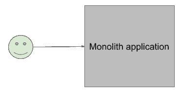
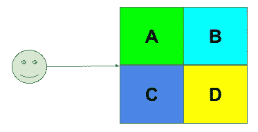
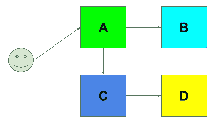
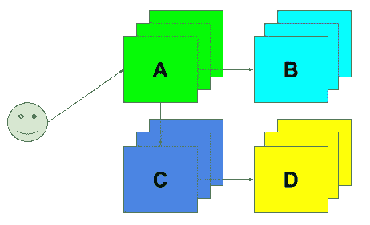
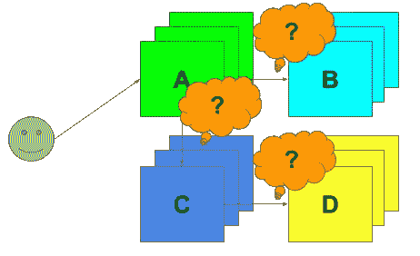

# 用简单的英语解释服务网格概念

> 原文：<https://medium.com/swlh/service-mesh-explained-in-plain-english-8e5505f74ead>

如果您听说过“服务网格”这个术语，但仍然很难理解它是什么，并且承认它可能已经太晚了，那么这篇文章就是为您准备的。

你从谷歌搜索“什么是服务网格”开始，希望很高，第一个结果告诉你这是一个可编程的基础设施，它很可能连接服务。如果这种谷歌搜索的努力没有帮助，仍然有“很好…但是什么是服务网格？”你脑海中的问题——继续读下去。

本文旨在用通用且相对简单的术语解释“服务网格”的概念，它是什么以及它试图解决什么样的问题，而不回顾具体的实现。

# 理解问题才能理解解决方案

要理解什么是服务网格，您需要理解它正在解决什么问题。它始于一个关于独石和微服务的故事。

传统上，应用程序是单一的，这意味着它是一个程序，作为一个二进制文件构建，作为一个进程运行。

Monolith application is what you think of as “normal application.”

独石很简单，但它们也有自己的挑战，仅举几个例子:

*   **难以衡量。**如果您的应用程序的任何单个组件需要扩展，您需要扩展整个应用程序。
*   **难以释放。**因为 monolith 中的一切都是紧密耦合的，所以您在应用程序中所做的任何更改都会影响代码的其他部分。将这个乘以试图同时进行变更的许多团队，得到你的版本发布地狱。
*   **技术灵活性降低。尝试新技术(比如一门新语言)，而不把整个代码库移植到它上面，通常是有问题的。**
*   **对团队动态的影响。**最后但同样重要的是，当你只有一个大的可交付成果时，就很难划分责任边界、分配角色和开发团队。

这些缺点只有在达到特定规模时才会成为问题。对于许多用例来说，monolith 是一个正确而合理的选择。然而，你开始缩放，它不再是你的选择。怎么办？嗯，当然，让我们把事情…分解一下。

# 微服务拯救世界

人们在称之为“微服务”变得流行之前就已经在构建这种服务了，这个行业喜欢用花哨的术语来炒作它们。“微服务”是一种软件设计模式，它倾向于将应用程序分解成独立的、相互解耦的组件。解耦意味着它们有自己的代码库，作为独立的程序运行，但通过某种通信接口相互连接。这个接口通常是网络。

当你有一个 monolith 时，它由几个逻辑模块组成:像前端/UI、后端逻辑、数据库或其他存储。

Monolith consists of several logical components A, B, C, D.

为了将它变成“微服务”，我们将每个逻辑组件变成一个独立开发和部署的程序。每个这样的应用程序都通过网络与其他应用程序交互，形成相同的整体连贯视图，就好像从用户的角度看什么都没有改变。当它运行时，我们将把这样的程序称为“微服务”。在实践中，术语“微服务”和“服务”是可以互换的，“微”试图强调这种服务是更广泛的应用或服务中相对较小的一部分。

> 实际上，术语“微服务”和“服务”是可以互换的。

Monolith becoming “Microservices,” services A, B, C, D interoperate over the network now.

一旦你转向这种设计模式，整个世界的可能性就展现出来了:

*   您可以独立地扩展每个服务。
*   您可以分离每个服务的发布周期。
*   您可以使用自己选择的技术自由编写每个服务，只要它们之间使用相同的通信接口。
*   您可以围绕独立的服务构建您的组织结构，能够分配清晰的所有权、角色和职责。

到目前为止，一切顺利，但我们也遇到了麻烦，以实现规模和弹性，对吗？这就是为什么我们不想运行服务 A、B、C、D 的单个实例(如果其中一个停止运行，如果服务需要更多容量怎么办？)，我们想要很多。我们剥离了 Apache Mesos、Kubernetes 或 Nomad 之类的东西，以大规模运行这些服务的许多副本。

Multiple copies of services help to achieve resilience and scalability.

## 微服务是容器吗？

让我们解决常见的误解。经常听到有人把“微服务”和“容器”混淆。事实是，它们是正交的概念。不需要容器才有微服务，也不需要微服务来使用容器。容器是打包服务的一种方式。这是一个选择，可以同样适用于(或不适用于)单片和微服务。

> 你不需要容器来拥有微服务，也不需要微服务来使用容器。

我将把这个想法留给您，在本文的其余部分，微服务将是它们的样子——独立程序，容器化或不容器化。

# 独石问题已经不复存在。微服务问题万岁！

恭喜你，你摆脱了 monoliths 的缺点，获得了一类全新的微服务问题。

Microservices are coming with their challenges.

现在，不是部署一个大的二进制文件，而是有 N 个较小的二进制文件在运行，它们有自己的生命周期，根据需要在许多不同的服务器上调度和终止，同时相互通信。

实际上，你得到了一个**服务网**(提示，提示)和以下全新的问题要解决:

*   **服务发现**。服务 A 需要与 B 通话，C 需要与 D 通话，等等。由于每个服务都可以在任何地方进行调度，并且可以在服务器之间来回迁移，那么服务 A 如何知道应该连接哪个服务器来与服务 B 进行对话呢？它需要在建立连接之前发现服务的确切位置。
*   **交通管理**。也许您在两个不同的数据中心运行服务 D 的实例，您希望服务 C 在数据中心 1 使用服务 D，并且仅在第一个服务不可用时才在数据中心 2 使用相同的服务。
*   **安全&策略管理。**您希望控制谁以及如何与服务 c 对话。网络级访问控制现在还不够，因为同一服务可能有不同的地址，这些地址可能属于不同的网络。您还希望确保服务之间的所有通信都是加密的。
*   **可观测性**。当您必须监控比单个二进制文件多得多的内容时，这是一个很好的监控词。您希望了解(观察)您的服务、连接和故障的状态，并能够跟踪和排除特定问题。随着服务和互连数量的增加，可观察性变得越来越难。

您可以将这些问题的解决方案卸载给服务，为它们配备这个额外的、特定于基础设施的逻辑。但是，这意味着以下情况:

*   应用范围将远远超出其业务需求。您的开发人员希望从事应用程序还是基础设施方面的工作？
*   您需要为您使用的每个技术堆栈重新实现这个逻辑(拥有微服务架构可能意味着不止一个)。

最好将这个问题的解决方案外包到它的发源地—基础设施。您需要一些软件堆栈，这将使您的部署现代化，以允许您的服务相互发现、控制流量和策略，并提供可观察性，最好不修改服务本身。**这种基础设施解决方案被称为“服务网格”**

棘手的部分在于术语过载，“服务网格”既是“许多服务的许多实例相互通信的部署”，也是针对服务网格带来的问题的“基础设施解决方案”。

我希望这有助于你建立正确的心智模型来理解“服务网格”所解决的问题的根源以及它是什么。[在下一篇文章](/@aburnos/service-mesh-architectural-patterns-5dfa0ad96e38)中，我将回顾如何实现“服务网格”的传统方法，以及每种方法的优缺点。