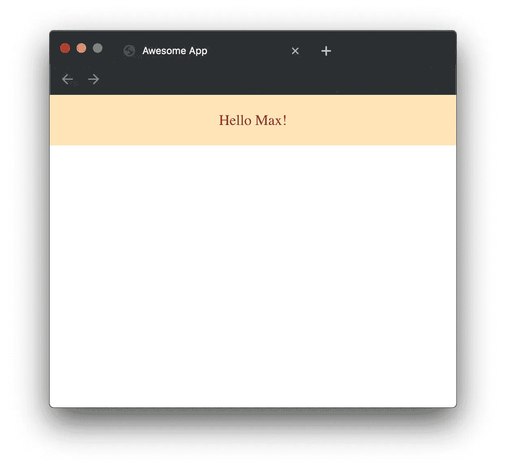

# 用 6 个步骤建立一个 React + TypeScript + SASS + Webpack 和 Babel 项目

> 原文：<https://medium.com/swlh/setting-up-a-react-typescript-sass-webpack-and-babel-7-project-in-6-steps-b4d172d1d0d6>


San Francisco — Image by [chenhengyu](https://pixabay.com/users/chenhengyu-5700844/)

在本教程中，我想告诉你如何建立一个防弹，IE 11 安全，前端项目使用 TypeScript，React 和 Sass。

注意:在本教程中，我将使用[纱线](https://yarnpkg.com/lang/en/)而不是 npm。如果你从未听说过，你应该去看看！😁

## 初始化空白项目

让我们从创建一个空文件夹并初始化一个空白节点项目开始。

```
mkdir awesome-app
cd awesome-app
yarn init
```

这将产生以下文件结构:

```
.
└── package.json
```

## 安装依赖项

在我们开始编写一些 sweet react 代码之前，我们首先要设置我们的蒸腾环境。在这种情况下与网络包和巴别塔。

但是为什么我需要转换我的代码呢？

嗯，有三个原因，为什么我们需要移植我们的代码:

1.  浏览器不支持 TypeScript(目前)，所以我们需要将它转换成 JavaScript。
2.  并不是所有的浏览器都支持现代 JavaScript(尤其是 IE)。我们需要把它转换成一个“旧版本”，这样普通的浏览器就能正确地解释它。
3.  我们需要将 SASS 转换成 CSS，因为(你可能已经猜到了)几乎没有浏览器支持 SASS。

让我们安装我们需要的所有依赖项:

```
yarn add core-js react react-dom regenerator-runtime
yarn add -D  @babel/core @babel/preset-env @babel/preset-react @babel/preset-typescript @types/react @types/react-dom babel-loader css-loader node-sass sass-loader source-map-loader style-loader webpack webpack-cli typescript ts-loader
```

事件虽然看起来有很多依赖项，但我们只有 4 个将内置到我们的应用程序中，其余的都是开发依赖项，只在我们的开发环境中需要。

如果您感兴趣，这里有每个包的简短描述:

```
react  // React framework
react-dom  // React's DOM framework
core-js  // Polyfills for a lot of ECMAScript methods
regenerator-runtime // Polyfill for runtime/* Webpack */
webpack
webpack-cli/* Babel core and presets to transpile TypeScript */
@babel/core 
@babel/preset-env 
@babel/preset-react 
@babel/preset-typescript*/** Type Definitions *for React */* @types/react 
@types/react-dom babel-loader*/* For transpiling SASS */* style-loader 
css-loader
node-sass
sass-loader/* For better debugging */
source-map-loader
ts-loader
typescript
```

## 设置 Webpack

现在我们已经安装了所有的依赖项，是时候创建我们的`webpack.config.js`文件了。

Webpack 将管理我们的[加载器](https://webpack.js.org/loaders/)。加载器是软件组件(npm 包),它将改变/传输/提取或分析我们的代码。

我们的`webpack.config.js`会是这样的:

我认为大多数选项都是不言自明的，但我想快速谈谈其中的四个。

`watch`声明如果 Webpack 注意到文件改变，它会自动重新编译。 *cmd + s* 。

`devtool: "source-map"`将添加源映射，这将使您的开发者生活轻松许多，因为它们为您的浏览器 devtools 提供了 TypeScript 源，因此类名、接口等不会丢失。 ***重要提示:对于生产版本，删除此选项和第 17 行。***

`["style-loader", "css-loader", "sass"-loader"]`是装载机链条。这基本上意味着右加载器的输出( *return* )将被下一个加载器用作输入，依此类推(*从右到左！*)。这个加载器链将从 SASS 文件中提取 SASS，将其转换为 CSS，最后转换为 JavaScript。

根据我们将在下一步配置的`.babelrc`文件，`babel-loader`将把类型脚本转换成 JavaScript(在我们的例子中是 ES2015)。

之所以需要 Transpiling，是因为浏览器目前无法理解 TypeScript，此外，我们还需要制作“旧的”JavaScript 来获得良好的浏览器覆盖。

## 建立巴别塔

建立巴别塔是小菜一碟！Babel 将帮助我们把我们的类型脚本转换成正确的 JavaScript 标准。这是我们的`.babelrc`配置文件:

我们基本上告诉 Babel 使用它的 React 和 Typescript 预设，并转换到 IE 11 和 Chrome 58 的最低版本。

## 设置类型脚本

等等，我们很快就要在 TypeScript 中写出我们的第一行了，但是在这之前，我们需要创建一个名为`tsconfig.json`的文件。这个文件将保存(您可能已经猜到了)一些 TypeScript 配置:

我也认为大多数选择是明确的，但我想简短地解释其中的两个:

`noImplicitAny`是一个标志，它将强制您声明类型化的函数参数。即使它不是必需的，我也鼓励你使用它，因为否则你会因为不知道你的函数参数是哪种类型而感到困惑。你可以在这里阅读更多关于这个标志[的信息。](https://basarat.gitbooks.io/typescript/docs/options/noImplicitAny.html)

`jsx`声明我们想要在 JavaScript 中编写 [web 组件](https://developer.mozilla.org/en-US/docs/Web/Web_Components)语法，或者在我们的例子中是 TypeScript 文件。

我们的项目结构现在看起来像这样:

```
.
├── .babelrc
├── node_modules
├── package.json
├── tsconfig.json
├── webpack.config.js
└── yarn.lock
```

## 让我们写一些反应吧！

恭喜你，你成功了！你可以开始写反应现在🥳

因为这篇文章不是关于编写 React 的，所以我不会详细介绍我的 React 代码，但是我想向您展示如何在 React 组件中使用 SASS。

让我们在您的项目根目录中创建一个`index.html`:

现在让我们添加一些代码！

为了让我的生活更轻松，我在我的`package.json`中添加了一个 Webpack 别名

```
...
"scripts": {    
  "webpack:dev": "npx webpack --config webpack.config.js"
}
```

现在你可以运行`yarn run webpack:dev`并打开`index.html`来查看正在工作的 app。🤩



我希望这篇教程对你有帮助，如果你想更深入地研究代码，我会在下面给你链接 GitHub repo。

干杯，麦克斯。

编辑 2019 年 8 月 8 日:

正如 [Julius Koronci](/@juliuskoronci?source=responses---------0-----------------------) 提到的，Babel 不会在构建步骤中检查输入是否正确，所以我添加了 *ts-loader* Webpack loader 来做这件事。

## 源代码

[](https://github.com/maxbause/typescript-react-sass-webpack-babel-boilerplate) [## maxbause/typescript-react-sass-web pack-babel-boilerplate

### 通过在 GitHub 上创建一个帐户，为 maxbause/typescript-react-sass-web pack-babel-boilerplate 开发做出贡献。

github.com](https://github.com/maxbause/typescript-react-sass-webpack-babel-boilerplate) 

## 如果你喜欢这个故事，你可能也想看看我的其他文章

[](/swlh/create-a-killer-frontend-for-2020-setup-next-js-graphql-styled-components-typescript-and-ssr-fe66cffd7d94) [## 创建 2020 年杀手级前端| Setup Next.js、GraphQL、样式化组件、TypeScript 和 SSR

### 我们没有时间讨论一个糟糕的网站！我将向你展示如何设置一个最强大的网络技术栈前端…

medium.com](/swlh/create-a-killer-frontend-for-2020-setup-next-js-graphql-styled-components-typescript-and-ssr-fe66cffd7d94)