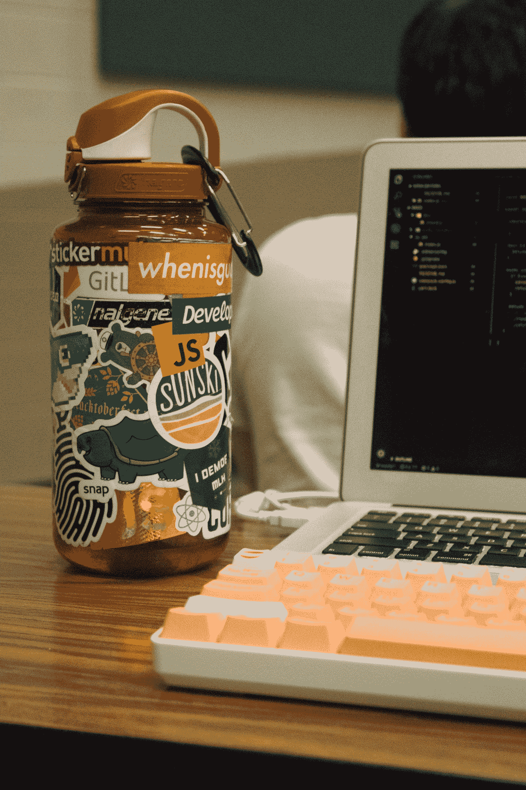

# 用 JEST 在 2 分钟内用 Javascript 设置测试驱动开发(TDD)环境

> 原文：<https://medium.com/swlh/setting-up-test-driven-development-tdd-environment-in-javascript-with-jest-in-2-minutes-c08b0290d2d2>

## 这篇文章快速解释了如何开始使用 TDD，以及如何设置用 JavaScript 编写 dojo 和 kata 的环境

Photo by Paul Esch-Laurent on Unsplash

如今，试驾开发越来越受欢迎。它有自己的理由。我…