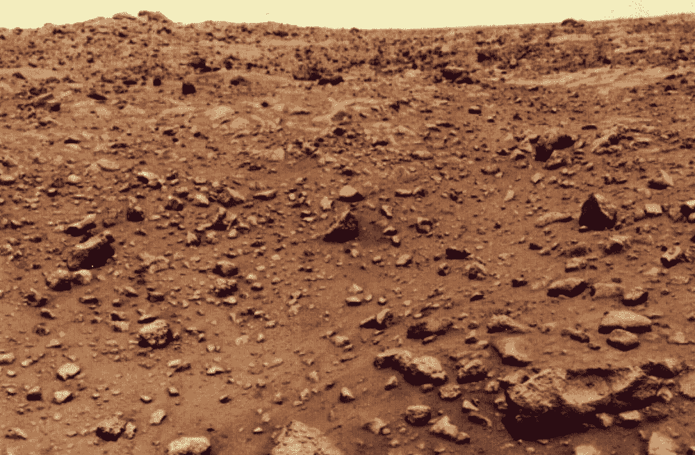
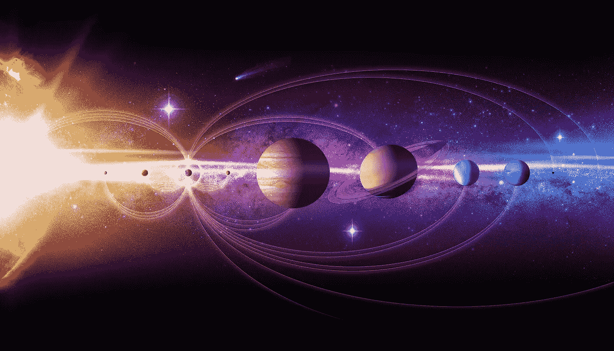
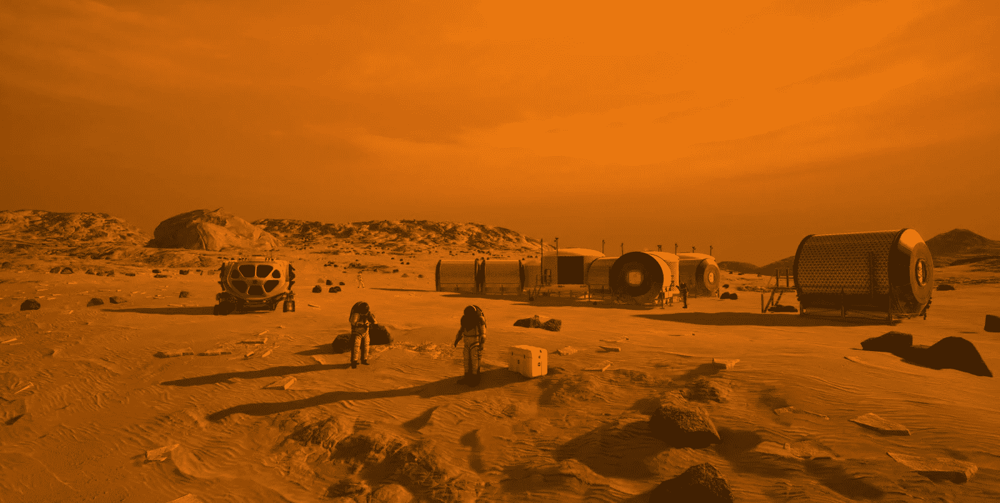
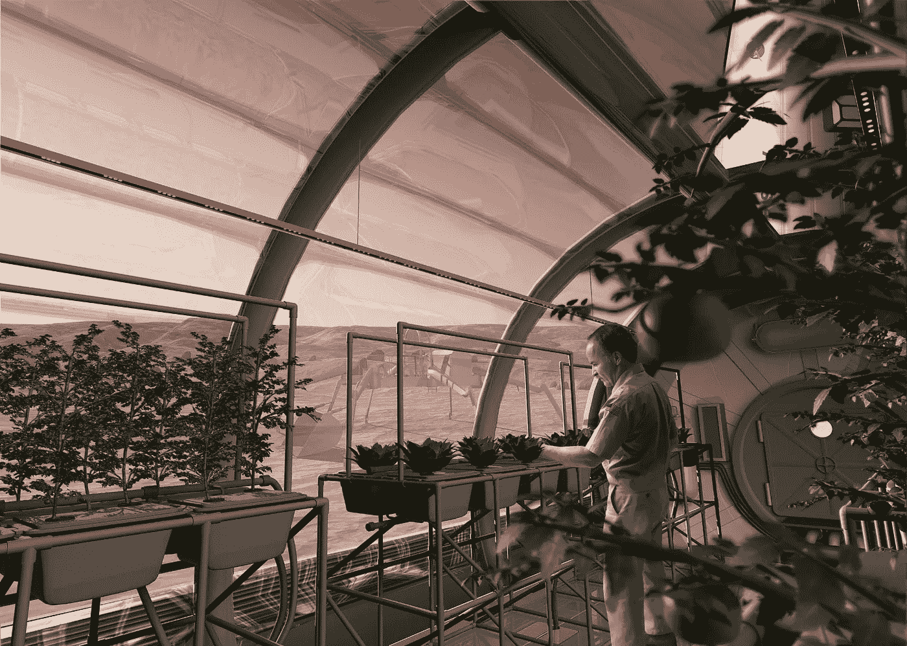
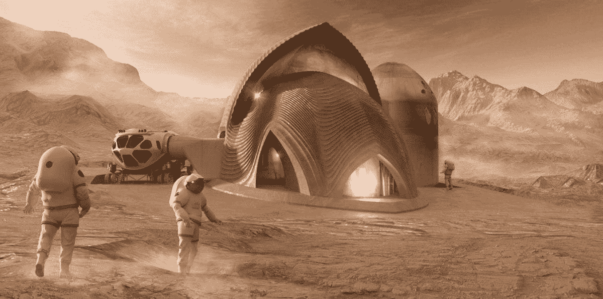
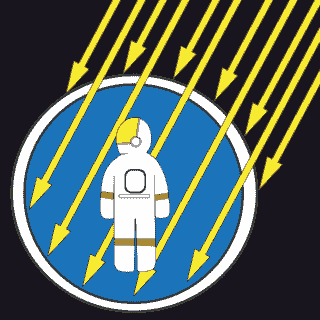

# 定居火星(在安迪·威尔的帮助下)

> 原文：<https://medium.com/swlh/settling-mars-with-a-little-help-from-andy-weir-6d131d580d1d>

NASA: The Planet Mars

> 火星像其他星球一样吸引着人类的想象力。凭借一种比重力更强大的力量，它吸引了人们的目光，让人们注意到清澈夜空中闪烁的红光。"
> 
> 约翰·诺贝尔·威尔福德，火星在召唤

在有记载的历史中，火星的红色幽灵引起了人们的兴趣。马尔斯是罗马战神，在罗马众神中仅次于朱庇特。1877 年，意大利天文学家乔范尼·夏帕雷利认为他在火星表面看到了一系列直线。他称这些为“canali”。对此的真正翻译应该是“渠道”。然而，许多人将此解释为运河，这种解释一直存在——直到我们有了更好的望远镜。

21st July 1976: The first colour photograph taken on the surface of the planet Mars, by the Viking 1 probe. (Photo by MPI/Getty Images)

直到 1976 年的海盗任务，火星表面的第一张真实照片才变得可用。显而易见，火星寒冷、干燥，几乎没有空气。

尽管火星表面上充满敌意，但人们对在那里建立永久的人类存在还是很感兴趣的。在某些情况下，这被视为人类的命运——也是我们好奇的探险家文明合乎逻辑的下一步。其他人认为火星是抵御灭绝级别事件的保险，灭绝级别事件会杀死地球上的所有生命。无论动机如何，将人类送上火星将是困难和危险的。

安迪·威尔的书《火星人》以及由该书改编的电影重新点燃了人们对载人火星探索的热情。埃隆·马斯克说，我们很快就能买到去火星旅行的座位了。在签约之前，我会等着看它是如何运作的。我为什么这么说？去火星真的很难。一旦到了那里，生存就更难了。

为什么这么难？

《火星人》最酷的一点是它对工程和科学的真实性。作者很好地描述了火星探险者将面临的许多挑战。安迪·威尔用宇航员马克·瓦特尼尖刻讽刺的幽默有效地服务了物理学、化学和工程学。

所以，我要请马克·瓦特尼帮我解释一下我们在殖民火星时将会面临的一些困难。

**火星真的很远！**

ASA/Jenny Mottar

当地球和火星围绕太阳运行时，它们之间的距离不断变化。近代史上最接近的一次是在 2003 年，当时它们相距约 3500 万英里。在最远的地方，地球和火星相隔 2.5 亿英里。

时机就是一切。大约每两年，火星和地球达到一个最小距离，使得行星之间的旅行更容易管理。

然而，使用传统的化学推进，航行可能需要近一年时间，假设我们在火星最接近时离开地球，这取决于有多少燃料可用。如果我们计划返回地球，我们需要等到火星和地球重新对齐。人类的火星任务可能需要 3 年时间！

**去火星会很危险！**

> “太空是危险的。这就是我们在这里做的。如果你想一直稳扎稳打，那就去保险公司吧。”
> ― **安迪·威尔，** [**玛蒂亚**](https://www.goodreads.com/work/quotes/21825181) **n**

NASA: First people on Mars

为了在火星上建立一个殖民地，任务规划者和工程师需要想出如何解决一些基本问题。水、空气、食物和住所是重中之重。然而，电源也很重要，因为所有这些都依赖于可靠的电源。他们还必须想出如何应对一些重大风险。

**水和空气**

> 火星上没有很多水。两极有冰，但它们太远了。如果我想要水，我就得从头开始做。幸运的是，我知道配方:取氢。补充氧气。燃烧。”
> ― **安迪·威尔、** [**火星人**](https://www.goodreads.com/work/quotes/21825181)

水是生命的关键。有了可靠的水源，就有可能灌溉花园，生产可呼吸的空气，甚至制造氢气和氧气推进剂，以便殖民者在需要时可以返回地球——但从地球上获取我们的殖民者所需的水是不可行的。因此，为了维持一个永久的殖民地，有必要使用当地的水源。幸运的是，火星上有大量的水。).不幸的是，这并不容易。众所周知，水冰在两极和陨石坑中形成。地下有水，火星土壤中也有微量的水。

马克·瓦特尼无法去火星的两极，也没有靠近冰坑，也找不到冰的地下沉积物。他被迫用现有的化学推进剂制造水。这是一堂很棒的化学课，但绝对不是在家尝试的实验。而携带推进剂去火星制造水，比试图携带水本身还要糟糕。

在已知水源附近建立我们的殖民地是最好的解决方案。在国家地理系列《火星》中，殖民者发现了一个满是冰的洞穴。虽然这将是一个了不起的发现，但计划在着陆后不久就找到这样的宝藏可能是不明智的。现有技术可以从土壤中提取水分，从稀薄的二氧化碳大气中提取氧气。提高这些过程的可靠性对人类在火星定居至关重要。

因此，确保我们在火星上的殖民地有足够的水和空气的三大法宝是:1)尽量把殖民地建在冰源附近，2)从土壤中提取水，3)从大气和当地水中提取氧气。如果我们想让我们的殖民地成功，我们需要追求这三个目标。当你命悬一线时，冗余是一个巨大的信心建立者。

**食物**

> "..我说过我讨厌土豆吗？因为，上帝啊，我讨厌土豆。如果我回到地球，我会在澳大利亚西部买一栋漂亮的小房子。因为西澳大利亚与爱达荷州在地球的另一边。”
> ― **安迪·威尔，** [**火星人**](https://www.goodreads.com/work/quotes/21825181)

NASA: Mars agriculture

让人们在火星上健康地活着需要多样化的饮食。为了生产所需的各种营养和维生素，我们的殖民地将不得不建立一个大型和各种各样的植物园。

这将是一项艰巨的任务，因为没有办法确切地证明地球植物在火星土壤中生长得如何。而且给殖民者送去成吨的泥土也不是很实际(那是多余的吗？)….好消息是，研究人员根据他们对火星土壤化学的了解持乐观态度。更好的是，人们认为啤酒花在火星的土壤中会生长得很好。).建立当地啤酒供应将是殖民者幸福和满足的关键。

除了种子、水、光和土壤改良剂之外，建立大规模的农业生产还需要时间、实验和设备。为殖民者提供多样化的饮食对保持精神和情感健康至关重要。

这个殖民地最初将不得不依赖来自地球的供应，但如果要持续下去，就必须在扩大食物供应方面取得稳步进展。

**避难所**

> “问题是(请跟我来，这里的科学相当复杂)，如果我在 Hab 上切一个洞，空气就不会再留在里面了。”
> ― **安迪·威尔，** [**火星人**](https://www.goodreads.com/work/quotes/21825181)

NASA: Mars habitat Built from local materials

为我们的殖民者建造一个居住的地方意味着与包括非常低的大气压力、几乎没有氧气、极度寒冷、低压和高辐射在内的地表条件进行斗争。

从地球上带来可充气的住所是可行的，但是这些不能提供长期生活所需的耐久性和辐射防护。

更进一步说，每一磅用来运送栖息地材料到火星的东西，都是一磅不能用来运送其他东西的东西。考虑到运送到火星的每磅材料的成本可能高达数十万美元——如果不是更多的话。把能就地制造的东西拿走，没什么意义。

栖息地可以放置在地下，例如已知存在于火星上的熔岩管中，或者放置在地面上并用火星风化层(土壤)覆盖，以保护殖民者免受辐射。科学家和建筑师正在努力了解如何利用原位材料结合从地球上带来的材料，以及 3D 打印等建筑技术。甚至有人认为，添加一些地球填料，火星砖可以用来建造房屋。

另一个挑战是提前选择合适的定居地点，因为一旦到达地面，殖民者将无法轻松地重新安置他们的行动基地。确定一个接近冰、建筑材料和保护栖息地所需的地质特征的地点将是一个挑战，并推动了寻找合适地点的先遣任务的需求。

**辐射**

> “由于没有磁场，火星无法抵御强烈的太阳辐射。如果我接触它，我会得很多癌症，癌症会有癌症。”
> ― **安迪·威尔，** [**火星人**](https://www.goodreads.com/work/quotes/21825181)

NASA: Space Radiation Risks

在低地球轨道之外，我们的殖民者将面临辐射疾病的巨大风险，以及中枢神经系统损伤、癌症和变性疾病的终生风险增加。

殖民者在火星表面看到的辐射也将比地球上的高得多。

为了更好地量化辐射环境，需要进行预先的任务和研究，但很明显，为了防止殖民者患重病和早逝，可能需要在往返火星期间进行屏蔽，以及屏蔽火星栖息地和限制地面旅行。

一些远见者预见到火星会形成陆地，这样人类就可以在没有压力服的情况下生活在外面。然而，火星缺乏像地球上那样的磁场，所以辐射防护将永远是一个问题——即使我们可以启动火星大气层。

**设备故障**

> “如果氧合器坏了，我会窒息的。如果水回收器坏了，我会渴死的。如果 Hab 破裂，我会爆炸的。如果这些事情都没有发生，我最终会耗尽食物，饿死。所以是的。我完蛋了。”
> ― **安迪·威尔，** [**火星人**](https://www.goodreads.com/work/quotes/21825181)

在火星上保持运转将会很困难。电子学不喜欢太空辐射环境。他们也不喜欢极端温度或真空。对他们来说，在上升到地球轨道和登陆火星的过程中所经历的颠簸也不是什么美妙的事情。

今天，我们在密封盒中使用特殊的空间额定部件。当一个盒子出现故障时，我们会更换它。对于火星殖民地来说，这不是最好的方法。我们带不了足够的替换盒子，如果我们的殖民者缺少备用的话，回到地球还有很长的路要走。

更糟糕的是，一些人建议我们在探险者之前向火星发送设备、电力系统、栖息地和供应品，这样他们就不必随身携带所有东西。这个想法是，一旦一切都在地面上，我们验证它是工作的——将宇航员送上一个更小的航天器将是安全的。这意味着硬件将不得不无故障地运行数年——甚至可能在殖民者到来之前的几年。

我们的火星殖民地需要更简单、可修复、冗余和坚固的设备，而不是尖端技术。但似乎很明显，随着殖民地建设基础设施，采购当地材料，并建立一个大型和多样化的生产基地来生产自己的设备和备件，在很长一段时间内将需要来自地球的再供应。

**安全着陆**

> “……工程师们通常将登陆火星描述为“7 分钟的恐怖”。" "
> 
> 登陆火星依然艰难，太空中的黛博拉·伯德| 2018 年 11 月 25 日

在我们把大量的人送上火星之前，另一个需要解决的重要问题是进入、下降和着陆(EDL)。稀薄的大气层使得我们的殖民者和他们的补给很难在地表着陆。我们知道如何像地球一样在稠密的大气层中着陆，或者像月球一样在真空中着陆。火星有足够的大气使这比任何一个都更困难。

迄今为止，我们的经验是使用小得多的航天器。弄清楚如何让我们更大的航天器安全着陆将是一个挑战。需要先进的任务来展示这些技术。

**下一步**

想去火星的人并不缺乏。美国国家航空航天局当然想发送载人任务，但鉴于美国国家航空航天局的项目和政治工作的方式，这可能是几十年和数百亿美元的未来。

火星一号计划计划在 2020 年向火星派遣殖民志愿者，以建立一个永久的殖民地——但在今年早些时候破产了。

埃隆·马斯克承诺人类将在 21 世纪 20 年代中期登陆火星，随后进行殖民。SpaceX 正在开发一种大容量火箭，打算用于火星计划。然而，正如我上面所阐述的，如果我们想要殖民火星，除了建造火箭把人送到那里，还有很多事情要做。

政治家和公民都很难支持的行星探索是，为了“正确”地完成它，你需要花两倍的钱。然而，如果你这样做了，你将获得 10 倍的任务成功率，并且降低 10 倍的死亡几率。我编造了这些数字，但是我自己在 NASA 项目中超过 35 年的经验告诉我，这基本上是真实的。按照传统的方式，直接把人送到那里，我不会对 20%或更高的灾难和死亡概率感到惊讶。

**技术演示和调查任务**

> “搭过野营帐篷吗？从里面？穿着一套盔甲？真是让人头疼。”
> ― **安迪·威尔，** [**火星人**](https://www.goodreads.com/work/quotes/21825181)

事实上，我们想在火星上做的任何事情都比在地球上要困难得多。在我们把我们的殖民者送到那里之前，我们需要采取措施找出如何高效和有效地做事。

**回到月球**

利用月球作为火星任务技术的测试平台可以显著降低直接前往那里的风险。虽然月球不是一个相同的环境，但支持火星殖民者所需的许多技术都可以测试。在月球表面生产水、氢和氧也将减少用昂贵的一次性火箭从地球陡峭的重力井里运送这些物质的需要。

**继续发送机器人，并执行短期人类任务**

机器人任务和短期人类探索可以用来填补我们信息的空白，找到一个永久定居的好地方，并开始为一个殖民地建立基础设施，包括储存火星产生的水。

这里的关键是有一个合乎逻辑的活动，而不是一个成功的(或灾难性的)事件。

**改进的推进力**

NASA 和 SpaceX 今天使用的推进技术与阿波罗使用的技术基本相同。核能热推进系统，如 NERVA 计划(几十年前演示过)，可以将推进效率提高三倍，并将旅行时间缩短一半。这意味着更少的体积和质量专门用于到达那里，以及在计划任务时更大的灵活性。

**改进的子系统**

应该进行研究来发展目前的航天系统，用于航空电子设备、生命保障、热控制、动力和其他方面，以便我们有更坚固、可靠和可修复的系统。同样，在月球上测试这些将增加信心和可靠性。

**建造星际后勤基地**

虽然月球可以成为星际探索的后勤基地，但也有人建议我们使用火星的卫星火卫一作为后勤基地。

火卫一是一个 7 英里宽的不规则形状的天体，据信含有大量的冰。火卫一可以作为来往于火星的宇宙飞船的加油站。它还可以作为一个基地，使用不必设计为登陆火星的转运船来储存物资。

**分摊费用**

在政府、商业和私人投资者之间分担费用正变得越来越普遍——国际任务合作也是如此。然而，这些努力经常陷入政治困境，需要更长的时间和更高的成本才能完成。我们需要打破政治密码，这样这样的冒险才能有效。毫无疑问，合作可能是一个巨大的力量倍增器，使火星殖民地的发生。

**不同种类的殖民者**

为了成功，我们的殖民地需要更少的飞行员，更多的植物学家、工程师、医生和化学家。自阿波罗时代以来，今天的宇航员核心已有所发展，但仍由飞行员主导。我们需要我们的殖民者有一点麦盖弗在他们身上，这样他们就能适应，并且用更少的东西来凑合。

所以让我们去火星吧！但是让我们用正确的方式，给我们的殖民者一个战斗的机会。