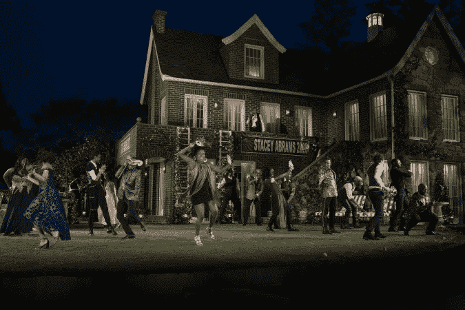

# 公园里的莎士比亚被一首全黑的《无事生非》惊醒

> 原文：<https://medium.com/swlh/shakespeare-in-the-park-gets-woke-with-an-all-black-much-ado-about-nothing-a9935d786632>

导演肯尼·莱昂(Kenny Leon)将莎士比亚设定在亚特兰大公园的“无事生非”中，他对这部经典喜剧的版本关注的是一个全是黑人的社区，从琐碎到政治都有问题。他的《无事生非》不同于这部经常上演的戏剧的其他主要作品。虽然所有的黑色投…