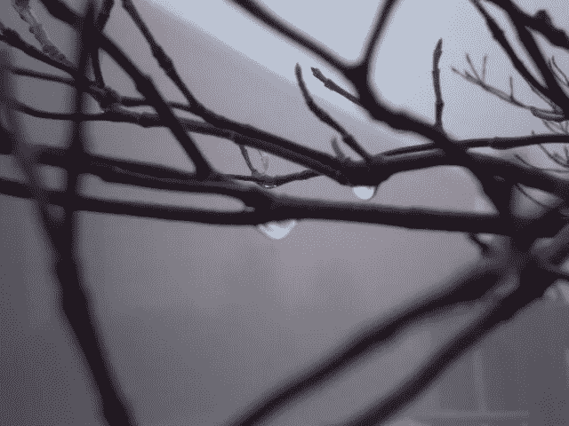

# 分担痛苦作为改变的途径

> 原文：<https://medium.com/swlh/shared-suffering-as-a-path-to-change-4e3e4e9b0f1f>

几周前，我所在的城市连续下了几天雨。我们经历了短暂的阳光，但雨断断续续持续了几个星期，没有减弱。我很喜欢。我喜欢下雨带来的宁静。我喜欢大自然迫使以自我为中心、膨胀的人类认识到我们对任何事情的控制是多么的少。

作为一种向外聚焦的文化，我们是如此不愿意向内转向。无论是字面上的还是隐喻上的，被风暴推入内心对我们来说是件好事，提醒我们自己的渺小和我们伟大存在的和平潜流。如果我们愿意顺应自然对我们的限制，而不是宣称自己与众不同，努力追求不朽，与自然世界的所有其他组成部分分开，我们的生活可能会更加和谐。

最近，我一直在平静地面对这个世界法则中固有的损失和死亡的现实。这可能是我过去一年经历的失败的逻辑结果。似乎在我们成年后，我们会抛弃青少年时期那种不可战胜的幻想，不可避免地面对现实，即我们实际上是有限的生物，损失和痛苦就像成长、新鲜和阳光一样是生活的有机组成部分。

我记得上周，在从一个朋友那里听说我们的城市最近发生了两起悲惨的死亡事件后，我问我的父亲，这个星球上的情况是否正在变得越来越糟，或者说，我对痛苦事件的意识是否只是随着年龄的增长而增加。他确认是后者。当我问他是否会变得更容易，我们是否会更少地感受到悲剧的刺痛时，他毫不犹豫地回答说:“不会。”

过去几周的大雨并没有让我完全呆在室内。即使在倾盆大雨中，我仍然会花时间在我们房子后面的小池塘周围散步，并且我有特权在那里观察几个加拿大鹅的家庭。它们孵出小鹅，在附近毛茸茸、软绵绵地蹒跚学步，每天花几个小时在池塘边吃草，在布满雨水的水面上戏水。

一天早上，一场比前几天更温和的雨使空气和小池塘变得刺眼，我和爸爸再次沿着池塘的堤岸观察了孵化的幼体和它们的父母——总共大约八只幼体和六只父母。在我看来，他们似乎在大多数人习惯性回避的雨中找到了极大的乐趣。

仅仅一个小时前，我们站在甲板的边缘，望着池塘，沮丧，因为我们只能发现一对夫妇的父母，在那一刻，响起了紧急警报，原因是我们还不知道。我们猜测其他人去了哪里。他们都还好吗？这是那对前几天只生了一只小鹅的夫妇吗？他们唯一的小家伙陷入了厄运吗？这种想法的失落感点燃了我大脑中的神经通路，我感觉到了我身体里的结果，一股悲痛和悲伤的浪潮。

突然，从我们门廊边的灌木丛中走出来一只看起来脏兮兮的狐狸。他的轨迹看起来很坚定——穿过后院，走向鹅群。然后，我们知道了观察鹅警告背后的意图。一只食肉动物在他们中间。

我们周围的雨下得更大了，我爸爸回到屋里，留下我看着狐狸绕着池塘跑到另一边。突然，好像害怕他看到的东西，他转身迅速向相反的方向逃跑，远离池塘和鹅。鹅很安全，我感到一阵轻松。

然而，这只可怜的狐狸看起来很憔悴，虚弱，他小小的身体周围挂着一簇簇支离破碎的皮毛。他一定感到困惑，我想知道他周围的环境——分隔墙另一边的繁忙交通、四面八方的房屋、淹没了宁静的城市喧嚣——该负多少责任。他可能饿坏了。

我又一次感到悲伤涌上心头，这一次是因为狐狸和它明显消瘦的状态。

我在九型人格图上是 7 分，这意味着当痛苦出现时，我特别擅长避免痛苦。与我习惯的逃避方法不一致的是，过去几年我生活中的事件——失败的关系、失业、失去家庭和生活计划——迫使我安静地坐着，面对痛苦，即使我身心的一切都在恳求我逃离它。

所以就在这一天，我对狐狸的观察和小鹅死亡的可能性引起了我内心古老的、未得到满足的悲伤。这一次，我没有逃避它，也没有用一些分心的事情来麻痹它，而是将那种痛苦藏在我的身体里。悲伤的泪水从我的眼中奔涌而出，我一直坚持着，直到我感到自己打开了更大的同情和爱。

很多时候，当我们停留在困难的情绪中，而不是掩饰或压抑它们，空间是为了展现更大的智慧。在那一刻，我沉浸在对鹅和狐狸的悲伤中，我想到(尽管这可能与美国西部人的情感相悖)，也许小鹅死了去喂狐狸或者狐狸死了本身并不是“坏”事情。生命为了延续而消耗生命，这是一切存在的事实。

我听到 Brie Stoner 最近在“万物的另一个名字”播客中说，我们人类期望生活没有痛苦是多么奇怪。她提到了做母亲和生孩子的痛苦。在创造任何事物的过程中——不仅仅是人类的孩子——都会有一种形式的压力、改变和毁灭，伴随着另一种形式的出现，并且经常(如果不是总是)会有某种不适或痛苦。

总是有一种生命形式的消耗朝向另一种生命形式的建立。这适用于所有的东西——植物、动物、矿物和精神。然而，我们人类如此害怕变化带来的痛苦，以至于我们经常完全避免可能是我们最精致的转变。有时，在恐惧中，我们甚至会剥夺他人的这种特权。

从门廊上的了望点，我回到房子里继续写作，暂时忘记了那些鹅，直到大约一个小时后，爸爸从窗口宣布那些家庭回来了。我们数了数，发现每个人都在——狐狸今天没有在他们中间做午餐。如果他有，那不是很好吗？毕竟，生命永远不会结束，只会改变。

我们只是人类。以我们的有限，我们无法理解整个地球生态系统的平衡。当然，我们的干预造成的不公正(不平衡)需要得到纠正。在生命的轮回中有固有的痛苦，但也有因我们的无知而造成的痛苦和折磨。

我想知道所有这些问题的答案是否不是尽我们最大的努力去抓住已经存在的痛苦，不管它来自何方，并等待智慧的出现，看看我们的物种如何建设性地与我们受伤的星球一起前进。拥抱彼此的痛苦，并倾听下一步该做什么，让爱和同情从痛苦中涌现出来。如果我们为自己和地球上所有其他生命形式的不适腾出空间，我们是否有可能在自己体内创造出承受新世界诞生的创造性收缩的能力？

也许，假设狐狸和鹅的生命周期可以教会我们一些如何应对一个苦难和垂死的星球是一种延伸。然而，不言而喻的是，我们停下来、观察和倾听得越多，我们越是走进呈现在我们面前的生活，我们就越能理解它的全部。就我而言，我相信正是通过我们与一切万有共同的痛苦经历，我们才能找到我们所寻求的答案。