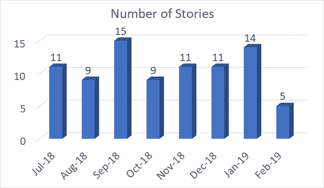
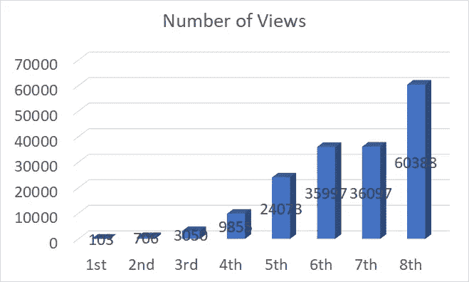

# 分享:每月 100 至 60000 次浏览

> 原文：<https://medium.com/swlh/sharing-from-100-to-60000-views-per-month-e4569518aced>

## 一个关于深度学习的科技博客

**Photo from David Klein, Unplashed**

> 现在，每月的最大浏览量已经达到了 15 万次！
> 
> 假设每月有 30 天，每天我得到 5000 次浏览。对于每一分钟，我将有超过 3 个视图。感谢您访问我的媒体！！:)

# 为自己写作

在介质上写作之前，我实际上没有在介质上读过任何东西。当我开始学习深度学习时，我没有计划如何提高视图数量。我只是决定记录一些我学到的东西。这就是我开始写作的原因。我相信世界上还有其他人和我一样，也在研究深度学习。

我找了很多写作的平台。最后，我偶然选择了 Medium。

当然，我相信在写之前做一个更好的策划或者营销是更好的选择。但这不是我的主要目的。( [Sik-Ho Tsang](https://medium.com/u/aff72a0c1243?source=post_page-----e4569518aced--------------------------------) @ Medium)

# 继续写

**Number of Stories for Each Month**

当我开始写作的时候，地球上只有很少的人每天阅读我的故事。但是不用担心。只要坚持不懈地写作，你每天的阅读量会越来越多。

我每三天写一篇新的故事。(有时一周由于日常工作繁忙。)

一开始，我写了一些关于教程的文章，比如如何安装一个驱动程序，或者如何使用一个软件等等。现在主要是看完一篇论文后写一篇评论文章。这也给了我定期阅读论文的主动性，有助于我在深度学习中理解的越来越多。

# 缺点

我的母语不是英语，所以我的英语写作不好。你可能会发现我有很多**英语错误**或**不寻常的表达**。然而，有时候，你不能在发表文章前逐字检查。这会浪费很多不值得的时间。只要你表达了意思，那就已经足够了。

当然，**事实核查**在发布前是必不可少的。因为我写的文章每个人都可以看。

# 将文章提交发布

如果浏览量在增加，那么很可能是在正确的轨道上。有时，这些出版物的编辑会要求你成为他们的作者。(或者你可以直接问他们，申请。)

向出版社提交一个故事对曝光非常有帮助。这可以帮助增加大量的意见。

# 制图法

最好在每个故事中包含一些图形或数字。有些演示视频绝对有吸引力。它无疑可以丰富故事。事实上，当我的故事没有任何吸引人的图形时，我被编辑警告过，哈哈。

# 我没做过的事

有些人说，其中一个方法是尽可能多的追随一些人，以获得曝光率。因为他们中的一些人会跟着你回去。但是我不遵循这种方法。

有些人说故事的最佳长度应该在几分钟之内。不要太短也不要太长。但是有时候，我发现有些故事，虽然超过 10 分钟，但仍然有很多人观看。也许对于科技博客来说，这是一个不同的故事。

# 我最喜欢的三个故事

1.  [**GeForce GTX 1080 ti GPU NVIDIA 驱动安装在 Ubuntu 18.04**](/@sh.tsang/geforce-gtx-1080ti-gpu-nvidia-driver-installation-in-ubuntu-18-04-1d3407ecfd5e)
2.  [**在 Linux Ubuntu 18.04**](/@sh.tsang/partitioning-formatting-and-mounting-a-hard-drive-in-linux-ubuntu-18-04-324b7634d1e0) 中对硬盘进行分区、格式化和挂载
3.  [**Docker 教程 Ubuntu 18.04 中的 Nvidia-Docker 2.0 安装**](/@sh.tsang/docker-tutorial-5-nvidia-docker-2-0-installation-in-ubuntu-18-04-cb80f17cac65)

它们都是教程，浏览量持续增长，即使它们不是提交给任何出版物的故事。

在科技博客领域，我相信有很高的需求。只要坚持写，浏览量一定会上升。

# 每 30 天的浏览次数

**Number of Views Per Each of The 30 Days**

如你所见，浏览量在增加。(也许你认为它仍然很低，但它对我来说已经意味着很多了。)每分钟至少有一个观点对我来说是很鼓励的，lol。

我希望我能继续写作(至少在接下来的几个月)。当我写这个故事的时候，我发现还有其他关于媒体浏览量的文章。你也可以搜索它们。:)

## 这篇文章发表在 [The Startup](https://medium.com/swlh) 上，这是 Medium 最大的创业刊物，拥有+422，678 名读者。

## 在此订阅接收[我们的头条新闻](https://growthsupply.com/the-startup-newsletter/)。

