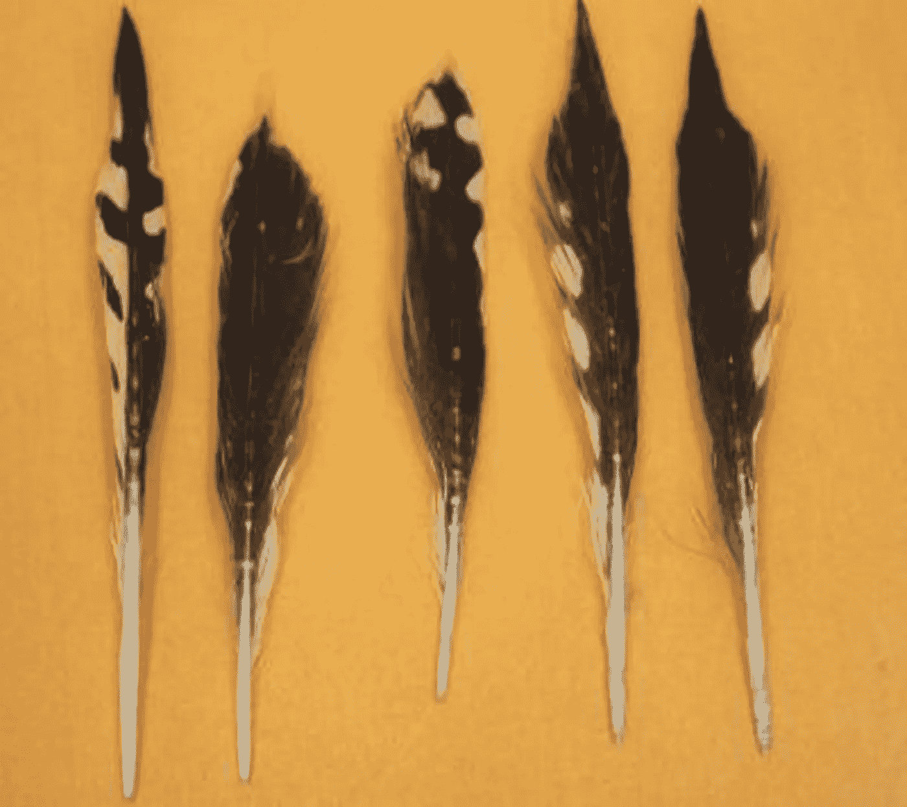

# 鲨鱼吃普通的后院鸟

> 原文：<https://medium.com/swlh/sharks-eat-common-backyard-birds-c911ae857039>

Songbird feathers found in the stomach of a baby tiger shark. Photo: Marcus Drymon

虎鲨是仅次于大白鲨的最大食肉鲨鱼，几乎什么都吃，从鱼到海豹、海蛇、海龟、金属、塑料，甚至是正在学习飞翔的信天翁。将常见的后院鸟类添加到列表中。

科学家们在墨西哥湾将 3 英尺长的年轻虎鲨抓进一艘船里，给它们洗胃。在这项研究中，没有鲨鱼受到伤害。但是…