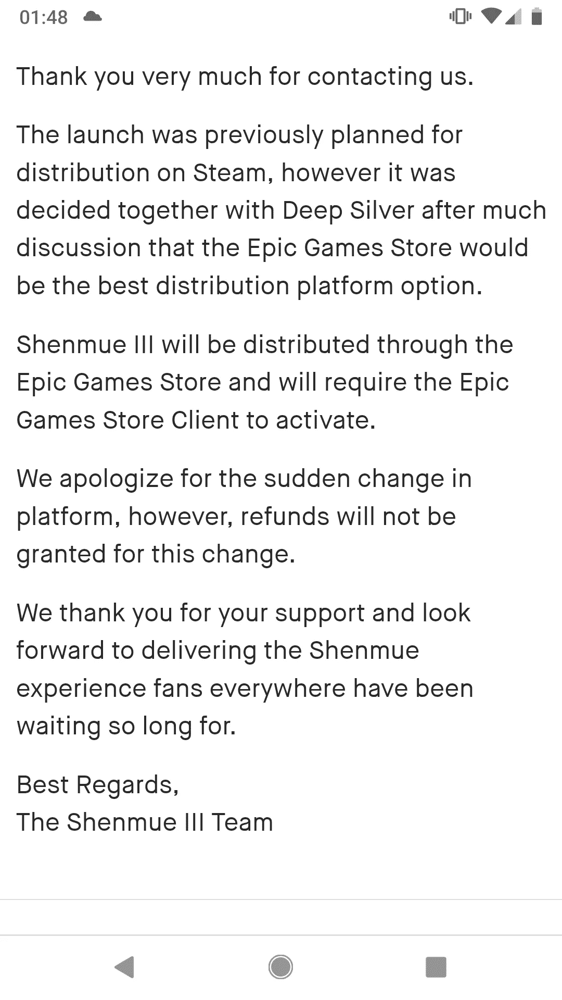

# 神木三将史诗独家导致社区骚动

> 原文：<https://medium.com/swlh/shenmue-iii-going-epic-exclusive-leads-to-community-uproar-d506ee1d386c>

备受期待的*神木三代*，由 YS 网开发，由 Deep Silver 发行，最近被证实为 Epic 商店独家发行，并将在[的 Steam 平台上再看一年](https://www.pcgamer.com/shenmue-3-is-a-1-year-epic-exclusive-publisher-looking-into-kickstarter-refunds/)，在 Epic 上发布后，预计 2020 年 11 月 19 日为那些希望在 Steam 上获得游戏的人提供 ETA。这一消息是在 2019 年 E3 PC 游戏展期间向公众公布的，后来在游戏的 [Kickstarter 页面](https://www.kickstarter.com/projects/ysnet/shenmue-3/posts/2532170)上被重复。这条新闻是在 Shenmue III 花了数年时间开发并通过其 Kickstarter 活动筹集了超过 630 万美元的资金后发布的，该活动使超过 69，000 人的游戏成为现实。

Kickstarter 页面内容如下:

"*我们很高兴地宣布，神木三代 PC 版将成为一款* [*史诗游戏*](https://www.epicgames.com/store/) *专卖店专属。神木三的开发一直在使用虚幻引擎向前推进，我们从 Epic 得到的支持非常好。但最重要的是，在寻找 PC 上最愉快的体验时，经过多次讨论后，我们与 Deep Silver 一起决定 Epic Games 商店将是最佳的分发平台选择。*

听到这个消息后，一些支持者对这个消息感到沮丧，因为当一个游戏宣布它将成为史诗独占时，这是很常见的，所以他们试图联系 YS 网，试图获得他们的 Kickstarter 承诺的退款。然而，他们得到的答复并不乐观，退款申请被拒绝。

当一些用户开始挖掘 Kickstarter 的规则集时，他们注意到 Shenmue III 可能违反了 Kickstarter 关于“可疑的创作者行为或承诺活动”的规则，因为该游戏从担任发行商的 Deep Silver 获得了额外的资金，也因为独家交易而与 Epic 交换了资金。

在接受《PC Gamer》采访时，Deep Silver 的一名代表在回应让这款游戏成为 Epic Store 独占游戏的决定时表示:

"*这将有助于莎木的发展，并确保它将成为未来十年中最好的莎木。*

我可以肯定地理解和同情 backer 的沮丧，因为整个发展突显出 Kickstarter 的钱更多地被用作一种有影响力的手段，试图进一步吸引出版商和其他股东加入游戏，再加上这些钱被用来影响 Epic 产生兴趣并进行额外投资，导致游戏现在成为一家商店的独家游戏，这家商店已经获得了非常反消费者的声誉， 这些人感到不安是可以理解的，因为这款游戏的 Kickstarter 页面是在一个像 Epic store 这样的想法已经成为现实的时代发布的，这意味着支持者不可能预料到这种转变。 在这些粉丝投入了所有这些投资之后，人们对转移到 Epic 商店感到不安，这是可以理解的，如果你想提出一个论点，说“如果是粉丝投资产品，他们为什么会在乎，他们会在任何地方跟随游戏”，仅仅因为你投资了一款游戏并不意味着你应该接受你不喜欢的东西， 因为你把钱投入到一个项目中并不意味着你被迫喜欢游戏中发生的一切，我觉得这些对成为史诗独占感到不满的人完全有权利要求退款并让它通过。

是的，Epic Store 对开发人员非常有利，我不会说“我不明白为什么开发人员接受这项交易”，因为我明白，但这是为了在项目背后获得尽可能多的资金，这不是一个真正的论点，许多人都愿意跳出来支持和捍卫。当然，开发者为什么去 Epic 商店是有道理的，因为他们的收入份额远高于 Steam，但这一举动会惹恼客户，这也是为什么开发者经常被嘲笑为跳到排他性，因为这反映了客户的优先事项，这就是优先事项不是客户或希望这款游戏成为现实的支持者。这对于像神木三这样的游戏来说更具破坏性，因为它的很多营销都是围绕粉丝的。“粉丝们想要！粉丝资助的！是球迷的游戏！”当企业前景以这种方式面对这种类型的游戏时，难怪它会给支持者一记耳光。

[推特](https://twitter.com/MellowOnline1)

[不和](https://discord.gg/RffzjeV)