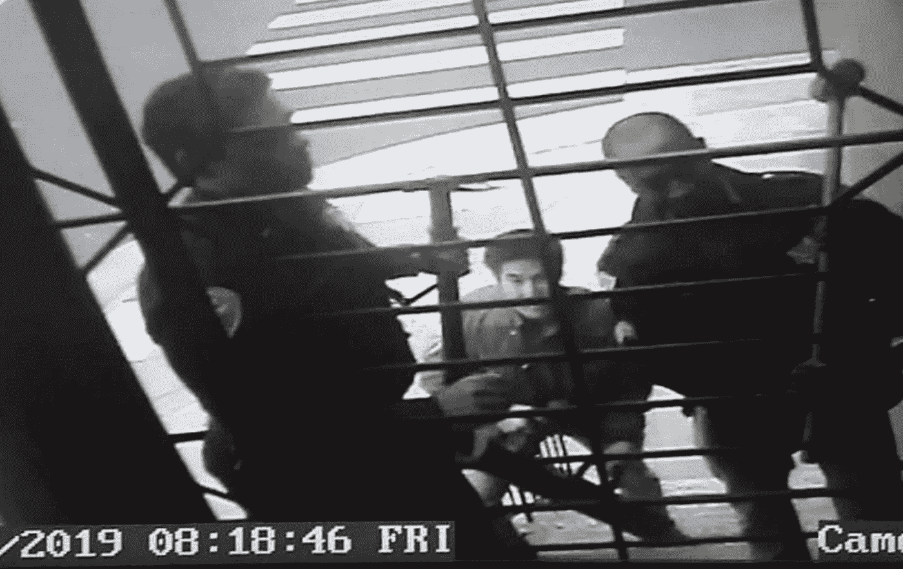

# 屏蔽法应该保护所有记者

> 原文：<https://medium.com/swlh/shield-law-should-protect-all-journalists-68c8b28e0ffe>

Security video image of San Francisco police serving a search warrant with with sledgehammers at the home of freelance journalist Bryan Carmody.

乔尔·p·恩加迪欧

杰夫·足立惨死的第二天早上，我接到了当地一位知名记者的电话。他们想知道我是否有任何可能得到警方报告的消息来源，这份报告描述了前一天晚上旧金山著名的公设辩护人死亡的现场。