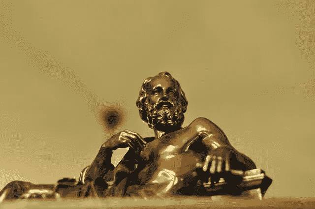

# 转变意识进化的范式

> 原文：<https://medium.com/swlh/shifting-the-paradigm-of-conscious-evolution-223190355989>

我浪费了整整一个工作日，看 YouTube 视频和阅读文章，为写另一篇关于意识的文章做准备。我学到了什么？视频世界里的每一个神经科学家、心理学家、瑜伽师和量子物理学家，都没有古希腊哲学家对我们的思想有更多的了解。

Bronze statue of Greek Philosopher — Source — Pixabay