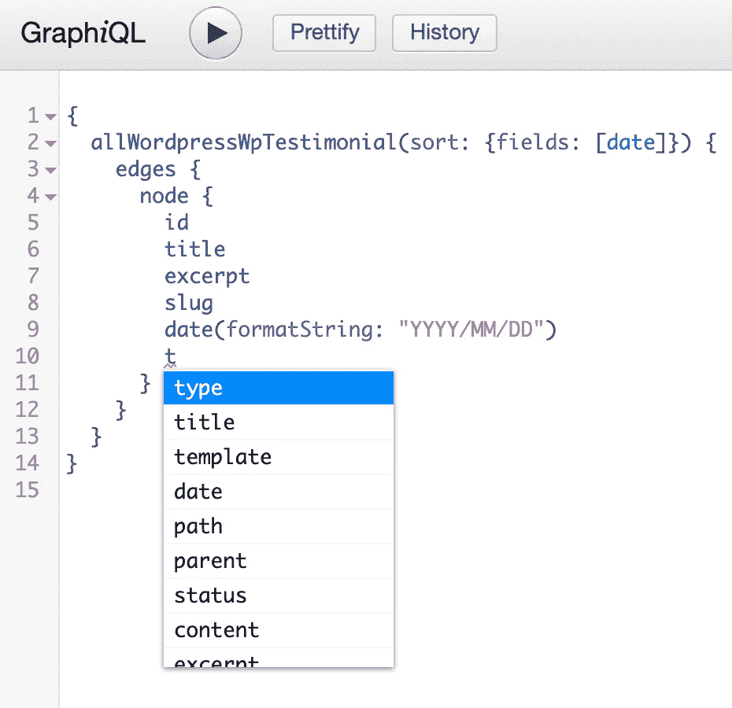
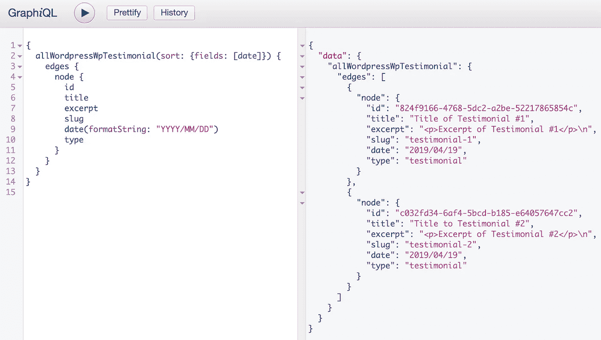

# GraphQL 简介

> 原文：<https://medium.com/swlh/short-intro-to-graphql-d00036bc8121>



GraphQL 是一种获取数据的方法，旨在通过使用 REST APIs 解决现代应用程序开发中的问题。从前端的角度来看，这就像发送一个对您想要接收的数据的查询，而不是要求预定义的实体。

## GraphQL 到底想解决什么？

GraphQL 的目的是能够查询您需要的数据。作为一个例子，让我们看看当代的应用程序设置，前端通常与后端分离，这可能导致密集的请求周期。多个前端也可能调用同一个后端。

为了获取数据，通常在 REST 之后获取数据，请求到达一个端点，并接收一个包含后端预先定义的数据的响应。这种数据的结构通常松散地基于前端的视图。视图需要一些相同的数据，然后它们可能还需要一些特定的数据。如果我们将一个端点与一个视图紧密地绑定在一起，我们就不能以有效的方式将该端点重用于其他目的。这通常以前端提取数据不足或过量而告终。我们可能会发出一个请求，并使用视图中的一些数据，然后我们发送另一个请求来获取剩余的数据，我们最终得到的数据比我们需要的多。这就是 GraphQL 试图解决的问题。

## GraphQL 查询

当用 GraphQL 获取数据时，我们定义我们需要的结构，它看起来像 JSON，但它只包含键，不包含值。

下面是一个使用 [Gatsby](https://www.gatsbyjs.org/) (Gatsby 是一个 your React 应用程序的框架)和 WordPress 的站点的例子，这是查询中使用的结构。

```
{
  allWordpressWpTestimonial(sort: {fields: [date]}) {
    edges {
      node {
        id
        title
        excerpt
        slug
        date(formatString: "YYYY/MM/DD")
        type
      }
    }
  }
}
```

以下是回应。

```
{
  "data": {
    "allWordpressWpTestimonial": {
      "edges": [
        {
          "node": {
            "id": "824f9166-4768-5dc2-a2be-52217865854c",
            "title": "Title to Testimonial #1",
            "excerpt": "<p>Excerpt of Testimonial #1</p>\n",
            "slug": "testimonial-1",
            "date": "2019/04/19",
            "type": "testimonial"
          }
        },
        {
          "node": {
            "id": "c032fd34-6af4-5bcd-b185-e64057647cc2",
            "title": "Title to Testimonial #2",
            "excerpt": "<p>Excerpt of Testimonial #2</p>\n",
            "slug": "testimonial-2",
            "date": "2019/04/19",
            "type": "testimonial"
          }
        }
      ]
    }
  }
}
```

而不是用 REST 向 WordPress REST API 发送一个请求，后者会用比需要更多的数据来响应。GraphQL 查询准确地接收到了所请求的数据。

与 REST API 相比，选择需要哪些数据是一件好事。在基于 REST 的 API 中，我通常用 Postman 发送一些请求，并查看响应来找出我需要什么。使用 GraphQL 还有其他工具，我在使用 Gatsby 时使用的一个工具是 Graph *i* QL，它可以让你测试一个查询，看看你得到什么。图 *i* QL 也有很好的智能感知能力来帮助你找到可用的钥匙。


当执行查询时，您会得到响应。



我所做的就是暂时在图*I*QL 中玩一会儿，直到我决定我需要什么。然后，我只需复制我创建的查询，并将其粘贴到 Gatsby 中包含的 graphql 方法中。

使用 GraphQL，您只需点击一个端点，该端点根据您的查询提供数据。要进行更有选择性的查询，可以使用过滤器，就像这样。

```
{
  allWordpressWpTestimonial**(filter: {slug:{eq: "testimonial-2"}})** {
    edges {
      node {
        id
        title
        excerpt
        slug
        date(formatString: "YYYY/MM/DD")
      }
    }
  }
}
```

该查询返回的推荐文章类型具有等于“推荐-2”的 slug。slug 嵌套在 node 属性中，假设我们必须查询嵌套更深一层的内容，我们可以重写过滤器，如下所示。

*附带说明:ACF 是高级定制字段的缩写，它是 WordPress 的一个插件，可以进一步增强你的数据*。

```
{
  allWordpressWpTestimonial**(filter: {acf:{grade: {eq: "2"}}})** {
    edges {
      node {
        id
        title
        excerpt
        slug
        date(formatString: "YYYY/MM/DD")        
        acf {
          grade
        }
      }
    }
  }
}
```

如果你想查询一个以上的文章类型，可以连接另一个查询，只要把它放在外面的括号里。

```
{
  allWordpressWpTestimonial {
    edges {
      node {
        id
      }
    }
  }
  allWordpressWpPortfolio {
    edges {
      node {
        id
      }
    }
  }
}
```

这个查询类似于向两个不同的端点发出两个 HTTP 请求。

如果我们想选择两个特定的证明，我们可以编写如下查询。为了避免名称冲突，我们需要使用一种叫做**别名的东西，**注意，推荐被重命名为`firstTestimonial`和`secondTestimonial`，否则，我们将会遇到名称冲突。

```
{
  **firstTestimonial**: allWordpressWpTestimonial(filter: {slug: {eq: "testimonial-1"}}) {
    edges {
      node {
        id
        slug
      }
    }
  }
  **secondTestimonial**: allWordpressWpTestimonial(filter: {slug: {eq: "testimonial-2"}}) {
    edges {
      node {
        id
        slug
      }
    }
  }
}
```

但是这一次我们重复我们自己，我们为每一个证明选择钥匙。为了解决这个问题，我们可以使用一个叫做**的片段**，看起来像这样。

```
{
  firstTestimonial: allWordpressWpTestimonial(filter: {slug: {eq: "testimonial-1"}}) {
    edges {
      node {
       **...testimonialDetails**
      }
    }
  }
  secondTestimonial: allWordpressWpTestimonial(filter: {slug: {eq: "testimonial-2"}}) {
    edges {
      node {
        **...testimonialDetails**
      }
    }
  }
}**fragment** testimonialDetails on wordpress__wp_testimonial {
  id
  slug
}
```

`wordpress__wp_testimonial`指奖状帖式。使用片段时，它看起来类似于 ECMAScript 中的 spread 操作符。

## 概括起来

GraphQL 是一种查询所需数据的方法。它解决了欠取和过取数据的问题。

有一些非常方便的工具来处理查询，我使用了 Graph *i* QL，它帮助我找到了我可以使用的键。这个数据结构看起来像一个“只有键的 JSON”。在 REST 中，使用 GraphQL 请求资源，基于查询请求数据。

为了避免名称冲突，我们可以使用别名来重命名项目。为了避免重复的键，我们可以使用片段。片段是一个模板，其中包含我们希望在查询中使用的键。

一个误解是，GraphQL 只适用于 React 和 JavaScript，但也有其他语言的实现，前端不必用 React 构建。