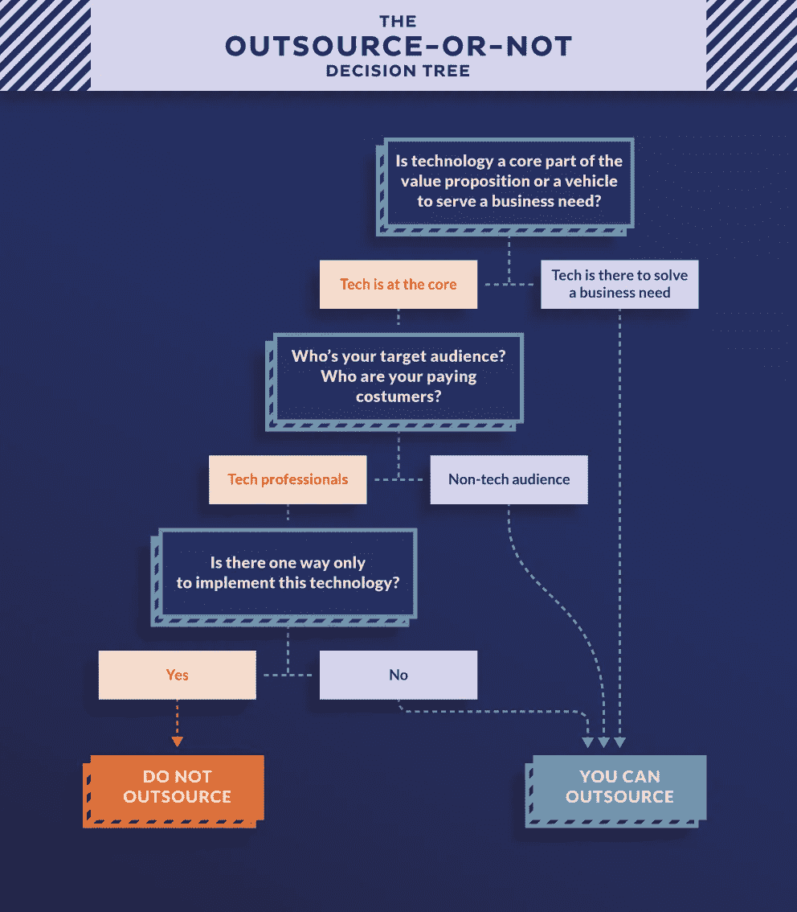
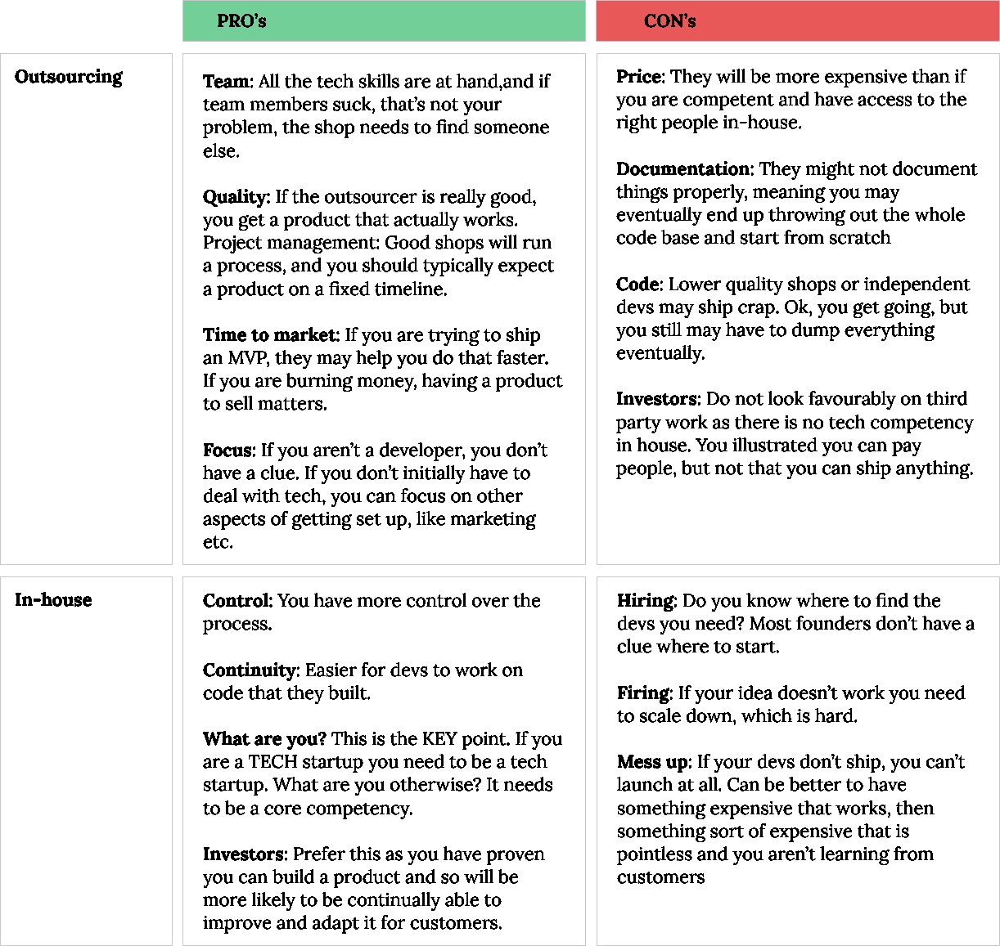

# 创业公司应该外包软件开发吗？

> 原文：<https://medium.com/swlh/should-a-startup-outsource-its-software-development-a125472efd6f>

这是一个决定创业成败的决定:你是投资内部资源来创造你的产品，还是外包给第三方开发者？一方面，作为创业公司，产品研发不应该是核心能力吗？另一方面，当然更好的方法是尽快进入市场，让“专家”帮助你到达那里，避免技术开发的所有陷阱？

**这两种方法各有利弊，决定绝非易事。答案取决于许多商业和文化因素，以及你想要构建的产品类型。然而，这是一个需要在创业初期就做出的决定，可能会让创始人陷入最佳方案的两难境地。**

**在** [**祭坛上。io**](https://altar.io) **我们与许多早期企业合作过，也为大型企业提供产品创新，我们学到了许多如何应对如此重大决策的经验。在这篇文章中——我们发布的关于外包和内部开发人员选择的系列文章的第一篇——我们提出了一种结构化的方法来帮助创始人决定哪种方法可能最适合他们的创业。**

# 外包决策树

正如生活中的所有重大决定一样，是否外包的答案需要你将一个复杂的问题分解成更简单的步骤:

## **步骤 1:技术是产品核心价值主张的一部分，还是解决业务需求的工具？”**

对于大多数创业公司来说，有两种可能的答案:

1.  技术是核心命题；或者
2.  技术是用来解决商业问题的手段

一般来说，如果你的企业属于(1)类，那么你更有可能在内部开发解决方案。如果是(2)，那么你的初创公司可以从外包开发中受益。

例如，考虑一下 [**Loopback**](https://loopback.io/) ，这是一个 Node.js 框架，开发人员只需很少或不需要编码就可以创建动态的端到端 REST APIs。在这里，技术几乎是唯一的命题，因此环回将归入(1)。与此形成对比的是 Airbnb ，它能让业主将他们的房子货币化，让游客在他们到访的城市有独特的体验。显然，AirBnB 的关键价值定位是面向业主和旅行者，这意味着这项业务属于(2)。

一般来说，属于第(2)类并且仅仅将技术作为解决业务问题的一种方式的企业应该考虑外包，原因我们将在后面讨论。

有时这种区别并不明显。考虑一下 [**GitHub**](https://github.com/) ，平台，供开发者托管和审查代码，管理项目和构建软件。虽然技术是核心主张，但平台本身是为开发者解决业务问题的。这造成了一个灰色区域，所以我们应该继续下一步。

## 第二步:你的目标受众/购买客户是谁？

一般来说，答案可以简单地概括为两者之一:

1.  我们的产品面向技术专家/开发人员；或者
2.  我们的产品面向消费者/商业客户

回到我们之前的例子，Loopback 和 GitHub 属于(1)，而 Airbnb 属于(2)。然而，这又会产生灰色区域，只能通过回答另一个问题来解决:

## **第三步:你的产品是否包含使其独一无二的技术“秘方”？**

这里，我们的意思是要么技术本身是你的创业公司专有的，要么它的实现方式是独一无二的。两个可能的答案是:

1.  有；或者
2.  不

这澄清了 GitHub 的“灰色区域”。该平台面向开发人员，但底层技术及其实现都不是独一无二或专有的，所以答案是(2)。这与 Loopback 形成对比，Loopback 属于(1)。

# 那么，我如何决定什么是适合我的业务？

如下面的决策树所示，在以下情况下，通常不建议外包软件开发:

*   该企业将技术作为其核心主张
*   最终消费者是技术人员；和
*   该技术在实现上要么是专有的，要么是独特的

在任何其他场景中，软件项目可以是内部构建的，也可以是外包的(或者可能是两者的组合)，这取决于您的意愿和可能影响您的业务案例的其他情况。

[Judy Robinett](https://twitter.com/judyrobinett) ，创业专家和畅销书作者*破解融资密码*笔记"*关键的决策点是围绕你需要多快进入市场和你的财务资源是什么。请记住，外包已经被许多非常成功的公司用来开发他们的 MVP，例如估值为 38 亿美元的 Slack，以 85 亿美元卖给微软的 Skype，以及 BaseCamp 和 Github* 。

但是，外包并不适合所有人，还有文化因素要考虑。Gadget Flow 首席执行官 Evan vars amis*表示，我个人更喜欢有一个内部团队来做项目，而不是为每个项目雇佣一个新的团队/开发人员。大多数自由职业者或外包团队关心的是项目的交付，不是项目的最佳版本，而是能带来下一笔付款的任何东西。他补充道:“(外包的)另一个问题是沟通。如果你有一个公司内部的人，很可能你们之间有化学反应，所以谈论项目和完成事情会更有效率。*

# 简而言之:外包的利弊

[初创公司导师、3 家初创公司“独角兽”的联合创始人 Alexander Jarvis](https://twitter.com/ADJBlog) 总结了外包和内部开发的主要优势和挑战:

# 那么，创业公司应该外包软件开发吗？

正如我们所看到的，决策树方法有助于澄清你的创业企业是否应该考虑外包开发。Insurtech 投资者、安盛种子工厂的创始人 Minh Q. Tran 将这个决定总结为:“*当技术对你的业务不重要时，外包出去。例如，如果你在众筹，那么你成功的关键将是在平台上获得项目并获得投资者，所以为什么不获得一个白色标签的解决方案来启动你的业务。他补充道:“(T10)当技术成为进入你企业的障碍时，情况就不同了。例如，在 regtech，您需要建立一个符合欧盟法规的 KYC 平台，这需要非常专业的资源，最好在内部部署。*

然而，即使外包是一个潜在的解决方案，这样做的决定将取决于许多业务和文化因素。如果外包是你要走的路，那么确保它是在正确的基础上。MediaTech Ventures 的创始人、全球创业孵化器 Founder Institute 的德克萨斯州主任 Paul O'Brien 对此提供了有用的见解:“*将需要完成的工作外包出去。不是需要做的原因，也不是需要做的事情的所有权；将技能和工作外包出去，就像你为任何工作雇佣最好的资源一样。对企业家来说，挑战在于认识到所建立的东西仍然需要成为你的知识产权。外包你的软件构建不应该以失去对你正在做的事情的理解、控制或所有权为代价。*

正如他们所说，选择权在你。但是，虽然从来没有任何保证，你采取的决定将是完全正确的，通过确保你在业务需求，文化适应，财政资源等方面的知情基础上采取它。意味着你成功的可能性更大。

## 顺便说一下，

我也是 10kStartup 的成员，这是一个由伦敦和里斯本的二次创业者组成的团队，致力于帮助创业者在 30 个日历日内以 1 万欧元的低预算建立他们简单的 MVP (UXUI + Dev)。所以，如果你有一个想付诸实施的绝妙想法，只要在 [**私信中给我写几行字，让我们一起聊天**](https://www.messenger.com/t/paolo.dotta.5) 。不管怎样，我都很乐意帮助你。

感谢阅读，
Paolo

如果你觉得这篇文章有用，谢谢鼓掌。

*随时提出疑问或问题，也可以提出批评💬尽管你喜欢，这是一个讨论的空间！*

# ***我们的下一篇博客:我如何找到适合我创业的软件开发外包商？…***

## 这篇文章发表在 [The Startup](https://medium.com/swlh) 上，这是 Medium 最大的创业刊物，拥有+434，678 名读者。

## 在这里订阅接收[我们的头条新闻](https://growthsupply.com/the-startup-newsletter/)。

