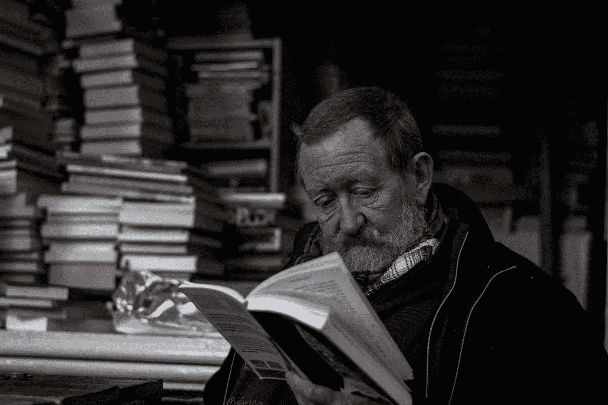

# 作家也应该是读者吗？

> 原文：<https://medium.com/swlh/should-a-writer-also-be-a-reader-3d90f0b9d34d>

## 这完全是关于视角的

Photo by [Jilbert Ebrahimi](https://unsplash.com/@jilburr?utm_source=unsplash&utm_medium=referral&utm_content=creditCopyText) on [Unsplash](https://unsplash.com/search/photos/read?utm_source=unsplash&utm_medium=referral&utm_content=creditCopyText)

许多人说写作技能更好地被描述为天赋而不是可转移的技能，然而我不敢苟同。写作本身是可以随着时间发展的，一个人成为作家的第一步应该是成为一个精读者。随着时间的推移，我们都形成了自己的写作风格，但是，看看…