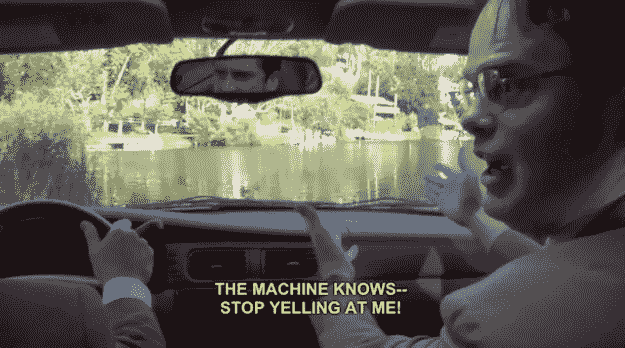

# 艺术家应该恐惧还是热爱 AI 还是两者兼而有之？

> 原文：<https://medium.com/swlh/should-artists-fear-or-love-ai-or-both-bad9869add04>

来自一位艺术爱好者的 8 个问题，探讨了人工智能对艺术的影响。

The screenshot is taken from Steemit: How ‘The Office’ changed comedy television forever.

# 学问

了解一门新学科的最好方法之一是提出问题。

人们对人工智能将对创意产业产生的影响感到兴奋和担忧。从积极的一面来看，许多艺术家和创意人员已经将人工智能作为一种…