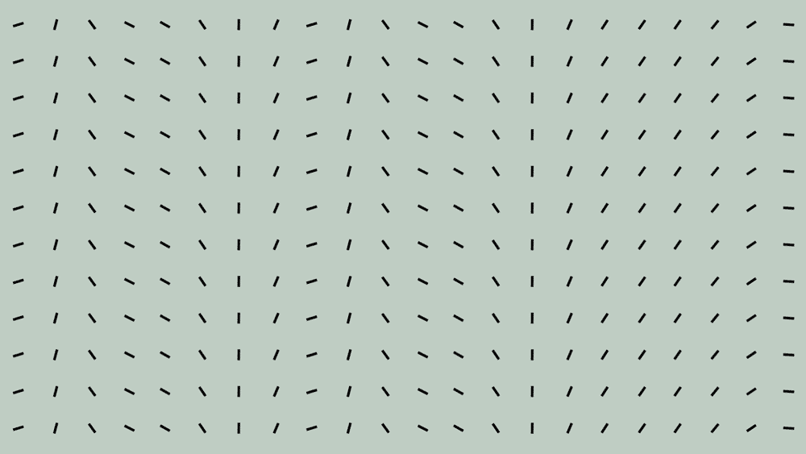
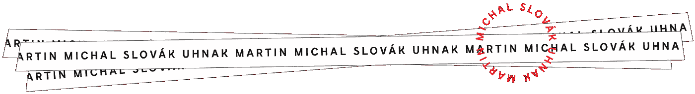

# 如果有效就应该很美吗？

> 原文：<https://medium.com/swlh/should-it-be-beautiful-if-it-works-f4541f83122d>

Source

## 论艺术性与实用性的平衡。

我最近和一个企业主讨论了一个设计竞赛。她主动提出合作设计一款将触及数千种产品的产品。

我们彼此不了解，所以我继续问她关于他们以前用过的设计的问题。她说，他们委托不同作者的一些设计，让他们的客户决定他们将生产的设计。

然后，她争辩说，一些更艺术的设计没有得到目标群体的认可。然而，他们还是生产了这些东西，因为他们想要一些漂亮的东西。没卖出去。

## 为什么美丽不起作用？

好的设计卖不出去就是坏的吗？设计是主观的吗？

可以的。这里的问题是如何管理所有的活动部分，并拿出一个我们引以为豪的结果，不仅因为它有销量。

美的主观性是一种廉价的辩护。批评设计很容易，因为就像写作一样，设计无处不在。但任何人都可以说‘我不喜欢’，这一事实为体验、工艺和新奇创造了空间。它必须符合目的*和*反对专业和外行的批评。

在制定战略的研究阶段，设计竞赛是一个很好的工具。对结果的决定成为品牌战略的一部分。结合其他决定，我们应该对我们是谁以及我们想说什么有一个很好的想法。谁，什么，为什么。这是关于故事，实质和信息。这是归零地。这是*的话*不是像素。

> *这里的问题是如何管理所有的活动部分，并拿出一个让我们感到自豪的结果，不仅因为它有销量。*

一个好的品牌战略是一个品牌工作室的完整的创意简报。当我们着手设计视觉形象时，几乎看不到它。

通常，我们抓住每一根可以抓住的稻草来创造一些意义和物质的感觉。很多时候，我们可以自由地创造故事，自由地想出一些东西，有时我们确实做到了。

它从来没有按照计划进行。在现实世界中，我们必须适应并做最好的工作。在努力创新的同时，做漂亮、受欢迎、有效的工作。

设计是商业艺术。商业和艺术并重。

> *“美丽的对立面不是丑陋，而是粗心大意。”*
> 
> 斯蒂芬·萨格梅斯特

设计是关于联系、情感和表现的。没有也不应该缺少其中一个。是的，很艰难。做有效、优雅和成功的工作是很难的。但相反的情况更糟。

## 相反就是懒。

一个专业的设计是正确的，看起来很好，对消费者说话，并传递目的。它感动人，创造变化。

就我的朋友而言，他们找到了适合客户的设计，卖得很好。尽管如此，他们对自己制作的东西并不满意。

她认为商业不能和艺术融合。

相反，设计是商业艺术。不是数据，不是焦点小组，不是故事或策略。这些因素与视觉吸引力、技术和工艺一样重要。

把它变得漂亮并不意味着把它变得古怪，不切实际或者莫名其妙。对我们来说，这意味着以正确的顺序和协作的方式，对过程中的每一步给予深思熟虑的关注。

我们只是*必须*让它变得美丽。

【martinuhnak.com】**这是我在* [*的博客上发表的。感谢阅读。*](https://martinuhnak.com/blog/)*

*如果你喜欢这篇文章，请点击这里* *加入我的圈子。我喜欢听取别人的意见，我会回复所有人。*

## 这篇文章发表在 [The Startup](https://medium.com/swlh) 上，这是 Medium 最大的创业刊物，拥有+445，678 读者。

## 在这里订阅接收[我们的头条新闻](https://growthsupply.com/the-startup-newsletter/)。

