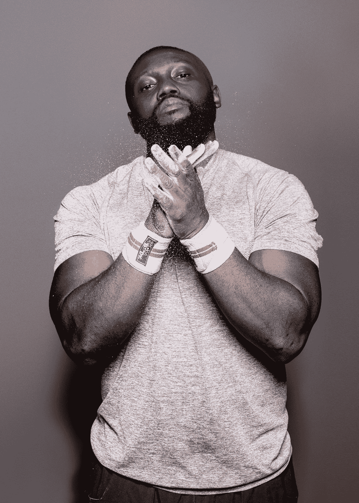

# 媒介应该有超级拍板的地位吗？

> 原文：<https://medium.com/swlh/should-medium-have-a-super-clapper-status-f6996ee9a8d1>

## 我说好，谁跟我来！

也许这是我的杰里·马奎尔时刻，我会在早上 6 点前删除这篇文章，或者，也许我可以发起一场革命。

[@mroz](https://unsplash.com/@mroz) Unsplash

我对每篇文章被限制在 50 次鼓掌非常恼火。我一直在看文章*，我想，我想给这篇文章打个 100 分。*