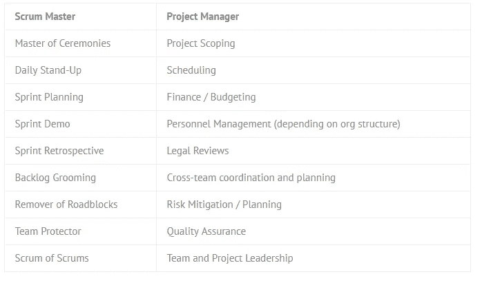
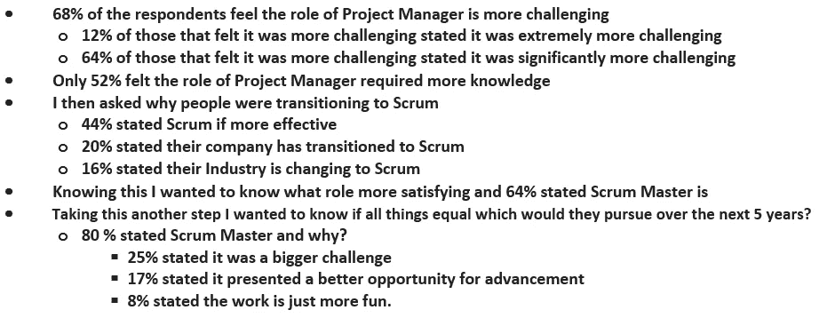

# 项目经理应该害怕敏捷吗？

> 原文：<https://medium.com/swlh/should-project-managers-fear-agile-ef275a26cc9e>

我在 2007 年正式进入软件世界。从那时起，我在许多不同的开发方法和系统中工作过:瀑布、Scrum-Fall、Scrum、看板和精益。将我的经历正式化，我从 2010 年开始持有 PMP 认证，2011 年和 2016 年分别持有认证 Scrum Master (CSM)和认证 Scrum 产品负责人。在那段时间里，我看到了软件的变化，但是更大的变化是越来越多的非软件业务向敏捷转变。

我目睹的与敏捷转型相关的最新和最具影响力的变化之一是，当公司匆忙采用敏捷时，他们的优秀项目经理变成了 Scrum 大师。理由是有了 Scrum，传统的项目经理角色不再需要了。

我甚至不确定在一个完全敏捷的公司里，这是否是 100%正确的。是的，如果你能够不受干扰地将完全敏捷的过程放入一个公司，项目经理的数量将会急剧下降。这种转变不会在一夜之间发生。我认为其中一个问题是敏捷不成熟的公司将 Scrum Master 视为等同于 PM 的 Scrum。

我认为这种逻辑存在重大缺陷，并建议企业不要做出这种主观臆断。如果这些趋势继续下去，我确实认为在业务的项目管理方面应该有一些担心。

为什么我认为这种转变正在发生？有趣的是，我在多家公司看到过这种情况，所以我知道在某种程度上这种情况正在发生。我也和敏捷社区中的一些人谈过，他们也看到了这种情况。现在，因为我还没有看到或听到任何这方面的实际研究，这些例子可能是孤立的，并不代表整个 Scrum 采用模型。

这是个简单的问题。更难的问题是，我们需要理解在 Scrum 实现中是否不再需要项目经理的角色，如果不需要，项目经理是否应该害怕这种变化，或者是否应该接受这种变化作为他们职业生涯中的下一个重大变化。

# Scrum 中的项目经理角色。

Scrum 的正常实现不包括或不使用 PM 的角色。项目经理的角色和职能由 Scrum Master、产品负责人和 Scrum 团队三人组成。这样就不需要项目经理了。

Scrum 将传统 PM 领导的项目管理的自上而下的管理风格分发给团队。许多项目工作、决策、规划和执行都实现了民主化。团队的行动成为焦点，远远超过单个人在 PM 中的作用。Scrum Master 经常代替项目经理扮演项目发言人的角色。

自然的结果是，过渡到 Scrum 的公司感觉他们实际上不需要项目经理。他们可能是合理的。

# 逻辑上的缺陷

PM 的角色比 Scrum Master 的角色复杂得多。我想澄清的是，这并不是对 Scrum Masters 的轻视。它不是。让 Scrum 大师变得伟大的工具和技术是多样的、复杂的和有影响力的。SCrum Masters 的仆人领导角色对于为团队建立和维护一个积极和成功的环境是至关重要的。

项目经理的角色可以分为三个部分，这一事实表明了项目经理应该承担多少责任。不仅仅是分配给 PM 的任务数量，复杂性也很关键。项目经理必须熟悉并能够处理大量复杂的任务。

下面是一个典型项目中 Scrum 主管和项目经理的典型职责的高度对比:

与他们的比较技能没有直接关系的是，很少有公司真正从上到下实施 Scrum。正常的敏捷转换项目会导致一个分离的实现，不同的团队采用 Scrum，而其他团队不采用。自然地，IT/IS 部门是最容易采用的部门，但是许多其他团队选择将他们当前的模型适应 Scrum，并且相对容易。在等式的另一边，有许多部门、小组和/或团队成为了抵制者。许多业务部门不理解采用 Scrum 的好处，或者他们当前的流程使转换变得困难。反过来，这使得任何将 PM 自动转换为 Scrum Masters 的决定对公司的健康发展都很重要。

我最近与北卡罗来纳州蓝十字/蓝盾的人交谈，因为他们目前正在进行敏捷转型。预计最大的障碍是向不同的业务部门和执行经理宣传变革的好处。他们预计并计划了来自不同团队/部门的重大阻力。为了应对这种阻力，他们正在准备敏捷布道者，他们可以在公司里推销敏捷的好处，也可以解决“困难”的问题。这些问题包括项目管理在敏捷世界中的角色。

# 询问社区—一项调查

相信首相正在发生巨变和知道它正在发生是两个不同的事实。今天，我们有太多的人仅仅根据他们自己的轶事知识来说话(我知道，因为我已经做了这件事)。仅仅因为我有限的经验告诉我一些事情正在发生，并不意味着它实际上正在发生，特别是在一个大型的多样化的社区中，比如项目管理和敏捷。

为了克服我个人的一些轶事偏见，并更好地理解 PM/SM——传统/Scrum 动态，我对项目经理和 Scrum 大师进行了一个小型的、非科学的研究。利用传统和敏捷社区中的联系人以及我在 LinkedIn 上的群组和关系，我让人们通过一个 10 个问题的调查向我提供一些信息。

结果只有一百多人对我的调查做出了回应。虽然我们不能从这样一个小的、非科学的投票中得出任何确定的结论，但是我们可以开始更好地理解这些变化的影响，以及项目经理和 scrum masters 如何看待这些变化。

最后，我很高兴我花时间对人们进行了调查，并认真研究了调查结果的含义。对我来说，最值得注意的是我的一些信念遭到了反驳。它确实表明 PM /敏捷社区对变化更加积极，对行业的发展方向比我预期的更加开放。最终，我对整个社区有了更好的了解，但我仍然需要在这些社区中继续我的知识之旅。

# 结果呢

该调查缩小了调查对象的范围，只包括 CSM 和曾经担任过项目经理的受访者。其中只有 44%的人获得了 PMP 或 Prince2 认证。

其中一些发现肯定不是我所期望的。我对 68%的人认为项目管理更具挑战性并不感到惊讶，因为平衡工作和优先事项是项目管理的一个常规组成部分。正如你在我上面的论点中看到的，我很惊讶只有 52%的人认为项目管理需要更多的知识。我想知道这一结果是否受到以下事实的影响，即只有 44%的受访者持有两种最常见的 PM 证书之一。

我对人们过渡到 Scrum 的原因也不感到惊讶。这些百分比是本次调查的唯一结果，我假设即使我们将受访者增加十倍，并进行真正科学的调查，这些结果仍将保持一致。

最后一个我没有预料到的答案是，25%的受访者认为 Scrum Master 在未来 5 年对他们来说是一个更大的挑战。我预计第一和第二个答案是:进步和更多的乐趣，但似乎不是这样。

# 害怕还是不害怕？

对于项目经理是否需要害怕敏捷，我的最终意见是什么？我认为这是一个大杂烩，必须根据你的兴趣和愿望单独决定。在传统的商业环境中，项目经理有更多的知识和责任。如果这是驱使你每天去工作的原因，那么我认为你有所畏惧。另一方面，如果你是一个愿意接受角色和职责变化的项目经理，你可能想要拥抱敏捷转变。

我确实认为对于那些愿意向敏捷角色转变的项目经理来说，未来是非常光明的。大多数的回答者，我认为这代表了我们社区的大部分，期望在接下来的 5 年里追求敏捷。通过引入有经验的项目经理，这将使敏捷社区变得更好更强大。

最后两个想法。首先，我见过数百名 Scrum 大师，我只知道少数人不喜欢这个角色。Scrum Masters 似乎是一群快乐的人。我推测这种积极的态度来自于他们帮助团队成功的工作的必要性。我完全可以理解为什么人们喜欢做 SM，就像他们在调查中报告的那样。

第二，我确实认为让一个训练有素的项目经理成为 Scrum 大师或产品负责人是一个错误。下周，我将发表一个更详细的反对这种实践的论点，我将在其中阐述为什么即使他们明天完全采用敏捷，企业也应该将他们的项目经理转变为其他角色。

*原载于 2019 年 5 月 15 日*[*【https://businessinquisitor.com】*](https://businessinquisitor.com/2019/05/15/should-project-managers-fear-agile/)*。*