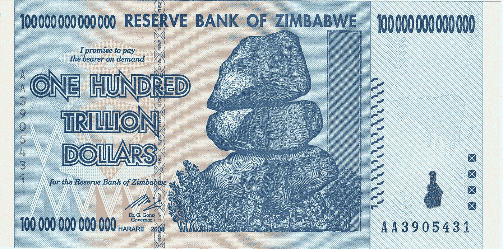

# 我们应该停止担心通货膨胀吗？

> 原文：<https://medium.com/swlh/should-we-stop-worrying-about-inflation-1a1aa0530fc3>

A Zimbabwean $100 trillion note — the result of hyperinflation. By Reserve Bank of Zimbabwe — Self-scan by (Marianian) followed by minor Photoshop enhancements to improve appearance and reduce size. Second version scan by (Camp0s) with original color preserved. Transferred from en.wikipedia to Commons by User:Avicennasis using CommonsHelper., Public Domain, [https://commons.wikimedia.org/w/index.php?curid=15515090](https://commons.wikimedia.org/w/index.php?curid=15515090)

## 为了制定好的政策，我们需要停止重写历史

上周,《纽约时报》编辑部认为,[美联储正在自找麻烦。他们认为，美联储通过强调控制通胀而不是创造就业，使自己成为特朗普和其他人的目标。他们甚至声称，美联储未能履行其义务，回应…](https://www.nytimes.com/2019/04/09/opinion/federal-reserve-fed-economy-trump.html?emc=edit_th_190410&nl=todaysheadlines&nlid=764788060410)