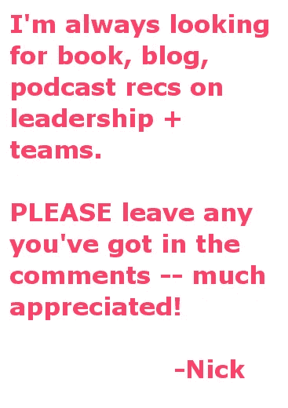

# 该不该给员工洗脑？

> 原文：<https://medium.com/swlh/should-you-brainwash-your-employees-6cbbc051c754>

## 入职、团队文化和一个很少讨论的细节

Photo by [Fikri Rasyid](https://unsplash.com/photos/FnKKF2bATEE?utm_source=unsplash&utm_medium=referral&utm_content=creditCopyText) on [Unsplash](https://unsplash.com/search/photos/hypnotize?utm_source=unsplash&utm_medium=referral&utm_content=creditCopyText)

还记得那些“[文化牌](/swlh/the-very-best-company-culture-decks-on-the-web-5a3de60c0bb9)”吗？然后是[反冲](https://www.nytimes.com/2016/04/10/books/review/disrupted-by-dan-lyons.html)？

你读过多少领导力的书籍——并试图付诸实践？

流行语？思维方式？

**从什么时候开始，所有这些事情变得更加……邪恶了？**

每一群人——从一个 3 人销售团队到整个国家——都需要平衡个人和整体的需求。前者太多，没有共同的目标，没有前进的动力。后者太多，你可能会疏远你的成员，或者在群体思维中停滞不前。

对于这个微妙的问题，有一个不可思议的解决方案，它在领先公司及其模仿者中风靡一时:**让人们认为他们*是*公司**。或者公司就是他们。通过将激励、太有趣而无法拒绝的额外津贴和对结果的不懈关注结合起来，他们模糊了公司想要的和团队成员想要做的之间的界限。

基本上:强有力地武装你的员工，让他们认同为公司设计的自上而下的文化。

从公司的角度来说这没有错。谁能抱怨有小吃、储备齐全的酒吧、小睡舱等的艺术校园呢？如果所有这些事情的含义是你需要每天在校园里呆 12 个小时以上，那么，*我们就是这样的人。*

这种行为会向四面八方扩散。

举办狂野派对→将人们引入狂野派对文化→ [将他们变成派对狂](http://fortune.com/2016/02/23/zenefits-sex-office-ban/)。

让人戴傻帽→？？？

Regency Enterprises

然而，对这些公司来说不幸的是，这种自上而下、包罗万象的文化建设方法有两个主要问题。

## **首先，你的文化在每一步都有被放大的风险**。

这听起来似乎是一件好事，但实际情况是，只有你的文化中最令人愤慨的(*=最容易重复和模仿的*)方面被夸大了。

在 5 个人之间被隐含理解为合理的事情，并不能转化为 5000 个人之间有几个管理层级。

这就是爱找乐子变得失控，真诚变成近乎反社会的原因:

> 这位前高管(在被解雇后)表示:“我试图在某人的职业生涯中帮助他们，但他们可能认为这是我软弱的表现。”。在飞往洛杉矶的六个小时的飞机上，她一路哭着回家，不知道该如何向怀孕的妻子透露这个消息。"
> 
> *“在网飞，激进的透明度和生硬的解雇令员工不安，”* [*《华尔街日报》*](https://www.wsj.com/articles/at-netflix-radical-transparency-and-blunt-firings-unsettle-the-ranks-1540497174)

因此，毫不奇怪，这种策略的弱点从一开始就存在。

**广播文化=广播其缺陷**。而且，人就是人，你可以猜测哪一个会有更大的影响。

## 第二，你创造了一种无声但真实的恐惧文化。

恐惧会杀死团队。这意味着人们花更多的时间去猜测自己，回顾过去，而不是实际工作。忘记分享想法——那可能会很棒。

但是如果你的团队中有人觉得他们需要在下班后呆在一起喝几杯，或者更糟，他们会感到不舒服。

我看起来像是在找乐子吗？我应该和谁谈？我从不喜欢聚会。

这些高中动态属于高中。因为他们会影响你的团队成员的表现，进而影响整个团队的表现。

通过将时间、资源和大脑空间投入到规定的公司文化中，你就为团队中的期望和接受建立了清晰的界限。显然，这可能是一件好事。显然，这也可能是一件坏事。

如果你不小心，这些线将疏远多于他们统一。将人们推向极端，而不是让他们走到一起。伤害你的团队多于帮助它。

用高压的、公司至上的文化给你的团队洗脑只会让你走得更远。一旦消息传出，人们就会避开你。你将会剩下一群不为自己着想的人，他们会因为最轻微的违规而排斥彼此。

# 更好的方法

所以不，不要给你的团队洗脑。关闭幻灯片演示。把帽子收起来。相反，为一些低效率的时间预订一个会议室，准备几个问题。

首先考虑你*团队领导希望在你的文化中看到什么。仅仅是高性能吗？是开放吗？支持？然后思考什么行动可以让这些目标成为现实。*

然后接受你只是团队中的一员。

也许你是整个公司的头儿(尽管你仍然有客户或社区需要服务)。或者你需要将你的团队与更大的组织结合起来。

无论如何，为了让你的团队感觉像一个团队，团队中的每个人都需要知道他们的声音很重要。通过关于文化的对话向他们展示他们的想法。

幻灯片演示不是对话。只有真正的对话才是对话。你知道那看起来像什么，听起来像什么。

*   心里没有终点。
*   每个人说话都一样。
*   发言者相互倾听

(提示:进行更好对话的一个好方法=卡尔·罗杰斯的人文主义方法:总结前一位发言者所说的话+在说任何原创的话之前让前一位发言者验证。)

这种方法肯定有缺点。不太确定。你不能干净利落地把它挂在你的 OKRs 上。

但最大的优势是，如果做得好，它开始了创建一个真正的团队文化的过程。当你有一群知道自己是谁，并为自己感到自豪的人时——我不知道你是否会接管世界或类似的事情——但你肯定比任何数量的跟班都要好。

**感谢**阅读。我正在研究团队文化，并且总是对新的视角感兴趣。

写信告诉我你的想法:)更好的是，链接到你写的东西！

## 这篇文章发表在[《创业](https://medium.com/swlh)》上，这是 Medium 最大的创业刊物，有+425，678 人关注。

## 在这里订阅接收[我们的头条新闻](https://growthsupply.com/the-startup-newsletter/)。

