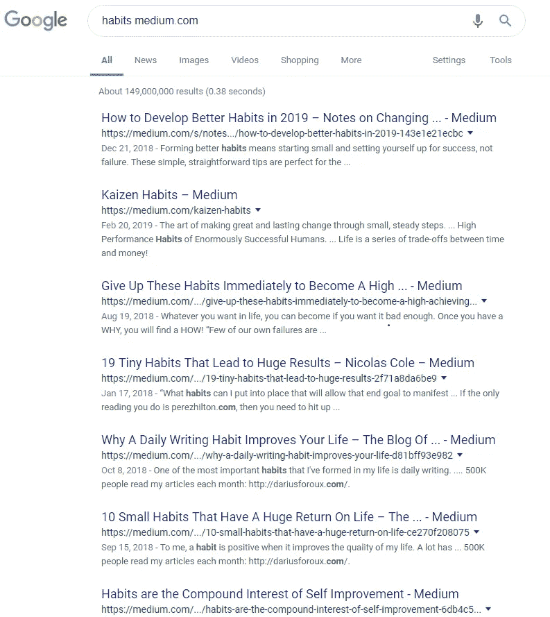

# 你真的应该相信关于习惯的宣传吗？

> 原文：<https://medium.com/swlh/should-you-really-trust-the-hype-about-habits-44847a58c2b7>

Photo by [Darius Soodmand](https://unsplash.com/@dsoodmand?utm_source=medium&utm_medium=referral) on [Unsplash](https://unsplash.com?utm_source=medium&utm_medium=referral)

习惯。

*是某些领域的流行语之一(*中，咳*)。*

## 附件 A:

Screenshot by the author

我停止我的案子。