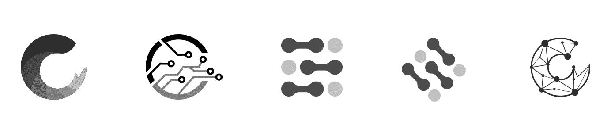
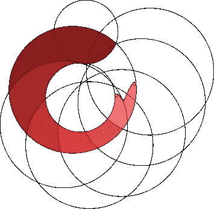

# Shrimpy:标志重新设计

> 原文：<https://medium.com/swlh/shrimpy-logo-redesign-e1ad0d8efb49>

Shrimpy 是一家位于硅谷中心的快节奏动态创业公司。它专注于加密货币投资组合管理和实时交易 API。我加入 Shrimpy 担任 UI/ UX 和视觉设计师已经快一年了。我们是一个小团队，对通过为我们的用户提供来自 Shrimpy 平台的最佳体验和价值来打破加密货币投资组合管理的格局充满热情。为了完成这个任务，每个队员都同时身兼数职！

我们以前的 Shrimpy 标志似乎更符合一个老派的餐馆业务，而不是一个尖端的技术公司。从我加入的第一天起，我们就想重新设计这个标志，最后，在由于其他业务优先事项而长期拖延之后，时间终于到来了。让我们来看看我们为创造最终标志所经历的过程和做出的决定。

**设计简介**

我首先创建了一份设计简报，交给 Michael(Shrimpy 的首席执行官)填写。他回答了我所有的问题。在简报中，我问了一些问题，比如——你喜欢和不喜欢当前的品牌形象，现有品牌背后的故事，与该品牌相关的形容词等等。我们讨论了所有的答案，以清楚地了解他的愿景和期望。这一步给了我设计研究一个坚实的起点。

**研究**

在设计简报之后，我从理论和应用的角度对当代设计趋势进行了深入的研究。为了获得一些现实生活中的例子，我还研究了其他企业在品牌和设计身份方面的做法。这一步，我才意识到 Shrimpy 的 logo 是多么的独特和不起眼。带着对不同可能性的开放态度，我继续头脑风暴和我的研究。

**情绪板**

根据从设计概要和我的研究中收集的信息，我创建了一个情绪板，上面有图像、文本、形状和样本对象，它们引出了我们希望通过我们的徽标和整体品牌传达的本质和主题。

**构思和草图**

我们希望我们的标志是简单的，可识别的，可区分的，但优雅和现代的同时。我开始在纸上画草图，记下我脑海中出现的每一个小想法。我花了大量的时间构思和绘制标志，以缩小我们的选择范围。

**插图**

经过一些认真的努力，一旦纸上草图最终确定，我就开始数字化这些草图，并探索不同的设计方向。起初，我想从标识中去掉虾，并从头开始尝试一种完全不同的方法。我们确实想出了一些潜在的替代方案；然而，所有这些似乎是相当普通和枯燥的。没有一个像我们的虾一样突出！尽管如此，我们还是为团队喜欢的新徽标列出了几个备选方案。

**候选名单**

彻底改变商标总是一件激进的事情。由于我们的用户群已经熟悉了标志性的 Shrimpy“shrimp”标识，用完全不同的东西来取代这一核心标识不仅会混淆我们现有的用户，而且 Shrimpy 可能会突然失去其累积的品牌价值。

> “身份是一切的开始。它们是人们认识和理解事物的方式。”—薛·博兰

此外，正如我已经提到的，我们的标志“虾”是独一无二的，非常明确，我们决定坚持虾，但简化了现代优雅的触摸。​​​​​​​

Logo construction

在这一点上，我们知道了我们的标志重新设计的方向。我专注于细节，并根据迭代反馈不断修改。随着时间的推移，它看起来更有凝聚力，更受欢迎。我们以前的标志只是一只没有明显意义的虾，它看起来是逆时针的，意味着时间的倒退，尽管这完全是无意的。我们目前的标志本质上是一个顺时针方向的虾，带有不同红色渐变层。它在一个简单而现代优雅的设计范例中激发了潜意识的安全感、信任感和进步感。此外，深红色象征着虾是精力充沛，强大，可靠，令人兴奋，坚定，主张和自信。

对于 logo 字样，我们探索了不同类型的字体，但是我们同意使用无衬线字体，因为它简单、干净、易识别。

Typeface exploration

**最终 Logo**

**前后**

我将非常乐意得到您的宝贵反馈、建议和建设性的批评。

# 谢谢你的来访！

*~Sumaya Mehzabin*

最初发布于 [blog.shrimpy.io](https://blog.shrimpy.io/blog/shrimpy-logo-redesign)

## 这篇文章发表在 [The Startup](https://medium.com/swlh) 上，这是 Medium 最大的创业刊物，拥有+445，678 读者。

## 在此订阅接收[我们的头条新闻](https://growthsupply.com/the-startup-newsletter/)。

