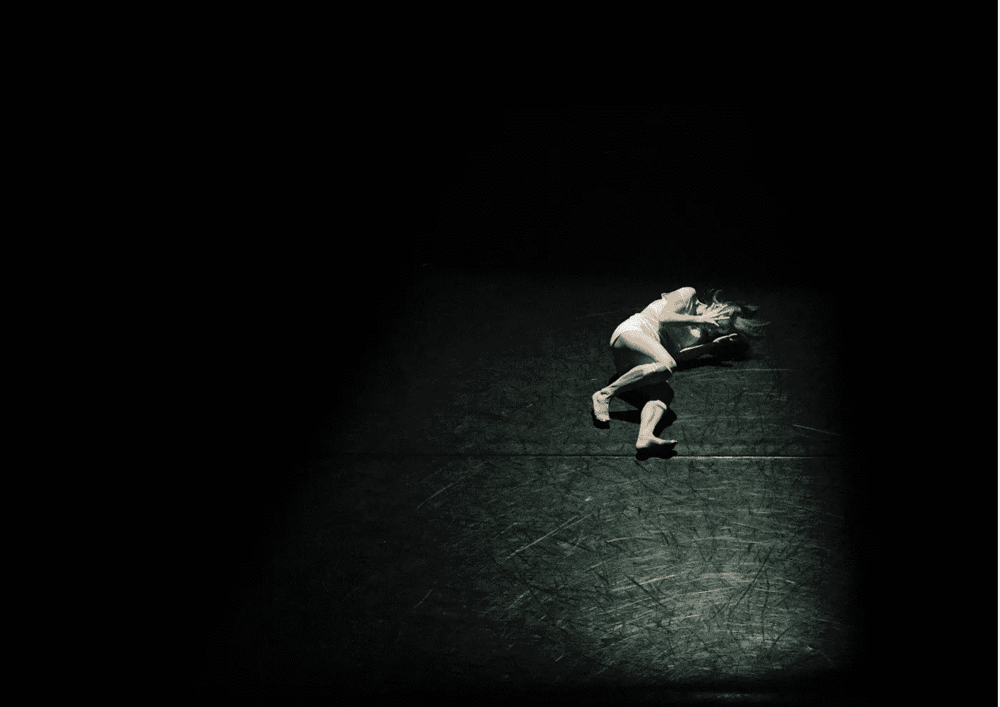

# 让我们头脑告诉我们的谎言沉默

> 原文：<https://medium.com/swlh/silencing-the-lies-our-minds-tell-us-3290f4de74bf>

## 提醒我们练习自我意识，自我同情，并重新训练我们的大脑相信我们足够好

Photo by [Hailey Kean](https://unsplash.com/@keaneyefoto?utm_source=unsplash&utm_medium=referral&utm_content=creditCopyText) on [Unsplash](https://unsplash.com/search/photos/scared-thoughts?utm_source=unsplash&utm_medium=referral&utm_content=creditCopyText)

我们的大脑是骗子。

该死的骗子。

根据科学家、治疗师和心理学家的说法，我们的大脑喜欢熟悉的事物。这些专家…