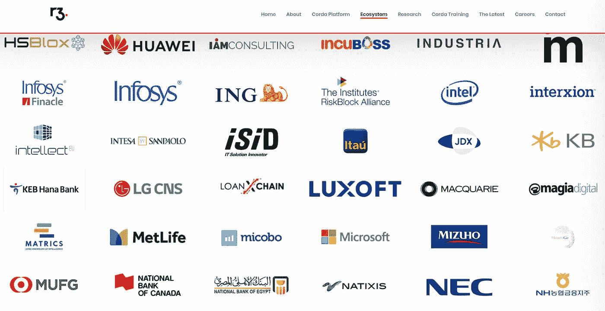
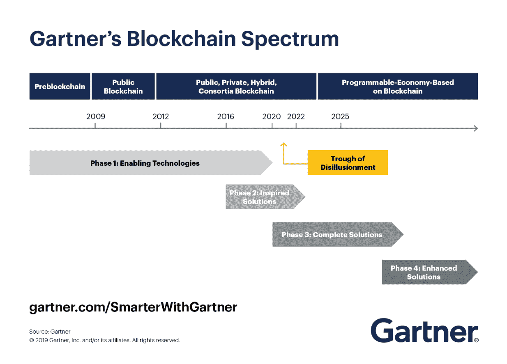

# 硅谷聚焦:R3 CORDA

> 原文：<https://medium.com/swlh/silicon-valley-spotlight-r3-corda-2b9ced92a646>

## 商业区块链的未来概述

上周，我有机会参加了由**因陀罗**和**英特尔投资**在马德里举办的创业活动。在硅谷的许多其他创业公司和成功公司中，R3 最吸引我的注意力。

本周，我们听说 ING 银行与 R3 签署了一份为期 5 年的许可协议，可以无限制地使用 **Corda 企业平台**。这并不奇怪:ing 现在是 Corda 生态系统的 200 多个合作伙伴和成员之一。

Some companies stated for R3 as a part of their ecosystem

大卫·E·鲁特在 2014 年创立了 R3，他们领导了 2015 年与巴克莱、BBVA、CBA、瑞士瑞信银行、高盛、摩根大通、苏格兰皇家银行、道富银行和瑞银一起创立的财团。

今天，R3 有超过 100 名员工和**在两轮**中筹集了 1 . 12 亿美元，是第一个最相关的 1 . 07 亿美元。根据 T21 的数据，他们的年收入估计有 300 万美元。

去年年中，我们读到了关于 R3 财务状况的令人担忧的消息:据前员工称，他们显然资金告罄，并做出了一些有问题的决定。然而，2018 年底达成的积极交易不言自明。

R3 的商业模式围绕着他们的主要发展: **CORDA** 。

# 科达到底是什么？

Corda 是一个为商业设计的**开源区块链平台**。实际上，一些[专家](https://www.gtreview.com/magazine/volume-15issue-3/r3s-corda-uncovered-not-blockchain/)同意 **Corda 的技术不完全是区块链**。然而，出于概念相似和营销原因，这正是他们声称要做的事情:

但是 R3 通常把 Corda 描述成一个 ***共享账本*** 。该平台提供了创建独立网络的可能性，维护不同群组之间的互操作性。

Corda 出现在区块链市场上，作为金融行业任何解决方案的通用平台。实际上，他们的步骤是将他们定位为工业区块链解决方案事实上的标准。

 [## 假人区块链

### 理解什么是区块链的五个关键

medium.com](/swlh/blockchain-for-dummies-d3daf2170068) 

Corda 专注于**隐私和安全**以使区块链范式适应商业世界。传统区块链是*无权限*网络*，* [Corda 网络是 ***有权限***](https://docs.corda.net/key-concepts-tradeoffs.html) *。*这意味着区块链用户是匿名的，但是**对 Corda 网络的访问是受控的**并且每个用户都有一个被证明的身份。

当然，对于受监管机构的开发者来说，这是一个必要的特征，它允许 Corda 摆脱像 PoW 这样的高消耗机制。事实上，Corda networks 的目标是快速，他们测量每秒超过 1000 次交易。

# CORDA 会引领区块链市场吗？

现在预测还为时过早，但我们可以清楚地看到，Corda 已经找到了将区块链引入行业的时机。

根据 [Gartner](https://www.gartner.com/smarterwithgartner/the-4-phases-of-the-gartner-blockchain-spectrum/) 的说法，**最初的区块链网络**只不过是**技术推动者**。他们中的大多数都有缺陷，并且他们帮助巩固了*分布式分类帐*范例。

然而，我们已经生活在这个区块链光谱的第二阶段，而 **Corda 正带领**与 **Hyperledger Fabric** 一起走向第三阶段**。**

# 结论

请继续关注 R3 的动向。他们是分布式账本技术短期未来最相关的参与者之一。如果您计划在您的业务中使用区块链技术，我建议您阅读 Corda 的技术文档。

几年前，区块链技术作为一种颠覆性创新出现，但现在，由于 Corda、BigchainDB 或 XinFin 等混合解决方案，我们正在部署其潜力。

 [## 为什么加密货币会下跌？

### 加密市场日子不好过，投资者纷纷逃离

medium.com](/drill/why-do-the-cryptocurrencies-fall-671ce99c88f3)  [## 互联网变了:HTTP/3 将不再使用 TCP

### QUIC 是下一版本 HTTP 的基础协议

medium.com](/drill/the-internet-changes-http-3-will-not-use-tcp-anymore-427e82eeadc0) 

*不要犹豫* [*在 LinkedIn 上联系我*](https://www.linkedin.com/in/telmo-subir%C3%A1-rodr%C3%ADguez-6103416b/) *。*

## 这篇文章发表在 [The Startup](https://medium.com/swlh) 上，这是 Medium 最大的创业刊物，拥有+415，678 名读者。

## 在这里订阅接收[我们的头条新闻](http://growthsupply.com/the-startup-newsletter/)。

