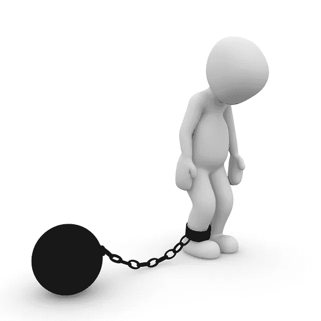

# 自由的简单钥匙:

> 原文：<https://medium.com/swlh/simple-keys-for-freedom-1dcd27e4a8cc>

## 自我破坏的新视角&如何摆脱这种有害的习惯。

Image: 3dman_eu on Pixabay

自我破坏。这是一个我们很多人都很熟悉的短语，不幸的是，这也是一种我们很多人都很熟悉的行为,不管是对自己还是对周围的人。

当一种行为或思维模式破坏了我们的目标或工作时，我们称之为*自毁*