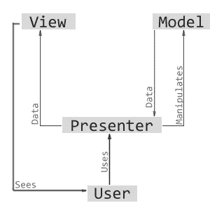
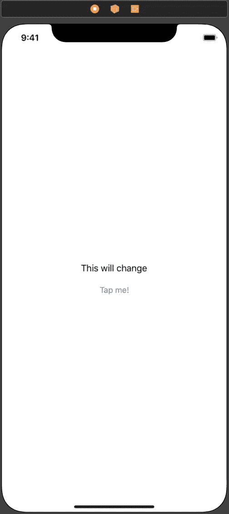
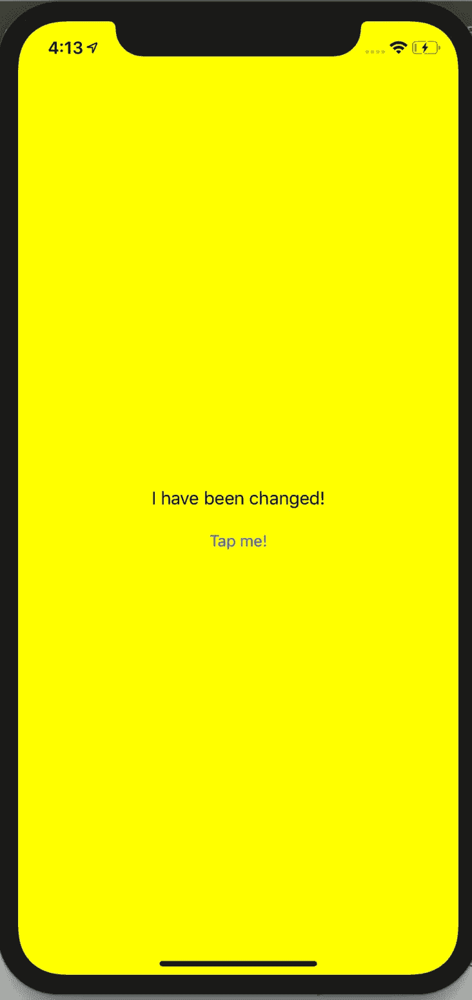

# Swift 中的简单 MVP 设计模式

> 原文：<https://medium.com/swlh/simple-mvp-design-pattern-in-swift-3655811e0415>



作为我学习的一部分，我一直在研究 Swift 中不同的设计模式和架构。

大多数人在开始学习 Swift 时，会熟悉 MVC(模型视图控制器)模型，但这可能会很快导致“大量”View Controller 文件，并且在对应用程序内的逻辑执行单元测试时可能会受到限制。

“大规模”风险投资问题的替代方案是实现 MVP 模型。MVP 代表 Model View Presenter，其核心是一种从 ViewController 文件中移走大部分逻辑并代之以对 Presenter 的调用的有效方法。这意味着您的演示者文件中的所有内容都是可测试的，并且易于访问和阅读。



这个简单、基本的应用程序将帮助我们使用 MVP 模型进行设置。该应用程序的功能很小，基本上我们有一个按钮和一个标签，当按钮点击 5 次，标签会改变(以及视图的背景颜色)。

在一个基本的单视图项目中，我将 ViewController.swift 文件设置为如下所示:

```
**import** UIKit**class** ViewController: UIViewController { **lazy** **var** presenter = Presenter(with: **self**)**@IBOutlet** **weak** **var** changeTextLabel: UILabel!**override** **func** viewDidLoad() { **super**.viewDidLoad()}**@IBAction** **func** tapMeButton(**_** sender: **Any**) { presenter.buttonTapped()}}
```

就是这样！我们给 ViewController 访问一个 presenter 的权限，一旦视图被加载，我们就将一个我们的“ **self** 的引用传递给 presenter。当点击**按钮**时，我们会给演示者打电话说“嘿！我被窃听了！我该怎么办？”

**接下来，**到 Presenter.swift 文件:

```
**import** Foundation**protocol** PresenterView: class { **func** updateLabel()}**class** Presenter {**weak** **var** view: PresenterView?*// Pass something that conforms to PresenterView***init**(with view: PresenterView) { **self**.view = view}**var** timesTapped = 0**func** buttonTapped() { timesTapped += 1 **if** timesTapped >= 5 { **self**.view?.updateLabel()}}}
```

这里我写了一个 **PresenterView** 协议方法，当订阅它时需要一个 updateLabel()函数，我们稍后将在 ViewController 上订阅它，在这里我们将告诉 ViewController 向用户显示什么。

接下来，在 **Presenter** 类中，我们设置一个可选视图，然后用**Presenter view**playing**对其进行初始化。一旦我们订阅了协议，视图的滚动将在 ViewController 上进行。**

**我已经设置了一个名为 **timesTapped** 的变量，并将其初始值设置为 0。接下来，我有一个 **buttonTapped()** 函数，还记得我们之前在 ViewController 文件中调用过它吗？这将使 timesTapped 值增加 1，一旦我们点击按钮 5 次，我们将访问视图(协议)并调用 **updateLabel()** 函数。**

**回到 **ViewController** 文件，我已经添加了 ViewController 类的扩展，并且符合 **PresenterView 协议:****

```
**extension** ViewController: PresenterView { **func** updateLabel() { changeTextLabel.text = "I have been changed!" **self**.view.backgroundColor = .yellow}}
```

**这是我们修改用户界面和操作视图的地方。最终结果看起来是这样的:**

****

**这只是 MVP 模型如何工作的一个非常简单的例子。请随时联系我们，寻求建议或改变。玩玩它，给你的 VC 添加更多的 UI 元素，疯狂地使用你的演示者的逻辑。**