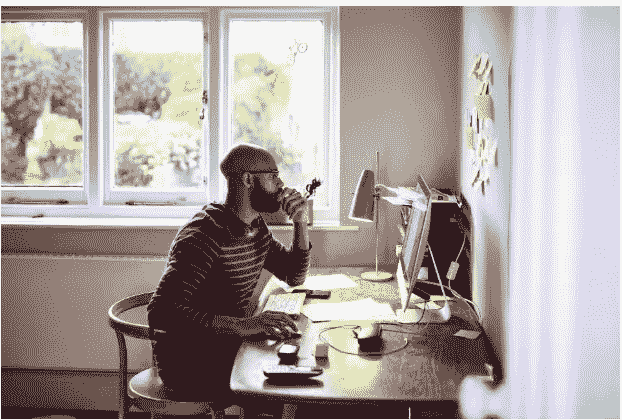

# 小企业和初创企业的六大品牌建设策略

> 原文：<https://medium.com/swlh/six-brand-building-strategies-for-small-businesses-and-startups-8670c7078571>

作为一名面临相当多困难的数字营销顾问，我看到许多小企业和初创公司面临着更大、更成熟的企业不一定要应对的挑战，尤其是在品牌方面。当你拥有丰富的资源时，建立一个品牌是相当困难的，但是对于小企业和初创公司来说，它可以…