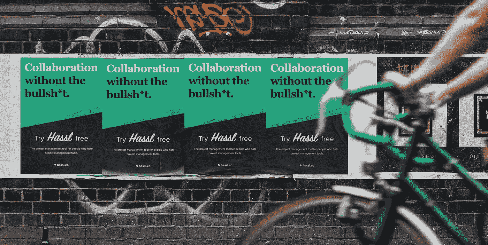

# 有抱负的企业家的六个(主要)悲观策略

> 原文：<https://medium.com/swlh/six-mainly-pessimistic-tactics-for-aspiring-entrepreneurs-1ef07b270ab6>

2018 年，全球领先的初创企业目录 AngelList 列出了超过 460 万家初创企业，其中只有 0.4%被列为种子阶段企业。所有这些关于中心、孵化器、加速器、共同工作空间和发射台的谈论，似乎每个人都在尝试。这部分是因为有更多的机会获得公共和私人资源，以及一种新的企业文化…