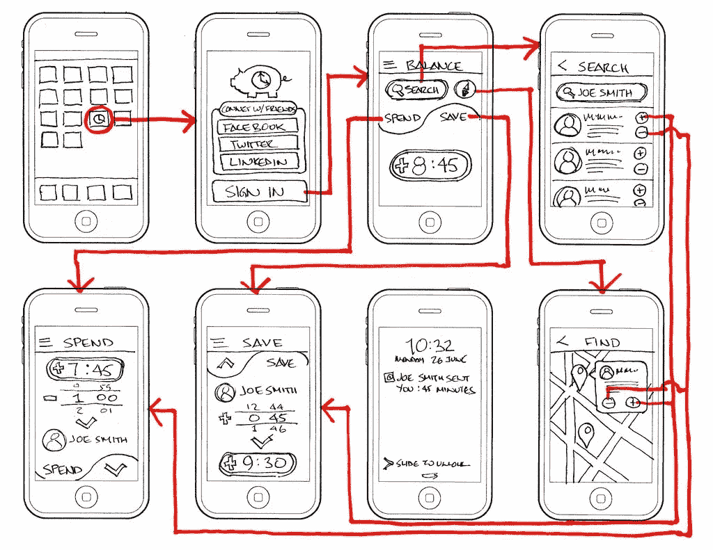

# UX 设计师必须具备的技能！

> 原文：<https://medium.com/swlh/skills-a-ux-designer-must-have-c4f9ac29840f>

要合格，不仅仅是学历！

UX 设计师是有创造力的人；我最初的观察结论是。酪 UX 设计师不仅仅是能言善辩、意志坚定、善于互动、多才多艺的人。UX 设计是世界上最热门的工作之一，对 UX 设计师的需求呈指数增长。根据我的经验和观察，我已经锁定了一个优秀的 UX 设计师必须具备的 10 项技能！

1.  观察
2.  好奇心
3.  神入
4.  思维能力
5.  草图
6.  沟通
7.  互动
8.  合作
9.  分析
10.  简易化

## 1.观察

> 要获得知识，必须学习；但是要获得智慧，必须观察！

观察是你创造完美体验之旅的起点。为什么会有人想到发明订书机？他曾 ***观察到*** 对一种工具的需要和需求，发明了人类 100 项最有用的发明之一！:P UX 设计是一个要求极高的领域；你需要理解多个维度

观察你周围的环境，尽你所能了解一切。观察你周围的人，他们在不同社会群体中的行为模式，他们需要什么，价值，需求，理解，他们的线上和线下行为，他们生活的基础设施，文化习俗，他们面临的问题，观察到眼睛的力量。

## 2.好奇心

> 成功来自对生活的一些奇怪的调整！

UX 是一个不断发展的领域。培养好奇心有助于设计师跟上行业精神。好奇心导致提出有见地的问题，积极倾听，并更深入地参与解决问题。UX 致力于让用户和界面之间的交互变得简单，这就需要好奇心；了解用户需要什么，他们重视什么，他们的需求、期望、行为、目标、动机等。

## 3.神入

> 只有你在自己身上感受到了，你才能理解别人！

他们说*像贼一样思考去抓贼*和 T *像杀人犯一样思考去抓杀人犯！*平行 *:* 像用户一样思考，了解用户。UX 就是要理解用户。它涉及到深入了解最终用户与产品、公司或服务的互动。

共情是理解和感受他人(用户)情绪的能力。作为一名 UX 设计师，你需要为用户思考、理解、感受和解决问题。一个人必须花时间去了解人们和他们的倾向。对最终用户的深刻理解让设计师能够创造出真正吸引人的产品。同情用户的能力是 UX 设计师的一项关键技能。

## 4.思维能力

头脑风暴！！！

洗澡时确实会有想法！但是这个想法只有在你头脑风暴的时候才能得到验证。

***构思*** 是产生、发展和交流新想法的创造性过程，其中想法被理解为思想的基本元素，可以是视觉的、具体的或抽象的。它包括一个思维周期的所有阶段，从创新、发展到实现。UX 设计师是创造者；体验、积极反馈、知识、快乐和参与。因此，UX 设计师是好的创意者是非常重要的。在构思过程中，开始质疑你的产品的各个方面，作为一名 UX 设计师，你正在努力创造。

## 5.草图

咄！！

如果你是一名 UX 设计师，在阅读这篇文章时，可以跳过这一步去阅读第 6 点**。**

但是，如果你是一个想进军 UX 的新手，画草图是 UX 设计中不可避免的一部分。尽管 UX 的设计大部分是在数字平台上进行的，但 UX 的设计师不能错过绘制线框、快速纸上原型和用户流。速写是一种简单、快速且非常有效的交流方式，有助于更长时间地可视化和记忆对话。

注意 SOS:你不一定要成为绘画专家。画简单的线条应该也能解决这个问题。

## 6.沟通

> 沟通的艺术是领导的语言！

与用户、利益相关者、客户的交流因人而异。UX 设计师必须是有效的沟通者。

1.  ***与客户沟通:*** 在大部分项目中，UX 团队作为客户与开发团队之间的桥梁，将项目进行下去。创建清晰的工件和文档对于任何成功的项目都是非常重要的。
2.  ***在界面上传达:*** 用户界面(UI)传达某个目标/解决方案对某个问题的陈述。一个 UX 设计师必须容易地与用户交流。

## 7.互动

当大多数人谈论设计时，首先想到的是视觉效果。几个世纪以来，它们就在我们身边:报纸、广告牌、电影海报，无处不在！但是现在是时候我们把我们的焦点从设计静态屏幕转移到设计交互式数字界面了。

交互流，我们将定义为线框流，它定义了每个交互元素，它的触发器、反馈、循环和结果。你的交互设计必须将过渡、视觉设计和交互集中在一个屏幕上。清晰的交互流程减少了用户的猜测和模糊。

## 8.合作

> 我们可以携手共进！

一个好的 UX 设计意味着整合开发者、客户、用户和团队成员的想法。UX 设计师需要有效地给予和接受反馈，探索解决方案，整合项目中每个人的专业知识和需求，以创造出最好的产品。单独我们能做的很少；我们一起做了这么多！与其他公司合作，携手拓展你的服务，雇佣专家和高管。

## 9.分析

> 分析是通过破坏创造的艺术！

当分析思维——这把刀——被应用于经验时，在这个过程中总会有东西被杀死。分析型思考者利用知识、事实和信息来确保他们把事情做对，很少匆忙下结论。他们对自己的专业很了解，在做决定之前会仔细考虑所有的事实。UX 的分析是相似的；使用知识、事实和信息来确保交付的体验是正确的，参与并满足上述要求。

## 10.简易化

作为服务提供者，拥有良好的倾听技巧、同理心和耐心非常重要。你应该学会保留你的想法、观点，并允许参与者说出他们的想法和关注点，而不受你的偏见。即使是点头这样的小动作，也会让参与者产生偏见。作为一名辅导员，你应该学会在思想和行动上保持中立。

一言以蔽之:具备以上 9 个素质！😀

希望这篇文章能有所帮助。干杯。UXing 快乐！

## 这篇文章发表在[《创业](https://medium.com/swlh)》上，这是 Medium 最大的创业刊物，有+437，678 人关注。

## 订阅接收[我们的头条新闻](https://growthsupply.com/the-startup-newsletter/)。

