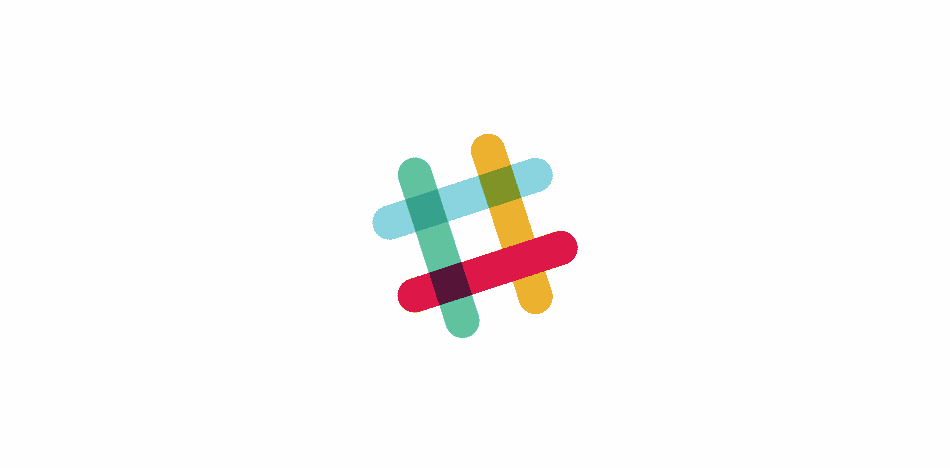

# Slack 和声名狼藉的品牌重塑

> 原文：<https://medium.com/swlh/slack-and-the-infamous-rebrand-95034df1c6a9>

文化和创意产业都是动荡不安的风景，随着时间的推移，曾经看起来很棒的东西变得无效或不合时宜。人们对设计越来越厌烦，或者公司已经不再需要它们了。那么，当谈到臭名昭著的**更名**时，为什么他们经常会像在你的培根上发现纹身一样感到不安呢？

在撰写本文时，最新的例子是 Slack，由著名的工作室 Pentagram 刷新。对于那些不了解 Slack 的人来说，Slack 是一款围绕直接和群组消息传递构建的软件。这也是一个我在工作中用在电脑和手机上的软件。

Slack 的标志是一个简单的散列，是他们任何信息渠道之前的一个字符，但也表示通过简单的文本命令标记用户、主题(包括 gif、表情符号和一系列其他通信形式)的能力。它是四个点连接并旋转成这个符号的动画，讲述了一个连接人们的故事，并以一种有趣的语气显示了不同渠道(对话)的重叠。风格简单是因为体现了使用起来有多简单。然而，这就是 T2 的 T3。

*#臭名昭著的*品牌更名仍然通过在品牌中加入“聊天气泡”机制从对话中获取线索。它保留了 logomark 的 hashtag 形式。它甚至保留了熟悉的调色板和无衬线字体风格。然而，问题是，随着它在全球的推广，许多人发现这是品牌身份的重大倒退。

批评的趋势主题似乎围绕着增加的复杂性如何与品牌重塑的直觉相悖。从本质上讲，当一个品牌变得更加成熟时，它的性格就会得到磨练，变得更加自信和清晰——反过来，这应该通过一个更简单、简洁的视觉识别来体现。五角星的额外复杂性与其他强烈的意见有关，即更新如何产生一种更通用的美学，可以适用于各种其他品牌。例如，尽管存在散列，但是由于新的负空间，散列不能被立即识别。

> 对我来说，作为一个独特的标志，它似乎更模糊，更难辨认。它下面可以有任何单词。
> ~山姆·托马斯
> 
> 它从一个独特、古怪的标志变成了看起来属于你当地药店的东西。或者 Web 2.0 律师事务所或银行。也许是当地中学的暑期艺术项目？
> ~ [纳皮尔·洛佩兹](https://thenextweb.com/author/napierlopez/)
> 
> 新的 Slack 标志看起来像是公共游泳池的
> ~ [@riklomas](https://twitter.com/riklomas)

…以及负面空间带来的所有解释。

> 我敢肯定，Slack 有了一个新的标志，实际上是四只鸭子缝在一起，组成了一条人/鸭蜈蚣。你加眼睛，不会错过的。
> ~[@陛下](https://twitter.com/HisRepMajesty)
> 
> 新 Slack 标志中的负空间使它看起来像一个异想天开的纳粹党徽。感谢你们来听我的 TED 演讲，关于互联网如何永远地毁掉了我的大脑。
> ~ [@HeyHeyESJ](https://twitter.com/HeyHeyESJ)

除了全新的品牌，旧的标志似乎真的不需要改变。尽管经过一番挖掘后，Slack 的公平意图变得更加清晰:

*“我们的第一个标志是在公司推出之前创建的。它与众不同，很有趣，八叉符号(或英镑符号，或哈希，或任何你知道的名字)类似于你在我们产品的频道前看到的相同字符。*

也很容易出错。它有 11 种不同的颜色——如果放在除白色以外的任何颜色上，或者放在错误的角度上(而不是精确规定的 18°旋转),或者颜色调整错误，它看起来很糟糕。这让我们很痛苦。就看:

*我们开发了不同版本的徽标来弥补这一缺陷，这些徽标适用于不同的目的。但这意味着每一个应用程序按钮看起来都不一样，而每一个按钮又与徽标不同。”*

这种推理我可以多少理解，但是标志通常会被人们滥用——你有多少次看到错误的 Twitter 鸟，错误的颜色，拉伸和涂抹——我仍然不确定这个更名会以什么方式显著缓解手头的问题。作为一种模式，新的标签将看起来更加不同，丰富的负空间将使扭曲更加明显，logomark 中元素的添加为人们提供了更大的空间来随心所欲地玩它...随着这些变化，我发现修改后的字体更加整洁，但代价是失去了个性，坦率地说，容易被遗忘。然后，当桌面应用程序更新时，它的新颜色让我和工作室的其他人看起来充满活力。

现在退一步说，我们应该意识到设计需要时间。让我们以 [Deliveroo 为例](http://www.itsnicethat.com/news/deliveroo-rebrand-designstudio-logo-visual-identity-050916)，这是一个相对年轻的品牌，但考虑到你看到其标志的频率，它具有相当大的城市意义。喜欢或讨厌敏捷的自行车手和他们不那么敏捷的箱子，Deliveroo 袋鼠图标和铁蓝色很难错过。但我指的不是硬角 logo，我说的是之前的线条画版本。

正如你所料，重塑品牌时，这可能很容易来自一个简单的意图，刷新他们的形象远离剪贴画，甚至可能在市场上重新调整自己。反应如何？…

> 商标没问题，但是那个标记完全是狗屎。我不在乎角度有多细致。
> 
> 我相信@Deliveroo 快递员不会对他们的新#标志竖起两根手指感到惊讶…
> 
> 这看起来也有一些可爱的图标设计概念完成。无论是谁打电话说要用最后一个，他的品味都很糟糕…

虽然人们显然不羞于表达自己的观点，但有些人比其他人更有口才和理性。

> 这个标志让我想起了 2012 年伦敦奥运会的标志。我认为这可能是不和谐的，侵略性的形式，现在已经成为我们图形语言的一部分来传达活力(这在美学上是否是一件好事是有争议的)。然而，这非常适合于一个主要依靠辛勤骑自行车的人的送货品牌。
> 
> 至于标识，我对这里的中性解决方案并不感到惊讶。似乎很明显，设计工作室已经采取了与英超联赛和 Airbnb 相似的视觉识别方法。所有这些都有各种各样的品牌，无论是足球队、住宿/东道主还是餐馆/食品供应商。在所有情况下，设计压倒上述子品牌的东西可能会适得其反。

这些也不是唯一的例子——我看到的几乎每一个品牌重塑都遭到大多数人的抨击，可能有 1%的敏捷品牌毫发无损地通过了键盘战士和创意评论家的战区。也就是说，我见过无数的发布会和揭幕会，虽然作品很华丽，但仍然会受到敌意干预式的庆祝派对。每一次更名，人们的反应都进一步下降到一种极端偏好的群体心态。好吧，好吧，无可否认，我个人当时并不喜欢 Deliveroo 这个品牌。考虑到该品牌灵活、快捷和舒适的价值，它最初看起来有点四四方方和笨拙。每个博客和搜索都展示了工作室摆在桌面上的大量草图和进展，其中许多似乎具有令人兴奋的潜力。

今天，回顾过去和现在的区别，更名显然是 Deliveroo 历史上两个里程碑之间的巨大进步。由于暴露在日常生活中，并且通常忘记了所有其他标识的可能性，很多怨恨已经过去了。这很像 Slack 的应用程序颜色变化起初是多么令人震惊，但在使用一天并再次尝试旧版本后，版本明显更好——相比之下，原始版本看起来温顺单调。我还可以看到聊天气泡的潜在机制，尽管 Slack 应用程序从未通过气泡形状显示消息。总的来说，我试图在我的观点中保持一定的保留，在互联网的暴民心态出现时，给它带来好处。虽然我不支持更名路线，但它最终不会阻止我自己或数百万其他人使用这项服务。与 Deliveroo 一样，随着时间的推移，我们将习惯于品牌的新外观和方向，而不是认为旧路线是荒谬的。

这里的一切都是在一个新品牌很少出现的场景下发生的，而是专门为整容和市场变化而保留的。我只能假设，除了任何已建立的恶名之外，这发生在这样一个事实上，当一个工作室被赋予一个新的品牌，他们被给予一个机会去改善已经经历了一个重要的生命周期的东西；构思，打入市场，抓住人们的注意力，成为人们熟悉的东西。重新想象这就像篡改人们的记忆或经历，甚至可能陷入一个不可思议的标志设计的山谷，只有当我们也能洞察原本可能成为现实的草稿和概念时，情况才会变得更糟。

尽管这些对话通常是和其他创意人员进行的。它们是关于细微差别和更大图景的激烈辩论，这无疑是令人着迷的，但当与创意产业以外的人进行这样的对话时，往往会像大多数人在他们的第一堂独轮车课上所做的那样深入(也差不多)。因此，也许品牌重塑的匹配并没有超出我们所涉及的圈子，当涉及到所有重要的客户时，陈词滥调的设计趋势、偏好和我们会做的方式只是落入塑造我们自己的风格，并给我们带来频繁的个人学习。然后，它成为品牌历史上的另一个演变，最终只是另一个标志。

*我叫罗伯特·洛依德，但你可以叫我鲍勃，我相信优秀的设计有能力改变世界。它可以改变人们的态度、环境和生活，所以我对创造力的态度就是* ***为伟大的人做伟大的工作*** *。哦，是的，我是一个获奖的艺术总监。*

感谢您的阅读，如果您想了解更多或接触更多，请加入我的行列:
[www . Robert Lloyd . design](http://www.robertlloyd.design)
[insta/@ yes . Robert Lloyd](https://www.instagram.com/yes.robertlloyd/)
[LinkedIn/@ Robert Lloyd](https://www.linkedin.com/in/robert-lloyd-2809684a/)
yes.robertlloyd@gmail.com

## 这篇文章发表在 [The Startup](https://medium.com/swlh) 上，这是 Medium 最大的创业刊物，拥有+420，678 名读者。

## 在此订阅接收[我们的头条新闻](https://growthsupply.com/the-startup-newsletter/)。

