# 睡眠给了我超能力

> 原文：<https://medium.com/swlh/sleep-gives-me-superpowers-f1b62841cc66>

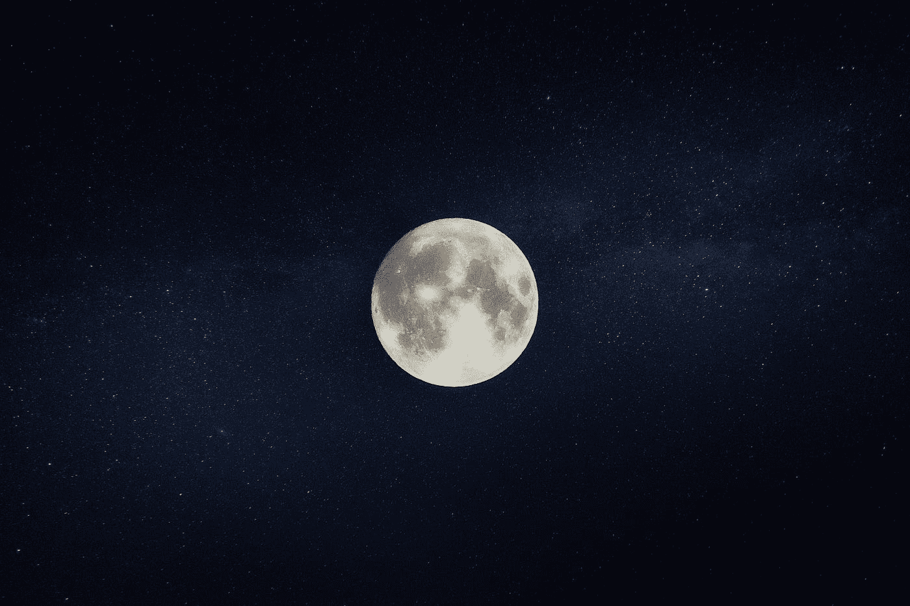

Photo by [Fabian Oelkers](https://unsplash.com/@foemedia?utm_source=medium&utm_medium=referral) on [Unsplash](https://unsplash.com?utm_source=medium&utm_medium=referral)

从一夜酣睡中醒来的视觉。没有闹钟的帮助，你平静地从床上爬起来——精神抖擞，没有身体或精神上的不适。在过去的几个月里，我一直专注于让这成为一个持续的现实。我很高兴地说，我一直朝着这个目标努力！

> 根据飞利浦去年的一项全球调查，超过四分之三的成年人(77%)已经采取行动改善他们的睡眠。这包括尝试各种药物、舒缓的音乐和新技术。——[筛过的](https://sifted.eu/articles/keeping-your-pillow-cold-and-other-european-sleeptech/)

近年来，我们已经开始对占据我们生活三分之一时间的令人困惑的过程进行充分的阐释，以保证一种严肃的睡眠优化方法。然而，令人震惊的睡眠科学的出现发生在一个充满科技、更多久坐的生活方式和虚假睡眠叙事的时代。诚然，强调一个人对睡眠的重视从来都不是*酷*；严谨的锻炼计划和严格的饮食无疑会赢得更多的崇敬。然而，作为健康的第一支柱，如果一个人希望看到任何生活方式改变的辉煌好处，充足的睡眠是必要的。

有一个谎言对我们尤其有害:挥之不去的、广泛流传的观点认为睡眠是浪费时间，是走向成功的障碍。十年前，我们可能会对此置之不理，但现在科学已经证明事实恰恰相反。如果你想看起来更有吸引力，吸收你所学到的，更有创造力和生产力，等等。—专注于占据你生活 1/3 的事情是有原因的，睡觉！任何人如果认为 8 小时或更多的睡眠是成功的障碍，那就是在为门外汉铺一条通往疾病和不幸的道路。

> 我现在知道，我们的睡眠质量比饮食和锻炼加起来更重要……——[肖恩·史蒂文森](https://youtu.be/4Mtw3vBQYOg),[睡眠更聪明](https://www.amazon.com/Sleep-Smarter-Essential-Strategies-Success/dp/1623367395/ref=tmm_hrd_swatch_0?_encoding=UTF8&qid=1559063284&sr=8-1)的作者

# 是的，科技正在损害我们的睡眠质量

Photo by [ROBIN WORRALL](https://unsplash.com/@robin_rednine?utm_source=medium&utm_medium=referral) on [Unsplash](https://unsplash.com?utm_source=medium&utm_medium=referral)

你心爱的技术被设计成从黎明到黄昏一直在我们面前，不断玩弄我们的“多巴胺寻求-回报循环”，让我们参与进来，寻求更多的新奇。我倾向于相信，毫不费力地避免无聊正在损害我们放松的能力。作为一个 16 岁的孩子，我很同情那些在睡眠中挣扎的同龄人。毫无限制地使用前所未有的媒介——互联网——显然是有害的，因为我们从很小的时候就开始喜欢它。社交媒体、视频游戏、电视节目等等。随时随地都可以使用。不管你的年龄如何，在充满希望的 7-9 个小时里，从你感到舒适的永无止境的内容来源中抽身出来是具有挑战性的，尤其是为了一些你可能低估或误解的东西。

## 夜间人造光

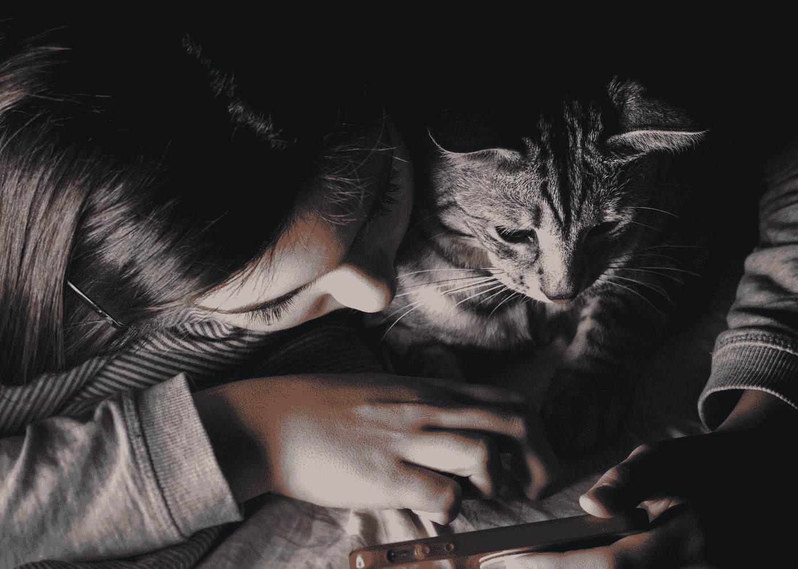

Photo by [Velizar Ivanov](https://unsplash.com/@lycan?utm_source=medium&utm_medium=referral) on [Unsplash](https://unsplash.com?utm_source=medium&utm_medium=referral)

> 一些研究表明**在夜间暴露在光线下**，例如上夜班，与某些类型的**癌症、糖尿病、心脏病和肥胖症**之间存在联系。这并不能证明夜间光照会导致这些症状；也不清楚为什么它会对我们有害。但是我们知道暴露在光线下会抑制褪黑激素的分泌，褪黑激素是一种影响昼夜节律的激素，并且有一些实验证据(这是非常初步的)表明较低的褪黑激素水平可能解释与癌症的联系。— [哈佛健康快报](https://www.health.harvard.edu/staying-healthy/blue-light-has-a-dark-side)

我们的设备不仅能刺激情绪，还能发出明亮的蓝光和绿光，让我们的大脑误以为太阳升起来了。结果是褪黑激素分泌受到抑制，昼夜节律被打乱。

直到晚上我开始屏蔽掉那些人造波长，我才意识到我的电脑显示器和电视对我第二天早上的感觉产生了巨大的影响。

# 不活动、缺少阳光和压力

我们大多数人一天中的大部分时间都坐着，积累了臀部、腿筋、背部等的紧绷感。睡前 5-10 分钟，在狭窄的区域做深伸展运动，可以极大地提高你的睡眠质量。

运动！一些简单的事情，比如在早晨的阳光下散步或者洗个冷水澡，都可以加强你的生理节奏。

压力:事实证明，白天或睡前的冥想可以提高人们放松和“放下”的能力。今晚睡前花 5 分钟冥想，看看是否对你有帮助。

> 事实上，睡眠基金会[建议](https://www.sleepfoundation.org/articles/how-meditation-can-treat-insomnia)冥想是一种全天然、无药物治疗失眠的方法，并指出这种做法已被证明减少了安眠药的使用，可能是因为冥想减少了大脑中的唤醒措施(训练放松反应，使睡眠更容易！).— [乌拉环](https://ouraring.com/meditation-and-sleep-score/?utm_campaign=oura-insider-u-20-2019&utm_medium=email&utm_source=Klaviyo&_ke=eyJrbF9lbWFpbCI6ICJtcmRhbmllbDg3NDdAZ21haWwuY29tIiwgImtsX2NvbXBhbnlfaWQiOiAiTXh4NXJHIn0%3D)

# 掌握控制权

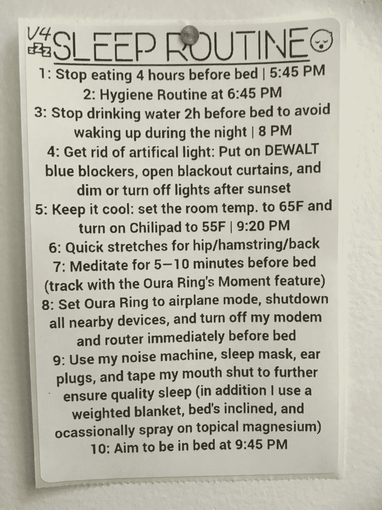

My Sleep Routine!

既然我已经把一切都摆到桌面上了，那就让我们进一步谈谈我们能做些什么来发现我们睡眠质量的显著差异。作为参考，以上是我挂在墙上的睡眠时间表。

## 1.睡前 4 小时停止进食

睡前 3 到 4 个小时停止进食，让你的身体有时间消化你在褪黑激素水平达到峰值之前吃下的食物。我一直在做与每日 16/8 间歇禁食相关的事情。

## 3.睡前 2 小时停止喝水

如果我睡前 2 小时不停止喝水，我可以保证我会在半夜醒来去上厕所。

## 4 和 5。阻挡人造光，降低温度

营造完美睡眠环境的三大要素是光线、温度和声音。使用 f.lux 和特殊眼镜等应用程序阻挡抑制褪黑激素的蓝光，并将恒温器设置为 65 F/18 C，将大大改善你的睡眠。

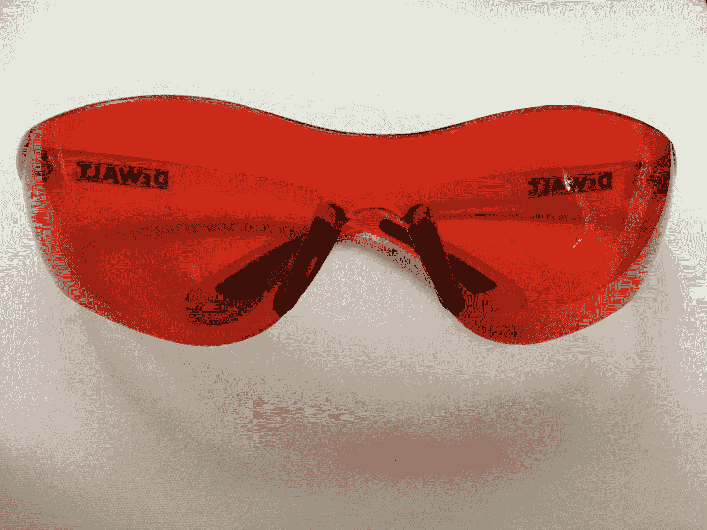

My blue blocking glasses

## **6 和 7。通过伸展和冥想缓解精神和身体的紧张**

所有这些久坐不动和不知所措的感觉都让我们付出了代价。伸展和冥想让你进入副交感神经状态。

## 8.关闭所有设备以限制电磁场暴露

听着，我不是一个会对电磁辐射的危险大发雷霆的人。但当我努力睡个好觉的时候，知道我的手机、电脑、谷歌迷你主页、路由器和调制解调器没有以疯狂的速度通信，我感觉好多了。

## **9。额外睡眠技巧**

[我的床是倾斜的，以改善淋巴系统排水](https://blog.bulletproof.com/inclined-bed-therapy-sleep/)

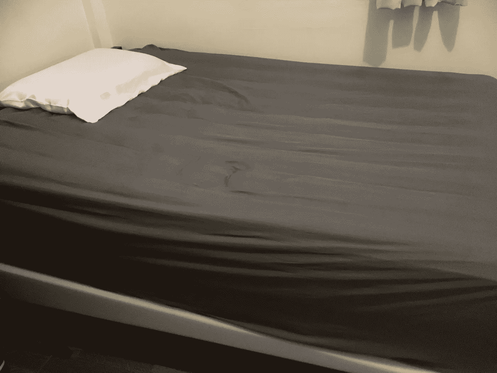

The head of my bed is raised by 7 inches

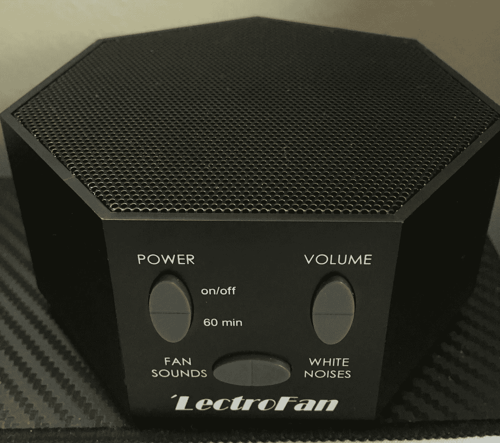

My sound machine

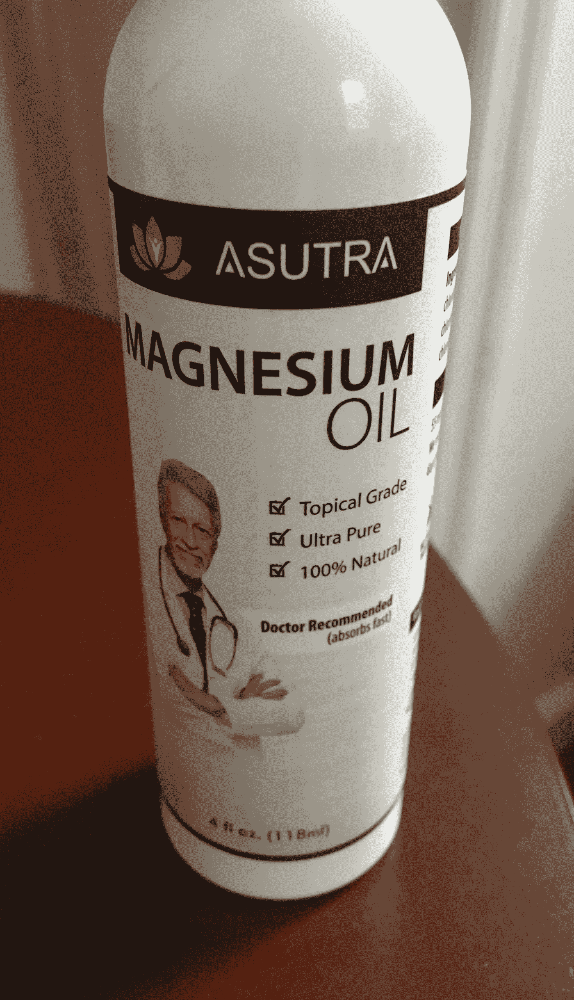

I occasionally spray magnesium oil on my skin before bed

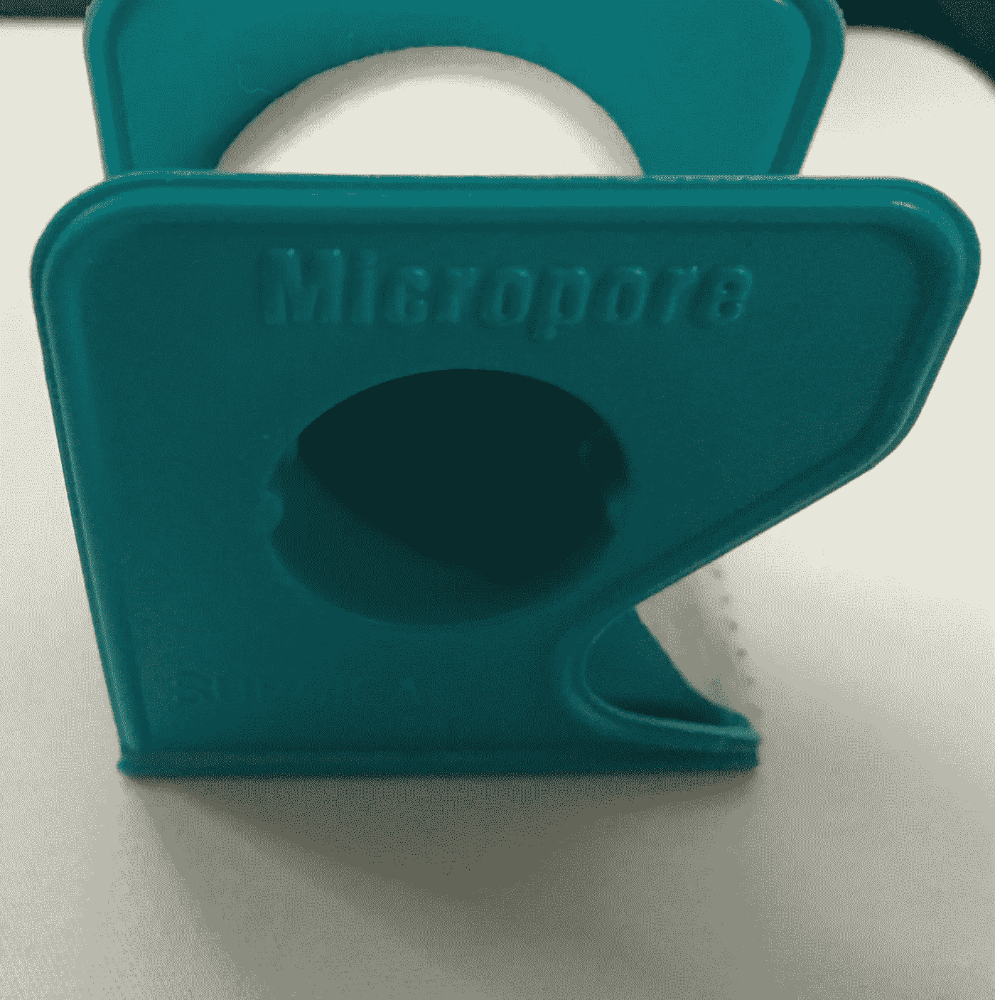

I use 3M Micropore tape to tape my mouth shut every night

# 结果呢

有趣的部分来了！

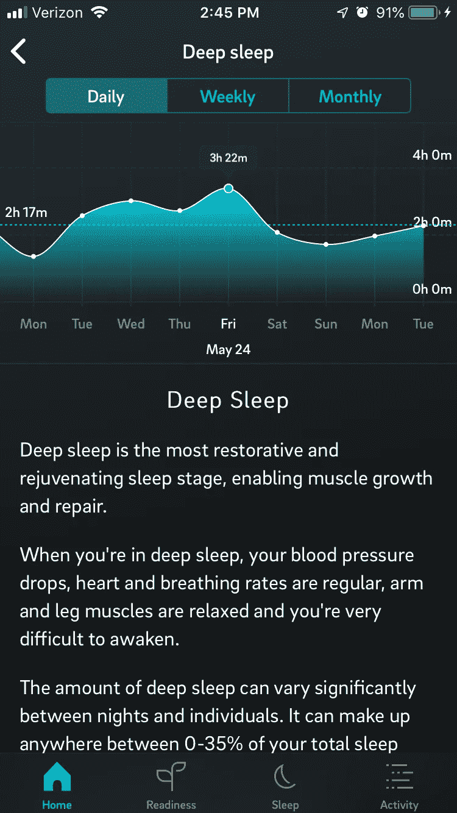

My record high of deep sleep

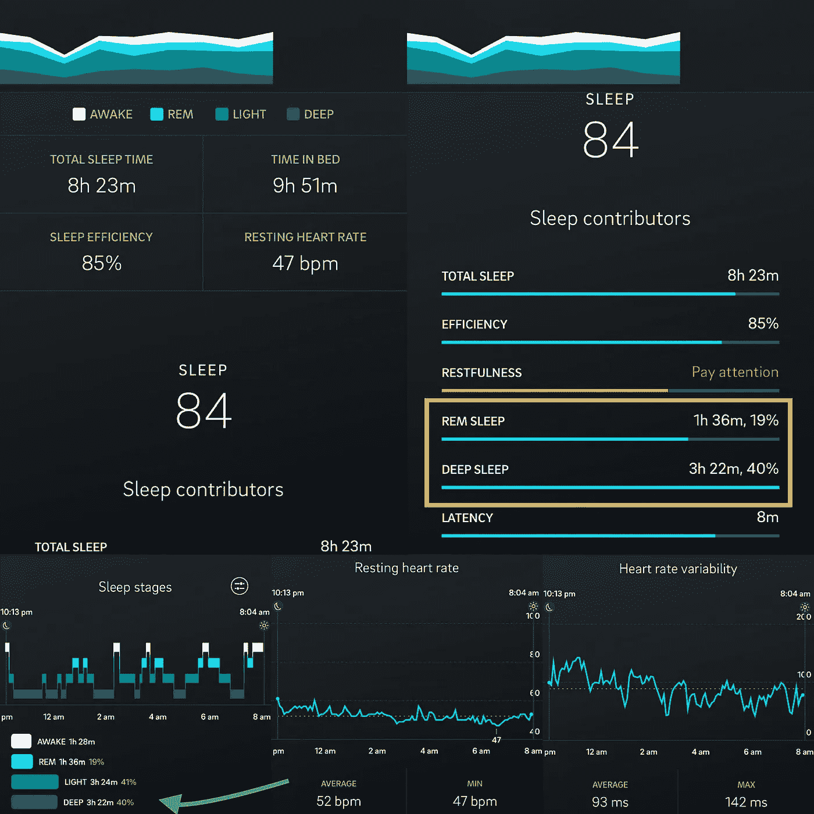

[Friday, May 24](https://www.instagram.com/p/Bx-0ccEp8qc/)

周五，我达到了 3 小时 22 分钟深度睡眠的 PRs 和 93 毫秒的平均 HRV。

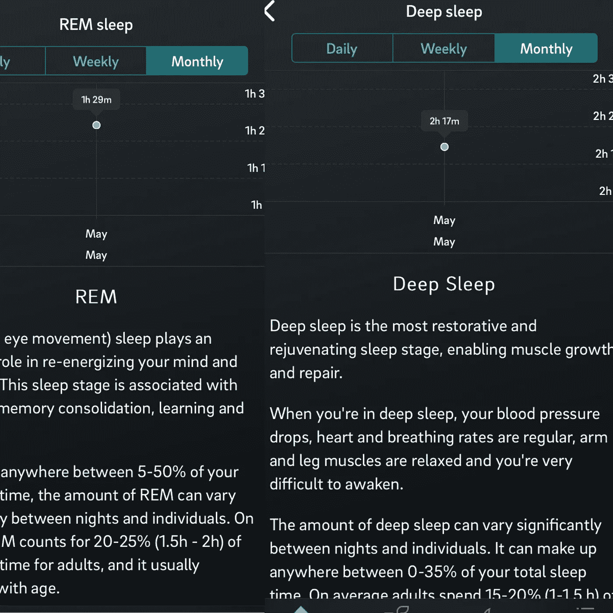

五月份，我平均有 1 小时 29 分钟的快速眼动睡眠和 2 小时 17 分钟的深度睡眠。感觉很神奇。

总而言之，开始时采取措施改善你的睡眠是乏味的，但它们值得坚持，因为你会感觉好很多。我们都有引导自己走向最佳健康状态的道德责任。这样做并不容易，但这是为我们周围的人树立榜样的最好方式。掌控你自己的幸福，你周围的人会倾向于跟随你。

**我很想知道别人都在做些什么来改善他们的睡眠。让我知道！**

> 睡眠是健康的瑞士军刀，因为无论什么疾病，睡眠很可能是盒子里的一个工具，可以让你看起来很好。——[马修·沃克](https://youtu.be/e9BL5vTkChQ?t=148)，睡眠科学家，也是《T8》一书的作者

# **度过一个美好的夜晚！**