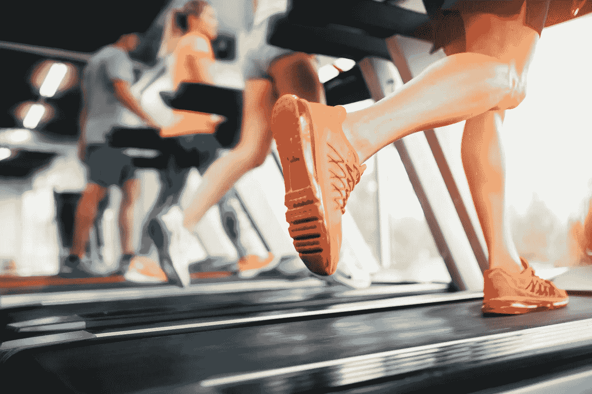

# 放慢脚步，在 2019 年做大

> 原文：<https://medium.com/swlh/slow-down-to-go-big-in-2019-77c3053e9e5b>

## 你觉得你的生活就像一台跑步机吗？

People running on treadmills ©nd3000

你有时会觉得生活就像一台跑步机吗？

你在空中沿着旋转的盘子跑。起初一切都很好。你是解决问题的大师，创造力的发电站。每一个行动，每一个决定都天衣无缝。