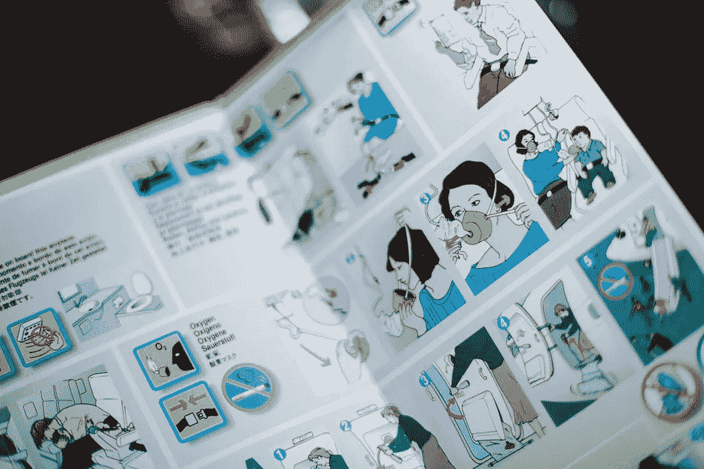

# 小企业主小心了

> 原文：<https://medium.com/swlh/small-business-owners-beware-12fced9a829>

Photo by [Calle Macarone](https://unsplash.com/@callemac) via [Unsplash](https://unsplash.com/photos/15wIddvL5dU)

小企业主当心…为你花时间！

当你拥有了你需要的东西，你就能更好地帮助其他人，满足他们的需求。

这只是常识，然而我们每个人都倾向于将他人的需求置于自己的需求之上。看起来孩子是第一位的，但是配偶或其他重要的人是第一位的，接下来是自主创业/工作义务，甚至可能是…