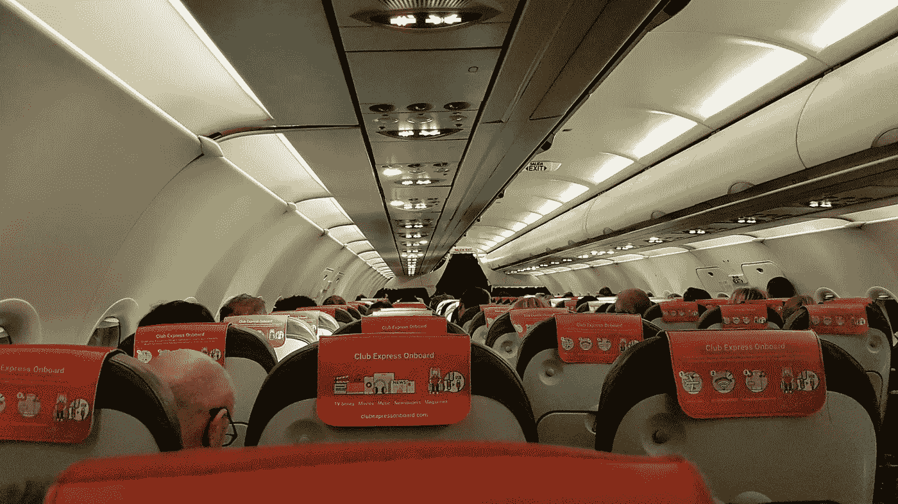

# 飞机上的闲聊

> 原文：<https://medium.com/swlh/small-talk-on-an-airplane-1a3191e0e6cb>

Photo by [Daniel Frese](https://www.pexels.com/@daniel?utm_content=attributionCopyText&utm_medium=referral&utm_source=pexels) from [Pexels](https://www.pexels.com/photo/interior-of-airplane-with-passengers-1547739/?utm_content=attributionCopyText&utm_medium=referral&utm_source=pexels)

我想要的只是喧闹的音乐和盲目飞行的宁静。事情并不总是像我们希望的那样发展。

我出差回家。我旅程的最后一站是在孩子们上床睡觉前到家，在我筋疲力尽倒下之前，我很兴奋能看到他们的笑脸。

当然，命运向我微笑，有三个小时的延迟。

## 它毁了我的夜晚。

我目光呆滞地盯着空姐，她热情地做着飞行前的介绍，这让我怀疑她是否知道我们以前听过这些。

我被砸在梦寐以求的中间座位上。我的一边是一个年轻的女人，她要么在装睡，要么就像一只昏厥的山羊。在我的另一边是一位看上去有些憔悴的老先生，大概有 70 多岁了。 ***他看起来比时钟说的要累。***

空姐终于完成了她的讲话，我准备好了我的耳塞。我有点期待着飘进舒缓的音乐中，而这音乐一点也不舒缓。我觉得我需要逃避。 我旁边的人清了清嗓子，我意识到我犹豫太久了。

## 我即将成为飞机闲聊的一员。

我无意冒犯，但你在飞机上进行的典型闲聊几乎没有什么是真诚的。它通常由一堆没有人想要真正答案的简单问题组成。

我度过了漫长的一天，我是应该坦诚面对他潜在的问题，还是应该满足于泛泛而谈？

> "这是美好的一天，虽然时间有点长，但依然美好。"

这一天过得并不愉快。我此行的全部目的是亲自向客户传达坏消息。

尽管这是自然而然的事。有一千个问题和一千个预先准备好的答案贬低了这些类型的对话。这就是我们想从陌生人那里得到答案的方式。

***说实话，我们经常想知道，甚至是从我们认识的人那里。***

## 我选择打破那乞求被打破的坚冰。

"去威奇托玩吗？"我天真地问。

但是他没有给我固定的答案。他受伤了。

> “不，我要去参加我最后一个童年好友的葬礼。老实说，我讨厌坐飞机。”

一开始不知道怎么回应。我试图从他诚实的回答所引起的震惊中尽快恢复过来。我向他表达了我的哀悼，并问他是否大部分时间都避免坐飞机。

> “我尽力了，但是我的孩子们尽快搬走了。他们永远找不到时间回来看我，所以如果我想和我的孙子们在一起，我就必须坐飞机。当我妻子还在的时候，事情就简单多了。”

我更加吃惊了。这个人当时非常脆弱。他清嗓子的时候，我没有戴上耳机，这让我感觉有点不对劲。

## 我完全投入到了这场我本希望避免的谈话中。

我们在整个飞机旅程中都在交谈。发动机的嗡嗡声几乎让我们提高了嗓门，但我可以看出，他的情绪随着每个新话题而改善。

他对世界的深刻体验令人耳目一新。虽然他对旅行和旅行的原因有点不满，但他说话的方式中透露出一种强烈的决心。

在我们一起度过的短暂时光里，能让他分心感觉很好。我并不觉得自己在听力方面有什么特别或优越之处。我非常想避开它。我没做什么特别的事。我刚刚在那里。我碰巧在正确的时间听了。

## 这不全是为了他。

我也从我们的谈话中学到了一些东西。

> 1.在飞机上闲聊没关系，你永远不知道你会学到什么。
> 
> 2.与周围的人相比，我的不适和问题往往微不足道。
> 
> 3.受挫的时候敞开心扉是可以的。
> 
> 4.不要让你爱的人赢得和你在一起的时间。
> 
> 5.享受和你爱的人在一起的每一刻。
> 
> 6.追随你的激情，但坚持你的信念。

最后一条其实是他加的。他告诉我他面临这些选择的两个例子。在一个例子中，他以牺牲信念为代价追随自己的激情，这让他焦头烂额。在另一种情况下，他既不跟随也不跟随，并且为他错过的机会后悔了几年。

## 他还告诉我，哪里都有需要。

我们快节奏的商业生活、需求和欲望会让我们盲目去做，但它就在那里。

在我们的飞行结束时，我很难过，因为我不想进行的对话就要结束了。我祝他在余下的旅途中好运，并再次向他表示哀悼。

## 这不是一个完美的结局。

我想说我帮他下了飞机。我应该帮他找到租车服务，他很紧张整理。

相反，我冲出机场，奔向熟睡的家人。

## 我知道我本可以做得更多，但我希望我们的谈话对他的帮助和对我的启发一样多。

生活就在我们周围，我们在最奇特的地方找到它。

有效性:我的引用准确吗？不。我不会假装记得确切的措辞，但它们的内容是真实的。撞击声回荡。