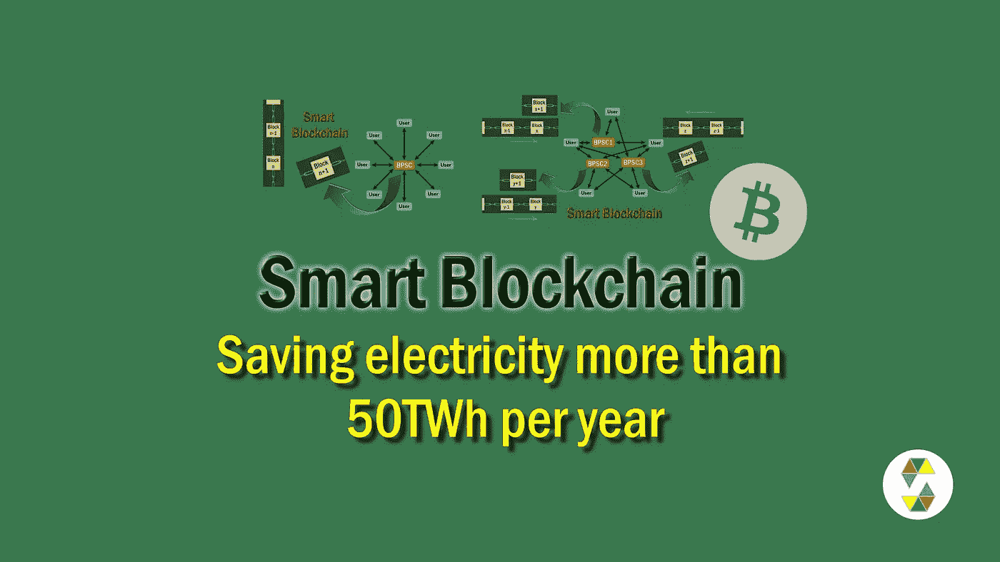
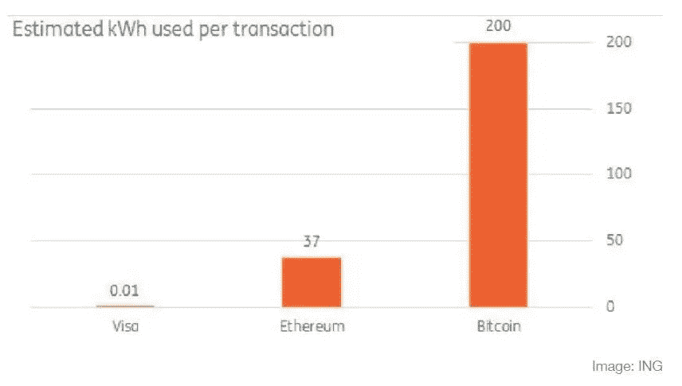
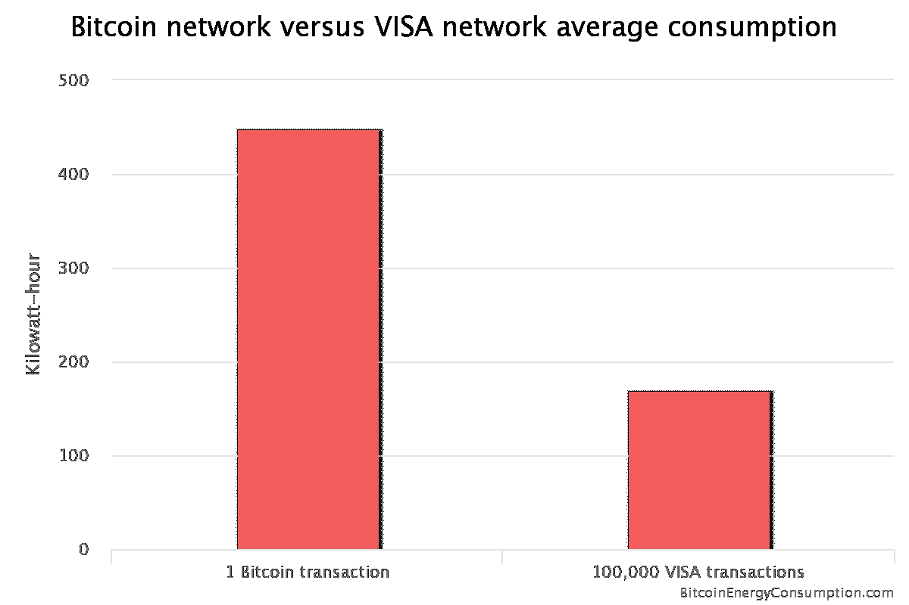
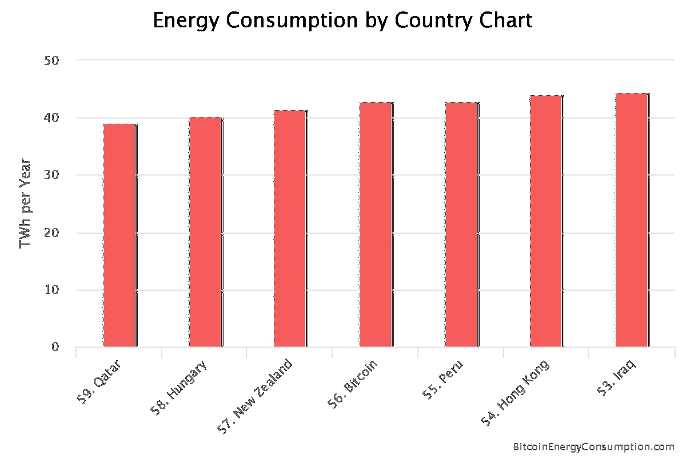
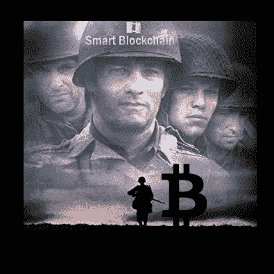
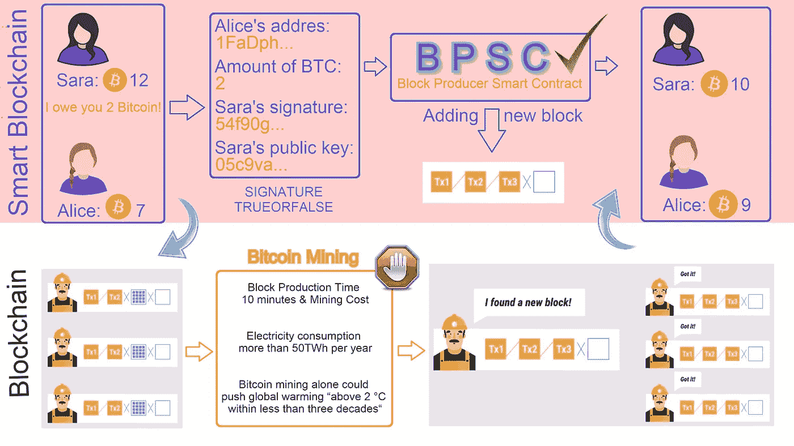
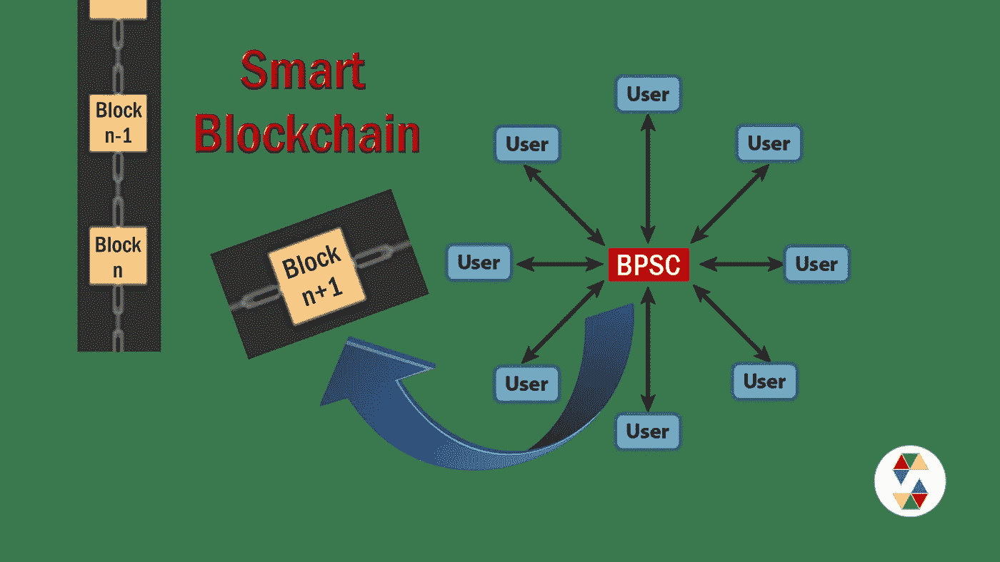
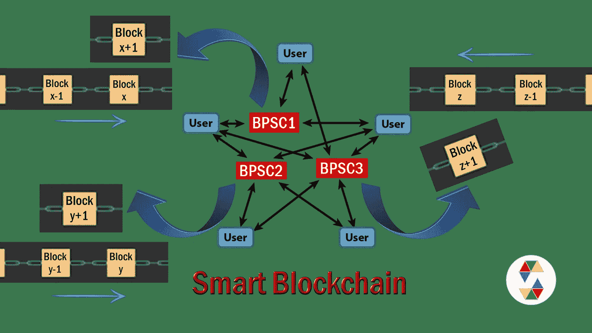
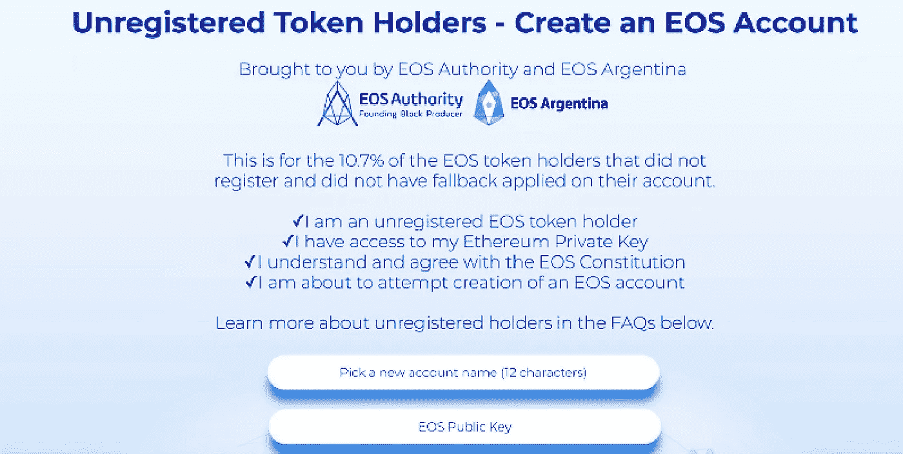

# 智能区块链；拯救比特币，每年节电 50 多万瓦时

> 原文：<https://medium.com/swlh/smart-blockchain-the-rescue-of-bitcoin-and-saving-electricity-more-than-50twh-per-year-c17606976fce>

一个比特币交易的电力消耗是一个 VISA 卡交易的 20 万倍，通过使用智能区块链，电力消耗将与 VISA 卡的交易相似，每年总共将节省超过 50 千瓦时。

这篇文章的作者是索马耶赫·戈拉米女士和迈赫兰·卡泽米尼亚先生，文章于 2019 年 1 月以波斯语和英语写成。

[*波斯文*](https://www.soliset.com/smart-blockchain1)

根据 [*比特币白皮书*](https://bitcoin.org/bitcoin.pdf) :“一个纯粹的点对点版本的电子现金将允许在线支付直接从一方发送到另一方，而不经过金融机构。”

换句话说，在一个点对点的网络中，比特币区块链没有任何金融机构来负责总账和交易登记。另一方面，人们和矿工并不相互了解和信任。因此，为了避免欺骗和重复支出，应该提出一个新的想法。比特币的新想法是使用工作证明机制，根据这一机制，矿商必须以竞争和合作的方式向区块链添加新区块，不幸的是，这需要消耗大量的电力，因此无法对交易数据的有效性提出投诉。

[*发表在《自然气候变化*](https://www.nature.com/articles/s41558-018-0321-8.epdf?referrer_access_token=h1fcePQqnrntGZtW4POj5dRgN0jAjWel9jnR3ZoTv0N_BlBOQJDHfvssdGkz36RF4-C7V0a3_EVtpCvGlNw-EnbTe8aHj0G6zUia-Ph07D9stGSwVr33awLgvAeF6wJMemMg8v0fJW4Fv4fkvd4UVqUc8AUCraiFlL0wQQpzHXejfnfIUa7cgU5GVf1-m6vebGayFvjf-pOpjCNuCq4tFepjgz_m7haDpjlNlw-l34JwomIaiMXK1GzxOQL8y37Vhl3dzb0oAHggs8BswICMcLAdnfLZbGezQTIfriWLRys%3D)(2018 年 10 月)上的研究甚至提出，仅比特币开采就可能将全球变暖“在不到三十年内推高 2 摄氏度以上”。比特币网络中使用的工作证明机制耗电量巨大。与此同时，很大一部分采矿作业是通过中国燃煤电厂的电力完成的，这导致比特币的环境问题和区块链技术越来越多。

2017 年， [*亚当·杰扎德*](https://www.weforum.org/agenda/2017/12/bitcoin-consume-more-power-than-world-2020/) 先生的文章显示，单笔比特币交易使用 200 千瓦时，而典型的 VISA 卡支付使用 0.01 千瓦时，这意味着比特币交易的功耗是 VISA 卡交易的 2 万倍。以太坊的网络状况比比特币好一点，以太坊的每笔交易消耗 37 千瓦的电力，但当然，以太坊的电力消耗无法与 VISA 卡的交易相提并论。

[*the article of Mr. Adam Jezard*](https://www.weforum.org/agenda/2017/12/bitcoin-consume-more-power-than-world-2020/)

但差不多一年后，Digiconomist 上发表了一篇 [*的文章，文章显示，每一笔比特币交易的消费已经超过 VISA 卡一笔交易的 20 万倍。当然，两篇文章中数字之间的差异部分可能是比特币挖掘难度的增加，或许 VISA 卡交易消费计算基础的差异也起到了作用。无论如何，不幸的是，功耗是如此之高，即使从数字的结尾(尾部)删除一个零，它仍然会令人震惊。*](https://digiconomist.net/bitcoin-energy-consumption)

[*article was published in the Digiconomist*](https://digiconomist.net/bitcoin-energy-consumption)

同时，在最近的文章中，为了数字的有形性，将比特币挖矿力的年消耗量与一些国家的年消耗量进行了对比。不幸的是，这种功耗只是浪费在记录比特币交易上，不会有其他结果。

[*article was published in the Digiconomist*](https://digiconomist.net/bitcoin-energy-consumption)

正如你可能已经注意到的，继续比特币交易的当前状态会引发很多问题。除了巨大的成本，它还会破坏环境，显著提高全球气温。当然，这些问题甚至会危及比特币的生命和许多加密货币。

不幸的是，比特币还面临着其他问题和威胁。例如，我们知道，在当前情况下，比特币的可扩展性增强是不可能的，这个问题导致比特币的使用受到限制。

Smart Blokhchain

为了解决这些问题，最近我们提出了一种使用智能合同概念的简单方法，并将其命名为智能区块链。幸运的是，使用这种方法将立刻解决未来加密货币甚至比特币和其他现有加密货币的上述问题。

# “智能区块链”功能和规范

一年多来，我们一直试图在分散网络中的交易发生时获得准确无误的交易数据。因为，在这种情况下，首先不需要为一个块产生多个替换，然后矿工通过花费大量的电力消耗和使用各种证明机制，能够选择有效和正确的块。

幸运的是，我们的努力已经取得了良好的效果:最切实、最简单的方法就是使用智能合约的概念来生产区块。也许这就是“智能区块链”适合新区块链的原因。

在“智能区块链”中，一个或多个区块生产者智能合约(BPSC)存在于网络中，没有 BPSC 的参与，没有成功的交易被执行。为了在网络中成功交易，首先，发送者必须将加密货币发送到 BPSC 的钱包，然后 BPSC 自动将加密货币发送到接收者。这一简单的行动使 BPSC 准确无误地拥有了所有网络交易的数据，然后作为一个准确可信的金融机构，将交易数据记录到一个新的块中，并将这个新的块添加到区块链的末尾，这样“智能区块链”中的矿工就没有任务了。

当然，在这种情况下，“智能区块链”交易的功耗和常规 VISA 卡交易的功耗没有区别。现在，加密货币的巨大功耗仅仅是因为使用了工作证明机制或利益证明机制，或者…..这在“智能区块链”中根本不需要它们中的任何一个。BPSC 存储的数据是完美的，因为它是在交易发生时注册的，没有人为干预。“智能区块链”简直可以结束额外花费 50TWh 电力和全球气温上升 2℃的噩梦。

此外，也不用担心矿工和砌块生产商的费用。bpsc 将自动并完全免费地完成矿工的所有任务，它只需要专注于 bpsc 和网络的安全性和流量。“智能区块链”的可扩展性无法与现有的区块链相比，甚至可以与 VISA 卡交易的速度相媲美。

在这种方法中，可以根据事务的主题来区分事务。如果这个过程是通过增加网络中 bpsc 的数量来完成的，那么对于减少 bpsc 的流量也会有很好的效果。这意味着，除了不同区块链中的交易分类之外，它还有助于减少 BPSCs 的流量。例如，在这种情况下，您可以与独立的区块链交易几种类型的网络加密货币。但是限制和同时重要的一点是，交易将被分配到不同的和单独的 BPSC，在那里它们彼此没有联系。例如，如果智能合同要求为每 100 个赞向用户付费，我们必须通过一个 BPSC 记录并存储该项目的赞交易和加密货币交易，并存储到一个区块链中。

要了解更多关于“智能区块链”的功能以及关于该主题的更多信息，您可以在下面的链接中查看我们的另一篇文章:

 [## 通过使用智能合同淘汰矿工和区块生产商

### (迈向智能环保区块链的第一步，也是最重要的一步)

medium.com](/swlh/the-elimination-of-miners-and-block-producers-by-using-smart-contracts-58b20e317e9b) 

与此同时，我们在这方面发表了另外两篇文章，它们在“智能区块链”的概念中是从不同的角度来考虑的。下面是两篇文章的链接:

 [## 智能区块链，区块链技术和智能合约之间的互惠服务

### 《另类硬币》杂志上的索玛耶·戈拉米

medium.com](/altcoin-magazine/smart-blockchain-reciprocal-services-between-blockchain-technology-and-smart-contract-669986dbf845)  [## 智能合约是矿商和区块生产商的合适替代品

### 本文讨论了区块链技术发展的必要性，以及消除矿工和区块链的挑战。

medium.com](/@somayyeh_43305/smart-contracts-a-proper-replacement-for-the-miners-and-block-producers-51153f1b0ce5) 

# “智能区块链”对比特币的拯救

正如你所看到的，“智能区块链”的主要任务被分配给了区块生产者智能合约(BPSC)，但基本上，没有办法将任何智能合约部署和执行到比特币区块链中，比特币网络也不具备类似以太坊或 EOS 的能力。

好在这个问题是可以解决的。如果我们想用智能合约拯救比特币，只需要建立一个新的分散网络，允许像以太坊网络一样存储和部署智能合约。这个新的区块链网络将分两步取代原来的比特币网络。

首先，在这个新网络中，我们设计并激活一个或多个“BPSC”区块生产商智能承包商。在确保 BPSC 在新网络上的功能后，在第二步中，比特币所有者需要获得与他们的比特币数量相等的新加密货币，同时，他们的初始比特币应该被烧掉。这些由网络的 BPSC 完成，BPSC 可以注册任何网络的初始加密货币。这样，最初的区块和区块链将由 BPSC 在新的“智能区块链”中完全精确地构建。

[Unregistered Token Holders — Create an EOS Account](https://eosauthority.com/unregistered)

最近这项工作由 EOS 网络完成，EOS 社区的成就可以成为一个很好的体验。当“Block One”想推出面向 EOS 的 ICO 时，还没有专门面向 EOS 的加密货币和网络。该公司决定暂时使用以太坊 ERC 20 代币来筹集资金。在 EOS 加密货币和网络建立后，参与者的 ERC 20 代币被烧毁，同时，被烧毁金额的 EOS 加密货币等值金额被支付给同一个人。

事实是，比特币目前的状况无法持续太久，“智能区块链”是拯救比特币和改造区块链技术的好方法。这种方法可以解决比特币的所有问题和局限性，同时比特币仍然不会依赖于任何金融机构和银行。

这是文章的结尾，我们期待收到您的反馈。

## 2019 年 1 月 2 日
索马耶赫·戈拉米
迈赫兰·卡泽米尼亚

[网站](https://www.soliset.com/)
推特
[电报](https://t.me/soli_set)

## 这篇文章发表在 [The Startup](https://medium.com/swlh) 上，这是 Medium 最大的创业刊物，拥有+405，714 名读者。

## 在此订阅接收[我们的头条新闻](http://growthsupply.com/the-startup-newsletter/)。

