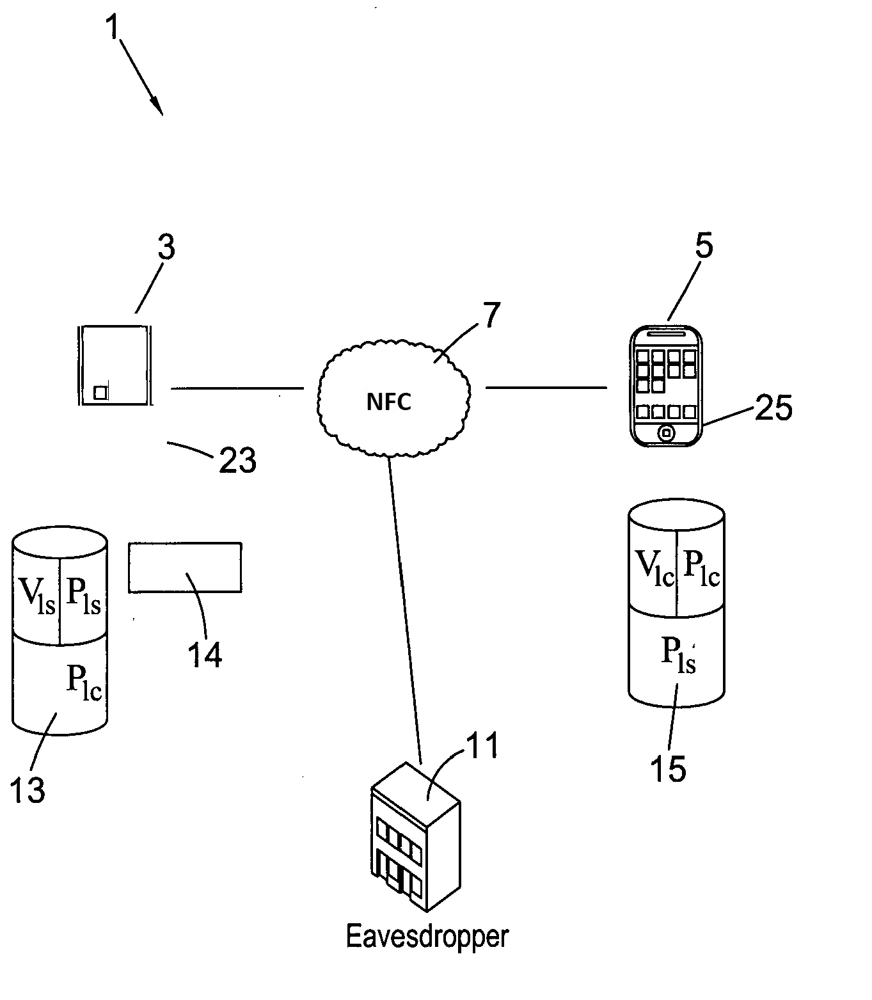
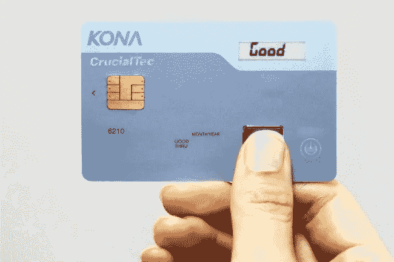
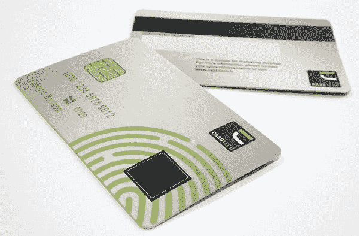

# 基于智能卡的移动钱包

> 原文：<https://medium.com/swlh/smart-card-based-mobile-wallets-9cb75595b71d>

在今天这一期可以使用 IP nChain 开发的商业创意中，我将详细介绍智能卡应用程序如何既有助于保护比特币钱包，又允许匿名(私人)和安全的系统认证。

我们(nChain)已经获得或被授予了一项专利[3],将 ECDSA 作为一种安全共享和创建密钥的方法。该机制可用于创建一个系统，允许用户向计算机进行身份验证，或创建一个钱包密钥存储库，该存储库可与智能卡和移动电话配合使用，允许一次性比特币密钥始终更新地址。

具有生物识别功能的 Java 智能卡的存在并不新鲜；这种卡开始被广泛使用。

钱包可以用作智能手机上的应用程序。以下过程中使用的数据可以公开保存而不损失任何安全性，可以写入区块链，也可以备份，以便在丢失时可以恢复。

在交换的基础部分的 ECDSA 密钥在区块链上保持未公开和不可公开获得的情况下，可以发行生物识别智能卡。相关联的地址甚至可以在 PKI(公钥基础设施)上证明，其中比特币地址(而不是公钥)由 CA(认证机构)记录。这样做甚至可以实现基于反洗钱/KYC 的完整身份系统，身份生物识别卡(如英国居留卡或护照)将允许使用 Java ECDSA 流程。

这样的过程解决了 PKI 和隐私的所有问题。

如果我们以专利中的例子为例，我们现在用智能卡取代了笔记本电脑。

NFC-based key exchange as per 1092/42

我们以一个允许在设备(比如电话)上签名密钥的系统结束。在这里，密钥存储为一个联合流程:

P0 =秘密(智能卡)X G (G 是 ECDSA 固化运算符)

Pi =秘密(钱包值)X G

区块链上的“币帮*”*是 c 复合；也就是说，钱包值加上智能卡密码，用户可以备份钱包。

Smart cards that use biometrics are now available.

手机上的应用程序将硬币秘密(钱包值)与交易哈希一起发送到智能卡。为此，该应用程序将交易的散列(手机具有允许交易被构造的“智能”)和秘密(钱包值)构造到智能卡中。

智能卡使用复合密钥对哈希进行签名:

*   S = secret(钱包值)+ secret(智能卡)

然后，用户钱包上的应用程序向智能卡发送以下内容:

*   Si =秘密(智能卡)
*   H =哈希(待签名的交易)

智能卡现在计算与复合密钥相关联的比特币地址的值(P0+Pi)。卡返回的签名为:

*   (R，S) i—地址的复合 ECDSA 签名(P0+Pi)。

应用程序将更改(如果有)设置为新地址 P(i+1)。

P(硬币+1)的地址在智能卡上导出，并返回给应用程序。为了做到这一点，在应用程序上生成一个新的密码并发送给智能卡:

*   P0 =秘密(智能卡)X G (G 是 ECDSA 固化运算符)
*   P(i+1) =秘密(钱包值+ 1) X G
*   P(硬币+1) = P0 + P(i+1)

手机应用程序从来不需要将秘密发送到卡上，它会发送公钥。如果持卡人知道(这是一种可能的方法)(比如不仅使用了散列地址，还使用了密钥)，应用程序就可以进行计算。

使用智能卡和应用程序，您现在可以拥有一个需要智能卡签名的安全钱包，它也可以用来增强 Handcash 或 Centbee 等钱包。每次对消息进行签名时，都会安全地生成一个新密钥。

使用该卡，可以为每种设备和多种原因创建单独的钱包。它允许人们从 Ledger 等笨拙而陈旧的硬件设备中寻找所有的东西，并且具有更大的灵活性。该过程确保您只使用一次密钥；更重要的是，它可以让你以后证明一个关键，同时保持完全的隐私。

每枚硬币在使用时都会被送到一个新的地址。每张都使用一次且仅使用一次，卡只需完成一个简单的操作，因为大部分交易构建都是通过手机或 app 设备完成的。

可以创建智能卡的备份并将其存储在保险箱中，以便进行恢复，并且只有当用户的生物特征(如用户的指纹)存在时，智能卡和应用程序才能一起工作。一张卡可以反复使用，永远不会暴露密钥，因为智能卡上的注册密钥永远不会用于发送和接收比特币。

更重要的是，这种卡可以与下面详述的过程一起使用，安全地加密文件(也见上一篇文章),甚至对计算机进行认证，并保护远程系统的 VPN。

# 个人设备安全-基础发明的细节

本发明描述了一种对任何个人电子设备上的数据进行安全加密的新方法，所述个人电子设备包括(但不限于)PC、膝上型计算机和平板电脑。该方法采用了在两个节点之间共享秘密值的技术，如题为“确定两个节点的公共秘密”的 nChain 专利中所描述的

## **问题描述**

笔记本电脑或个人电脑等个人设备上的数据加密旨在保护硬盘数据，以防设备丢失或被盗。现有的方法有许多缺点。例如，要解密硬盘，用户可能需要输入密码，如 PIN 或密码短语。但是，黑客可以很容易地破解短代码，例如通常为 4-8 个长字符的 pin 码，因为他们实际拥有该设备，并且有足够的时间来尝试常见的组合。密码要安全得多，但这取决于用户是否记住了一长串密码或一个长句子。一个更安全的过程包括使用密钥，例如插入 USB 驱动器。然而，即使这样的方法也有安全漏洞。尽管 USB 驱动器和设备之间有直接的物理连接，但由于传输过程中产生的电磁信号(例如通过功率分析)，传输的秘密仍可能被截获[1]。

本方法通过使个人设备能够基于认证用户仅传输非秘密信息来*计算*秘密，从而克服了这种性质的问题。

## **词汇**

DCS——专利名称为“T4 ”,确定两个节点的共同秘密

PED —要加密的个人电子设备(如笔记本电脑、PC 等)。)

钥匙圈—包含用户主密钥的设备(例如，智能手机、USB key 等。)

用户——PED 的授权用户和钥匙圈的所有者

软件——大写时,“软件”是指在 PED 上运行的应用程序，它执行椭圆曲线计算并与密钥环通信。

App——大写时,“App”指的是在钥匙圈上运行的应用程序，它执行椭圆曲线计算并与 PED 通信。

ECC —“椭圆曲线加密”

会话—PED 未加密且被用户使用的时间段。会话以用户认证开始，随后是 PED 解密，以 PED 加密结束。

周期—一整轮加密和解密事件(其间 PED 处于空闲状态)

**本发明的关键要素如下:**

1.加密/解密密钥是全强度加密密钥(例如 AES256)，其本身从不在用户和设备之间传递。相反，在对用户的密钥环进行身份验证后，需要时会重新计算密钥。加密密钥仅用于一个加密/解密周期。为每个周期计算一个新密钥。

2.该方法使用在 nChains 专利“[确定两个节点的公共秘密](https://medium.com/r/?url=https%3A%2F%2Fpatentimages.storage.googleapis.com%2Fe9%2Fd4%2F1a%2F644d344019a178%2FEP3268914B1.pdf)”中描述的秘密密钥共享协议(以下缩写为 DCS —“确定公共秘密”)。

# **除外责任**

1.实际的加密/解密过程采用现有的标准，这里不再描述。

2.此处不描述处理通信中断(如电缆断开)的协议。

# **技术描述**

在下面的描述中，参考了 DCS。为保持一致，此处使用了与 DCS 中相同的术语，如下所示:

*   PED(“服务器”)主私钥=虚拟机(由 PED 保密)
*   PED(“服务器”)主公钥= PMS(非秘密)
*   密匙环(“客户端”)主私钥= VMC(由密匙环保密)
*   密钥环(“客户端”)主公钥= PMC(非秘密)

该描述是通过假设 PED 是运行该软件的膝上型电脑，而钥匙圈是运行该应用的智能手机的例子来进行的。

# *初始化(参考 DCS 注册’)*

初始化阶段从一台完全未加密的笔记本电脑开始，软件已下载并安装到该笔记本电脑上(安装到一个保持未加密的分区中)。该软件的兼容智能手机应用版本已经安装在智能手机上——“兼容”意味着在两个设备上使用相同的 ECC 标准(例如 secp256k1 ),具有包括生成器 G 在内的公共参数集，并且每个设备上的软件使用本文所述的公共协议。ECC 参数永久存储在每个设备上(不需要保持安全)。

1)笔记本电脑和智能手机已连接。这种连接是通过电缆或蓝牙等无线协议实现的。笔记本电脑软件与智能手机应用程序建立联系，并通过交换适当的信号来验证软件版本是否兼容和同步。

a.注意:所有现有的安全措施都被认为是有效的。即，智能手机已经被用户的安全码解锁，并且用户已经以通常的方式用密码登录到膝上型电脑。

2)笔记本电脑软件和智能手机应用程序都基于 g 独立生成自己的公钥/私钥对。最初生成的密钥是主密钥。私钥(虚拟机和 VMC)都安全地保存在相关的自有设备上。公钥(PMS 和 PMC)各自被传输到另一个设备。每个设备永久保存三个主密钥(它们自己的私钥/公钥+其他设备的公钥)。

3)膝上型电脑创建新消息‘Mn’(n = new)，并使用标准算法创建消息的散列，得到 256 位整数:

*   Message = Mn(随机生成数的哈希 160)[【1】](#_ftn1)
*   消息哈希= SHA-256(Mn)

初始化持续到第一加密阶段结束。从那时起，每个会话由开始的解密阶段和结束的加密阶段组成。

# *加密*

4)膝上型电脑软件使用 Mn 来重新计算它自己的下一代私钥/公钥对和智能手机的新公钥:

*   笔记本电脑的新私钥= VnS = VMS + SHA-256(Mn)
*   笔记本电脑的新公钥= PnS = PMS + SHA-256(Mn) X G
*   智能手机的新公钥= PnC = PMC + SHA-256(Mn) X G

5)软件现在可以计算一个(新的)秘密序列号:

**软件**计算 Sn = VnS X PnC

(注意:App 也可以计算秘密，如在 DCS 中，但是在本发明中，仅需要软件来导出该值)。

6)在本示例中，秘密 Sn 不被用作加密密钥，尽管在一些变型中它可以被用作加密密钥(参见变型 1)。在本例中，膝上型电脑的序列号被编码在加密密钥中，以确保它仅特定于膝上型电脑。加密密钥 E 的计算如下:

E = SHA256(SHA256(盐+序列号)+序列号)

在哪里

Salt = Mn(有关加密 Salt 的解释，请参见[2])

7)作为注销和关机过程的一部分，软件对磁盘进行加密。加密密钥 E 没有存储在任何地方，并且消息 Mn 没有存储在膝上型电脑上。消息 Mn 被安全地存储在智能手机上，用于在下一次会话中解密硬盘驱动器。

# *解密*

8)笔记本电脑和智能手机已连接。该连接通过电缆或无线协议(如蓝牙)来完成。笔记本电脑软件与智能手机应用程序建立联系，并通过交换适当的信号来验证软件版本是否兼容和同步。

(注意:该步骤与初始化阶段的步骤 1 相同)

9)对于应用程序验证，笔记本电脑会创建一条新消息“Mn”Mn 将用于当前解密阶段的认证，也将用于后续加密阶段的加密。该值是新创建的，不同于加密阶段结束时存储在智能手机上的先前创建的消息。为了区分这两者，先前存储的消息将被称为 Mo (o = 'old ')。笔记本电脑将 Mn 发送到智能手机，并使用标准算法创建消息的哈希，得到 256 位整数:

*   Message = Mn(随机生成的数字的哈希 160)
*   消息哈希= SHA-256(Mn)

10)智能手机应用首先根据 Mn 的值计算新一代的私钥/公钥对(详情请参考 DCS):

*   智能手机的新私钥= VnC = VMC + SHA-256(Mn)
*   智能手机的新公钥= PnC = PMC + SHA-256(Mn) X G

11)应用程序然后用其新的私钥签署 Mn，并发送回膝上型电脑软件:

*   签名消息= Sig-VnC

12)与在 DCS 中一样，软件通过验证签名消息来验证应用程序。它通过使用(10)中的公式独立计算应用的新公钥(PnC ),然后在 Sig-VnC <mn>和 PnC 之间执行标准 ECDSA 检查。</mn>

13)建立了应用程序的凭证后，软件现在向应用程序发送请求，以获取“旧”消息 Mo，该消息 Mo 在之前的加密阶段被安全地专门存储在智能手机上。为了增加安全性，应用程序使用新一代私钥对 Mo 进行签名，并将签名后的消息发送回软件:Sig-VnC <mo>。软件可以验证签名，并以通常的方式检索 Mo。</mo>

14)消息 Mo 与膝上型电脑和智能手机的前一代公钥/私钥对相关联，即在前一加密周期中生成的密钥。膝上型电脑现在能够重新计算这些密钥，因此也能够重新计算秘密 S 和加密密钥。

15)重新计算的加密密钥用于解密磁盘，用户现在可以照常操作膝上型电脑。新创建的消息 Mn 在会话期间被保留在存储器中，当用户注销、重启或关机(等等)时，该会话将以加密阶段结束。).

## *变化 1:加密密钥=秘密密钥 S*

在某些情况下，将序列号嵌入加密密钥可能没有必要或不可行，例如，PED 是一种没有可访问序列号的设备类型。在这种情况下，秘密 Sn 本身可以用作加密密钥。

## *变化 2:文件夹/文件加密*

一种变体是对单个文件或文件夹进行加密。PED 和密匙环应用程序可以设计为提示用户加密哪些文件/文件夹。对于每个单独的文件/文件夹，将生成新的 salt(消息 Mn ),从该 salt 中将导出文件/文件夹特定的加密密钥。在这种情况下，钥匙圈应用程序将安全地存储一个将唯一的文件/文件夹 ID 链接到相关消息的表。至于磁盘加密，加密密钥仅在一个周期内有效——因为对于每个新周期都会计算一个新的加密密钥(即，在已经访问了文件/文件夹的每个会话之后，在表上替换相关的存储消息 Mn)。

# **参考文献**

[1][https://the intercept . com/document/2015/03/10/TPM-vulnerabilities-power-analysis-exposed-exploit-bitlocker/](https://theintercept.com/document/2015/03/10/tpm-vulnerabilities-power-analysis-exposed-exploit-bitlocker/)

[2][https://en . Wikipedia . org/wiki/Salt _(密码术)](https://en.wikipedia.org/wiki/Salt_(cryptography))

[3] *使用椭圆曲线密码进行秘密共享的个人设备安全:*[https://patent images . storage . Google APIs . com/4c/C5/D2/48 ad 44 c 210 de 89/EP 3257006 b 1 . pdf](https://patentimages.storage.googleapis.com/4c/c5/d2/48ad44c210de89/EP3257006B1.pdf)

## 脚注

[【1】](#_ftnref1)为了生成加密密钥，消息的选择是任意的，但是需要在每个周期都是新的。通过散列将消息减少到 160 位，以保持消息长度较短。

## 这篇文章发表在 [The Startup](https://medium.com/swlh) 上，这是 Medium 最大的创业刊物，有+411，714 人关注。

## 订阅接收[我们的头条新闻](http://growthsupply.com/the-startup-newsletter/)。

